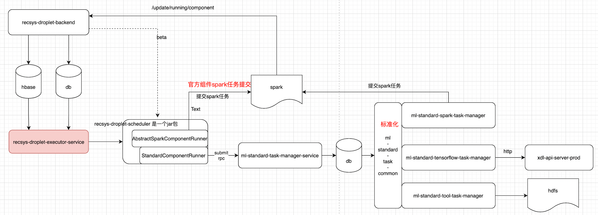
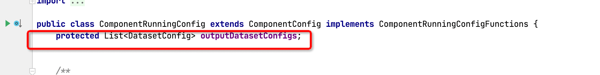

项目总结:主要的内容有dag构建原理, dag任务调度, 特征处理流程, 标准化组件服务等

### 平台模块:


### 各服务执行流程:

###实验调度:

项目目录
```java
recsys-droplet
	recsys-droplet-backend			// dag 后台
  recsys-droplet-deploy				// pom 部署 模块
  recsys-droplet-executor-module			
  	recsys-droplet-executor-dao
    recsys-droplet-executor-service		// 从db 中拉取job 配置并提交job 到quartz
    recsys-droplet-mapred-executor
    recsys-droplet-spark-executor
    recsys-droplet-standard-executor
  recsys-droplet-executor		// 对 job task 进行了抽象 和执行
  recsys-droplet-component	// component 相关抽象，配置、参数等
  recsys-droplet-service    // dagService , yarnService, alertSenderService
  recsys-droplet-task				//  各种spark 任务的spark 代码
```

#### 实验管理
-   dag以job的方式构建
-   一个dag包含多个组件(component)

创建job: /job/dag/create

job和task 都是 protobuf 预先定义,task总包含输入输出的Dataset 定义,dataset中包含datasetColumn定义:  
使用 protobuf 的原因: 个人理解性能好,效率高, dag的job或者task是组织了非常多的成员变量和配置, 如果使用普通的类序列化存储可能是个问题  
比如json通过text存储到mysql或者blob方式存储, 很可能出现性能上的问题    
序列化和反序列化的时间开销都减短 
```protobuf
syntax = "proto3";

package modelProto;

option java_package = "com.ximalaya.recsys.droplet.proto";

message Job  {
	string  jobName = 1;		//job名
	int32 jobId = 2;			//已经被废弃掉
	string jobOwner = 3;
	int32 taskCount = 4;			//task数
	string cron = 5;			//job定时设置
	repeated string taskIds = 6;		//job包含的taskIds
	string activeOrNot = 7;
	int64 historyId =8;
	int64 lastUpdateTime = 9;
	string desc =10;          //job描述
	string alert = 11;       //job邮件通知
	string queue =12;      //job运行的yarn队列
	string project = 13;   //job属于的项目
	string group = 14;
	string uploadFile = 15; //上传文件自动绑定
	string version = 16;
    string creater = 17;  //创建人
    string opsid =18;    //创建人id
	string runType = 19;  //job运行类型 dag noteBook
	string runStatus=20; //job运行状态 cron runAll runSingle runOnThis runAfterThis
	string loopStatus=21;
	int32 loopRunningSize=22;//loop是第几次运行
	int32 loopMaxSize=23;//loop的最大运行次数
	string priority=24;//任务优先级
	string cronKillHour=25; //定时任务运行超过多少小时就自动kill
	string dagEstimateTime=26;//dag预估时间
}

message JStatus {
	int32 jobId = 1;
	string startTime = 2;
	string endTime = 3;		//最后执行时间
	string jobStatus = 4;
	int64 historyId =5;
}

message Task {
	string taskName = 1;
	int32 taskId = 2;
	map<string,string> taskArguments = 3;		//需要的参数
	string templateName = 4;           //模板id
	repeated int32 idSet = 5;			//依赖的taskId,如果为0，表示不依赖任何task
	map<string,string> taskOutput = 6;  //task的输出
	int64 historyId =7;
	int64 lastUpdateTime = 8;
	repeated Dataset inputDataset = 9;
	repeated Dataset outputDataset = 10;
	map<string, string> optimizeArguments = 11;
	string trainArguments = 12;
	map<string, string> dagArguments = 13; // 用于前端展示
	map<string, string> extendArguments = 14; // 自定义参数
	int64 oldHistoryId = 15;   //保留老的hid以方便离线调度查询日志
	string labelText = 16;   //保留老的hid以方便离线调度查询日志
	CheckParam checkParam =17;
}

message Dataset {
	string datasetId = 1;
	string datasetName = 2;
	string datasetType = 3;
	string datasetModelType = 4;
	string value = 5;
	repeated DatasetColumn columns = 6;
	RuntimeInfo info = 7;
	repeated string configData = 8;
	string datasetDisplayName = 9;
	string datasetFileType = 10;
}

message DatasetColumn {
	string name = 1;
	string type = 2;
	string description = 3;
	string value = 4;
	repeated DatasetColumn subColumns = 5;
}

message RuntimeInfo {
	string type = 1;
	string path = 2;
	string partitionColumn = 3;
	string partitionType = 4;
	string partitionValue = 5;
	string modelInfo=6;
}

message Project{
	string name =1;
	map<string,string> attributes = 2;
}

message TStatus {
	int32 taskId = 1;
	string startTime = 2;
	string endTime = 3;			//最后执行时间
	string logUrl = 4;
	map<string,string> taskOutput = 5;  //真实的输出
	string taskStatus = 6;
	int64 historyId =7;
}
message ShowData{
	string key = 1;
	repeated string columns = 2;
	repeated string showValue = 3;
}

message ContainerStatus {
    string userId = 1;
    string applicationId = 2;
    string applicationTimestamp = 3;
    string address = 4;
    string status = 5;
    string extendInfo = 6;
    string userName = 7;
}
message CheckParam{
	repeated string requireParam=1;
	repeated string issueParam=2;
}
```


对于job和task的持久化都是通过hbase来存储,个人理解主要是利用非结构化数据存储特性,job ,task, 对于job,和task的存储的是 protobuf 序列化的结果  
这也同样体现了 protobuf 在序列化和反序列化 的性能上的优势
对于配置期和运行期(包含historyId)都分别做了存储, 以row_key做区分  
组件运行结束可能会更新整个dag的 运行期 状态

为什么不用redis存储? 个人理解,redis可能存在不一致的问题,数据的持久化还是放在硬盘比较合理


关键问题: 组件如何和调度整合的?


#### 组件管理 组件运行:
-   平台中的组件分为 官方 和 非官方组件(标准化组件) 
    -   官方组件由平台方提供一些common和必须的组件: 包括xql组件,画像组件,特征组件,部署组件等
    -   标准化组件一般是一些spark任务或者一些训练组件任务(TensorFlow, pytorch组件) ,  
        由专门的服务(ml-standard-task-manager)负责标准化组件的提交,日志,状态更新等

-   ComponentSpecManager 启动的时候通过 Reflections 扫描包路径获取所有 ComponentSpec 的对象  
    也可通过实现 ApplicationAware接口 然后通过 getBeanNamesForTypes() 方法
    并将所有的 ComponentRunner 注册(静态代码块中完成),同时也注册了componentSpec信息  
    个人理解通过静态代码块还有 Reflections 方式 相比 Spring 可以避免考虑类初始化依赖其他实例对象的次序问题
-   ComponentSpec :
    -   在用户添加组件的时候会通过前端传递的组件名获取 ComponentSpec 解析默认配置 
        build 一个 task 并将 task 和 job 绑定, 持久化
-   ComponentRunner
-   对于配置期和运行期,配置期仅配置datasetKey,在组件运行后会配置datasetVal 
    ,图中DatasetVals是作为一个工具类提供对FileDatasetVal 和 ConfigDatasetVal 的反序列化生成 DatasetVal
    
    
-   组件相关一共四个接口:
    -   ComponentSpec 组件的一些基础定义信息
    -   ComponentRunner:定义一些生成运行期和配置期的configure,配置更新操作等(包括taskbind等),run(),interruptRunningComponent()
        -   AbstractComponentRunner 
        -   run() 方法最终是通过AbstractTaskConfig(重要的类,和整合调度有关)执行. 调度相关的, 后续单独一节整理


    -   ComponentConfigFunctions:获取配置期的一些配置信息(tarinParam等),获取或更新 inputPoint 或者 outputPoint 信息 ,bind unbind dataSet 等
    -   ComponentRunningConfigFunctions:运行期配置
继承关系:

运行期配置相比配置期多了 ouputDatasetConfig, 运行结果会生成一些配置信息如特征配置,画像配置等  

        

组件 runner 和 组件任务调度的整合(以标准化组件为例):

组件整合依赖关系: 左边部分是运行期中间是配置期 还有runner的关系,   
右边通过桥接的的方式把componentRunner的整合到ComponentTaskConfig里


剩下的内容主要是看调度相关的, 还有quartz的整合调度


调度执行:


-   TTask 和TJob主要包含 **execute()**方法 , traceListener包含一些状态通知方法, ExtractAfterJobCompleted为具体实现
-   task相比Job多了Registertings的接口 ~~目前理解是对task的一些上下游依赖task(暂定,后续更正)~~

TTaskConfig里包含genTask()方法,返回一个TTask

TaskEngine 里定义了run()方法会调用AbstractTaskEngine里的execute()方法,  
AbstractTaskEngine 里的execute()最终会调用TTask的 execute()方法(套了好几层...)  
而这个execute()就会调用上面提到的 **componentRunner** 里的run()方法了


 


