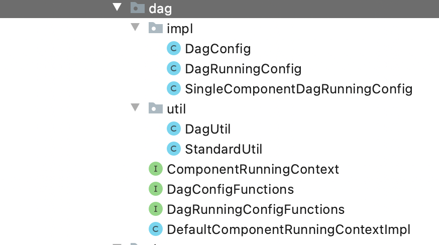
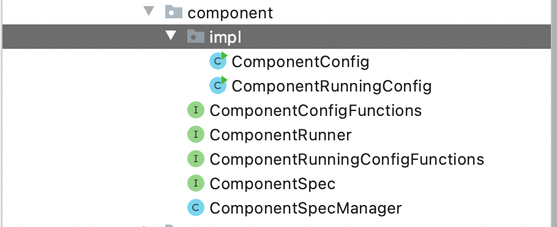

recsys-droplet-component 
    通过protobuf 定义了完整的dag各个构成成分: Job(包含task的id list) , JStatus, Task,Dataset,DatasetColumn,RuntimeInfo,Project,TStatus,ShowData
    
    使用protobuf的原因: 复杂结构的定义,方便序列化,也方便后续hbase的存储
    job还有task都是通过hbase存储:
    put2table(rowKey, COLUMN_NAME, j.toByteArray());

DagUtil 主要将protobuf中的对象转化为应用中使用的对象
ComponentRunningContext 包含一些返回上下文信息的方法
DagConfigFunctions(DagConfig) 配置期对dag的一些操作
DagRunningConfigFunctions 运行期对dag的一些操作
DefaultComponentRunningContextImpl ComponentRunningContext的唯一实现类

DagRunningConfig extends DagConfig implements DagRunningConfigFunctions
SingleComponentDagRunningConfig 和DagRunningConfig 的区别是一个里面只含有一个 ComponentRunningConfigFunctions ,另一个是包含ComponentRunningConfigFunctions 的list

