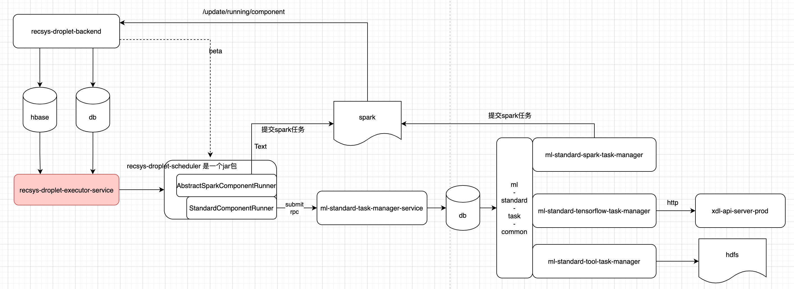
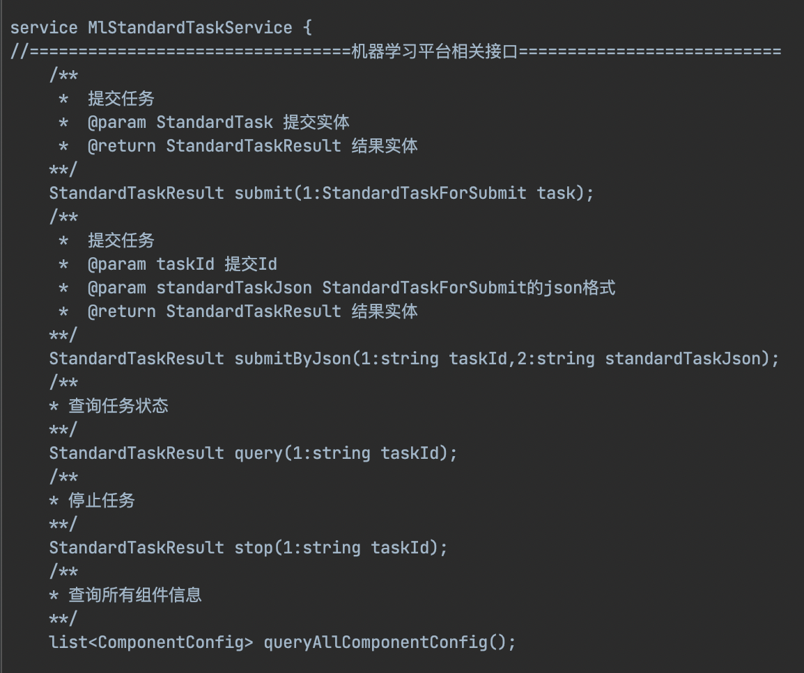
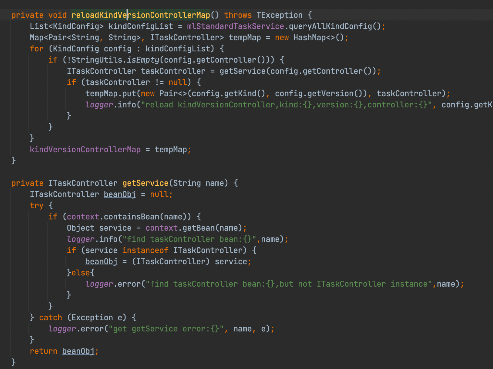

服务简要说明：
ml-standard-task-manager-service统一接受来自外部的任务，存入任务表，该服务本身无状态，可多实例部署
ml-standard-spark-task-manager管理spark相关组件类型任务，会定时从ml-standard-task-manager-service获取任务，运行任务，将状态信息更新回ml-standard-task-manager-service
ml-standard-tensorflow-task-manager管理tensorflow相关组件类型的任务，会定时从ml-standard-task-manager-service获取任务，运行任务，将状态信息更新回ml-standard-task-manager-service

相关表：
ml_standard_component_config //组件配置信息
ml_standard_kind_config  //组件模版配置信息
ml_standard_kv_store  //组件分组信息
ml_standard_task_config  //组件任务运行状态信息

ml-standard-task-manager-service 对外提供rpc 接口 主要接口： 

1. ml-standard-task-manager-service 仅仅只是对数据库做增删改查操作，并没有实际操作task
   有一个对应的mainstay接口供外部使用

2. task由对应的task-manager执行操作：
   ml-standard-spark-task-manager
   ml-standard-tensorflow-task-manager
   ml-standard-tool-task-manager

3.细节说明
三个服务单独部署，查询db 拿到task 执行，每一个服务都有自身实现的ITaskController， 服务启动后会自己轮询注册本服务相关的ITaskController，
然后轮询表中的waiting，stop等任务，由于每一个task都有对应的kind和version信息， 通过kind和version信息可以绑定对应的ITaskController， 
本服务如果注册了该ITaskController，那么执行具体的task操作，更新状态等然后通过mainstay接口更新回db

ml-standard-spark-task-manager 用于处理spark相关的任务，是一个scala+springboot服务，接受task参数然后将任务提交到yarn平台

ml-standard-tensorflow-task-manager 处理训练相关的任务，通过post请求提交任务到深度学习平台， 如果增加新的ITaskController,需要深度学习平台提交告知如何配置

ml-standard-tool-task-manager 处理hdfs文件的copy， move，以及获取子路径文件

oss上云相关：ml-standard-spark-task-manager服务
ml-standard-tool-task-manager服务
