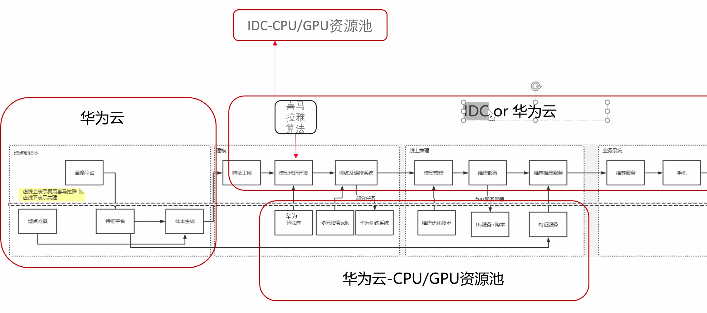
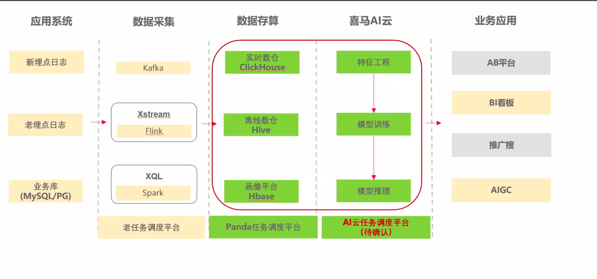
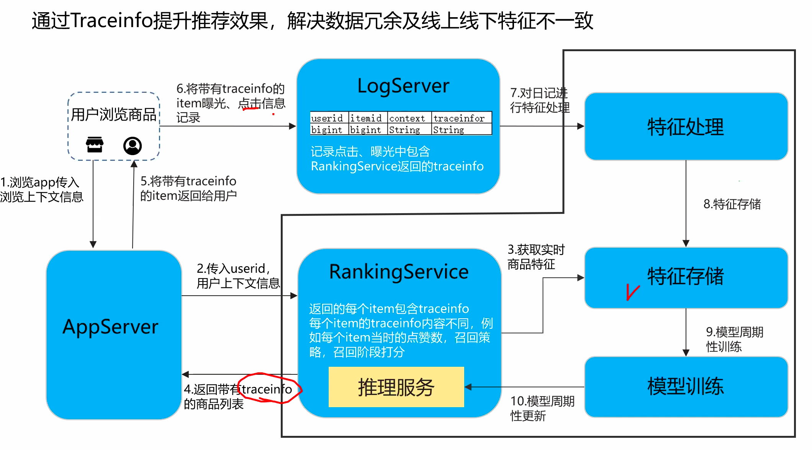
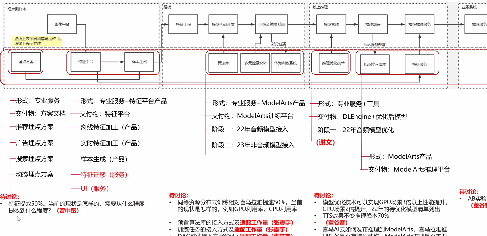
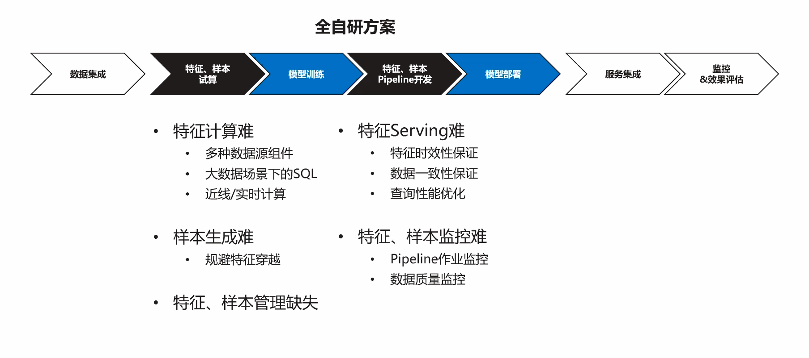
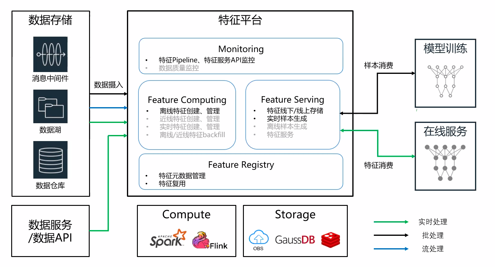
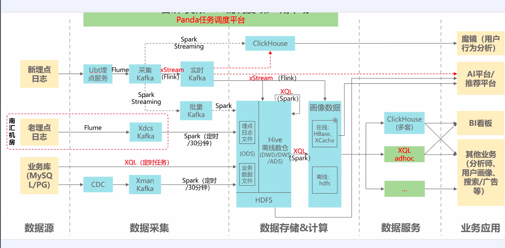
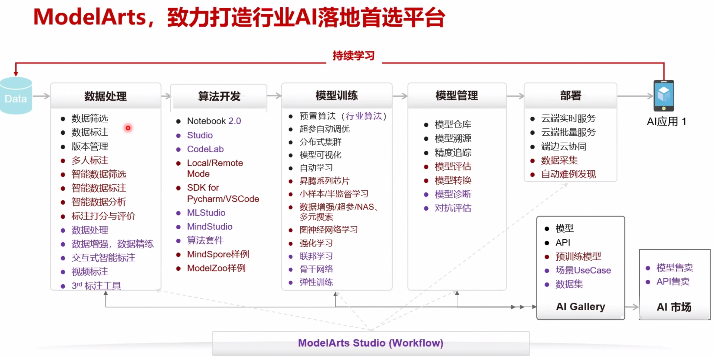

（新词 feature serving）

训练平台（以下全部可以UI + 参数化）
1. 训练输入输出，用某个云存储路径表示
2. 环境 tf/pytorch
3. 算法：自定义/预制算法
4. 超参数
5. 特征处理的配置yaml
6. 资源配置：GPU规格、节点个数（作为env注入到脚本上）

推理平台
1. 推理服务描述： 名称、版本
2. 模型来源
3. 运行配置
4. 部署类型：在线、批量、边缘

创建完了之后，有一个列表，在列表里可以部署，是一个新的页面（支持多版本）

k8s 组件的各个环境的部署文件：http://gitlab.ximalaya.com/geek/doc

beta环境：可以用生产的数据来跑dag, 调度层面（spark 逻辑和调度逻辑都不一样）和生产环境分开, 数据层面是一样的
开发

https://www.processon.com/view/link/609baaca1e08533e429dc9c1

虚拟机开发模式
开发
可以直接在 juypter 写代码。 juypter 运行在容器中，此处的文件目录 用的是共享存储。

然后训练任务后台：http://ops.ximalaya.com/droplet/develop/task  提交

训练
训练任务后台：http://ops.ximalaya.com/droplet/develop/task
给算法工程师用的文档： https://alidocs.dingtalk.com/api/doc/transit?spaceId=2674317761&dentryId=35887741437&corpId=ding51f195092fd77474

算法可以直接在任务管理后台触发任务，也可以由DAG 触发（少数）。

为xxjob套了个壳： 指定类型 + 配置，转换为tfjob/vcjob 等部署

任务类型是pytorch tf 等，资源是一个json ，描述了镜像名、 python文件地址（启动命令即运行这个python文件），多少个实例， cpu、gpu等

http://ops.ximalaya.com/xdl-member-server/web/index.html  人员与团队关系维护

团队与资源queue的关系维护 http://ops.ximalaya.com/xdl-member-server/web/configGroup.html

查看 queue 信息 http://ops.ximalaya.com/xdl-member-server/sys/queue

DAG开发模式
一个模型 抽象为一个 组件（对应一个python 文件） + 一系列参数，算法选择组件和配置参数即可。

整体设计
下图是vivo的设计，喜马也有点像

特征
问题：算法有跟 各个业务数据约定一个统一的格式然后纳入到机器学习嘛？（比如每个用户的性别、画像等） ，或者换个表述，公司这么多数据 转换机器学习为训练、测试样本  有统一规范嘛? 还是说这个事儿交给算法自己去弄，我们只是提供dag 之类的工具把数据流串起来? 基本上是csv，存在hdfs。只是可能因为存储效率、空间等考虑换一个格式，当样本数据的“样子”就是csv，包含列名和数据。

算法只需要准备各种原始id数据，然后去我们统一的画像库join就行了。如果需要的画像数据没有，就找画像团队支持。可以认为，是统一了，只是统一的格式体现在画像库上，特征平台主要是基于 画像库做工作。

原始特征，模型特征（作为训练集）

以age_year为例，表达用户的出生年龄，原始数据是 nulll/00/10/60/70/80/90/95

我可以配置一个规则，让 nulll/00/10/60/70/80/90/95 映射为 0 1 2 3 4 5 6 7 作为一个enum_feature。

enum_feature 是一种对特征转换的简化配置（或者说dsl不用手写了），更复杂的特征转换，需要自定义dsl（raw_feature），确定使用raw_feature 之后，enum_feature 配置就作废了。

对产出的特征，不能对其继续使用dsl 产出新的特征。

除了enum_feature 还有boundary_feature/list_feature/id_feature，描述特征转换还有cross_dsl

特征转换过程（训练由spark NewConfFeatureComponentTask 调用，推理由TfComputerPredict 调用）
val featureConfigs = NewFeatureTransormerformService.getTraormConfig(featureConfInfo)
val arrayOps = FeatureService.generateFeatureByFeatureConfig(featureConfigs, personaValues)
featureTransformerGenerator  = FeatureTransformerFactory.getOrCreate(featureConfigsVal)
new FeatureTransformerGenerator(featureConfigs)
featureTransformer = new NewFifoFeatureTransformer(featureTransformerConfig)    // 来自feature-feature
featureTransformer = featureTransformerGenerator.featureTransformer
featureTransformer.transform(personaValues, globalContext)  // 即NewDefaultFeatureTransformer.transform
NewDefaultFeatureTransformer.normalFeatureCompute
featureEngine.transform(featureContext)                 // DefaultFeatureEngine
FunctionTransform<ArrayOps> .transform
val result = TrainDataSupport.arrayOps2PrettyVal(arrayOps)
核心是 FeatureService.generateFeatureByFeatureConfig

比如 age_year 可选值 "NULL","00","10","60","70","80","90","95" 将其转换为 0123 这种

有两种函数，一种是脚本函数（带main函数，其实也是像普通函数一样执行）， 一种是算子函数。一种是解释执行，一种是Java的编译执行。
def meta(){
initArray(1,0)
}
def main(){
raw = x("user_device_age_year")
a = if(raw.eq(""), "NULL", raw)
b = array("NULL","00","10","60","70","80","90","95")
d = index(b,a)
e = if(d.lt(0), 0, d)
array(e)
}

王胜当时在recsys-lang 项目中，写了一个词法、语法解析器（https://github.com/sirthias/parboiled2，runs at compile time and translates a grammar rule definition (written in an internal Scala DSL) into corresponding JVM bytecode.），每一个单词对应一个FuncTransform，比如getColumnValue 对应 PersonaValuesFunctions.GetColumnValueFunc。

每一个FuncTransform 对应一个FuncTransformFactory（负责创建FuncTransform实例）， 在启动的时候会被注册到 ExecuteScriptContext.Map<String, FuncTransformFactory>（遍历所有实现了 FuncTransform 接口的类）。也就说 给一个 名字（比如getColumnValue ）就能拿到一个FuncTransform 实例。

FunctionalParser.parseText 会对上述脚本（自定义def meta和 def main）进行解析，meta 和 main 都会对应一个 ScriptFuncTransform（封装了ScriptFunction），同时将meta 和 main 函数下的 “单词”对应的FuncTransform 添加到 ScriptFunction.statements 中。也就是说：根据文本解析到 meta 和 main 针对这些“单词”的关系，并将这个关系转换成 ScriptFunction和FuncTransform 的包含关系。

以main的运行为例，ScriptFuncTransform.transform ==> doTransform ==> ScriptFunction.callUDF ==> 遍历并执行ScriptFunction.statements 中每一个 statement/FuncTransform 的transform 方法。整个过程，就是为了 根据 的def main 这段dsl，构建类实例之间的关系，用ScriptFuncTransform.transform 代替里main 函数的运行。有点像tf的 op 算子，顶层只是一个opName 构成的graph，底层一个op 对应一段c++ kernel代码，然后tf 负责串起来op kernel 执行(包括提供上下文一类的)。其实这个dsl 用json 描述也是可以的，用类似代码的方式来描述可读性更好些，表现力也更强大，但实现上就需要用复杂的ast 解析工具了，从这个视角看，不一定有用json 来描述好。

public class DefaultFeatureEngine implements FeatureEngine {
private FeatureConfig featureConfig;
private FunctionTransform<ArrayOps> dataFunctionInvoke;
public DefaultFeatureEngine(FeatureConfig featureConfig) {
this.featureConfig = featureConfig;
parsing();
}
// featureEngine 对 dsl代码进行解析
public void parsing() {
ParsingResult parsingResult = FunctionalParser.parseText(featureConfig.getScript(), featureConfig.getExecuteScriptContext());
featureConfig.setExecuteScriptContext(parsingResult.resolveScriptContext());

    FuncTransformFactory<Void> factory = featureConfig.getExecuteScriptContext().findInContext("setup");
    if (factory != null) {
      invokeFunction(factory);
    }

    FuncTransformFactory<RandomAccessArray> metaFactory = featureConfig.getExecuteScriptContext().findInContext("meta");
    Preconditions.checkNotNull(metaFactory);
    this.metaData = invokeFunction(metaFactory);

    FuncTransformFactory<ArrayOps> dataFactory = featureConfig.getExecuteScriptContext().findInContext("main");
    assert factory != null;
    dataFunctionInvoke = dataFactory.create(TMetas.begin());
    dataFuncSpec = dataFactory.getFuncSpec();
}
public ArrayOps transform(FeatureContext featureContext) {
return dataFunctionInvoke.transform(featureContext);
}
}
对应到上述到代码，启动是parsing 一下dsl，得到一个 ScriptFuncTransform赋值给dataFunctionInvoke。干活的时候 DefaultFeatureEngine.transform 即对应main 方法的执行。

离线转换
分为新老版本两类

问题：老的特征组件接受不同的输入，如何根据输入拿到对特征的dsl 并进行转换

可以看到，老的特征组件，直接根据输入列 写转换dsl 就行了。相当于每个dag 特征组件都要自己写？复用性略差？

新的特征转换

点击特征配置——绑定输入列

deviceId/uid/albumId  作为原始输入  对应的都有哪些特征，特征标记了自己属于哪个domin user  device 还是album，特征的数据来源可能是画像、用户的播放记录，然后可以选择使用哪些特征，比如有uid 就可以拿到 domain=user的所有特征

这个时候，特征转换 更多像 根据上游输入列，筛选输入列可以查到的特征，特征交给特征平台管理后，使用时直接筛选就可以。

在线转换

原始输入是uid/deviceId/albumId ，之后根据模型配置信息找到绑定的画像数据，之后进行dsl 转换，每一步都加有缓存。

目前每个模型级别已经做了获取画像的缓存，来减少调用画像的耗时。从算法侧了解到，其实大部分画像的更新频率并不高，完全可以对需要的特征进行缓存，从而减少特征转换的耗时。

在之后排序过程中，一个用户在一次排序过程中，会依次调用多个模型，而这些模型里面，存在着大量相同的特征，因此在第一次模型计算后，缓存这次请求的特征计算结果，在后续的模型调用过程中就可以大量复用特征计算的结果，从而减少耗时。
模型

模型文件保存在hdfs上

模型可以选择相应的部署配置

“模型在线服务”即对应“在线服务”，db 内部有表来负责关联（deploy_service_provider），页面没有做。

组件机制

xxRunner 负责触发、停止、查询状态
1. spark 会使用yarn Client提交spark任务， 会对应一个 xx.scala 文件（spark任务代码），描述这个组件做了什么，用户只需要配置这个spark 任务的参数即可。
2. 训练组件 会发送rpc 提交训练任务，一个模型一个组件，一个模型对应一个docker镜像文件，用户只需要配置这个模型的参数即可。

如何运行

很多任务，算法连代码都不用写了，全部抽象为dag图，图由组件构成，前提是指定几个规范
1. 输入配置：组件上下游数据约定规范
2. 训练参数：包含超参数、模型参数、优化器参数、训练参数、输出模型配置等。
   a. 有超参数、模型参数、优化器参数，train_script.py 基本就确定了。
   b. 有训练参数，就可以触发训练任务了
3. 高级：还没懂

这与tensorflow2 中高级api代码的思路基本一致，基本上都是参数了。
# 定义模型结构和模型参数
model = tf.keras.models.Sequential([
# 输入层28*28维矩阵
tf.keras.layers.Flatten(input_shape=(28, 28)),
# 128维隐层，使用relu作为激活函数
tf.keras.layers.Dense(128, activation='relu'),
tf.keras.layers.Dropout(0.2),
# 输出层采用softmax模型，处理多分类问题
tf.keras.layers.Dense(10, activation='softmax')
])
# 定义模型的优化方法(adam)，损失函数(sparse_categorical_crossentropy)和评估指标(accuracy)
model.compile(optimizer='adam',
loss='sparse_categorical_crossentropy',
metrics=['accuracy'])

# 训练模型，进行5轮迭代更新(epochs=5）
model.fit(x_train, y_train, epochs=5)
# 评估模型
model.evaluate(x_test,  y_test, verbose=2)

训练参数

高级

组件有组件管理，组件对应模板还有模板管理。不同的组件  配置项很不一样
输入输出

组件输入

组件输出

相同的类型可以连线

比如上游组件将数据准备好之后（parquet格式），写入hdfs，将hdfs路径传给 训练组件，训练组将从hdfs 读取parquet 转为dataset 格式 。一个已离职员工之前搞的一个tfdata 项目http://gitlab.ximalaya.com/jingxiang/tfdata/blob/master/dataset/execute.cpp。
组件模板管理
组件与组件有区别，有共性，共性的部分交给模板，区别有两种
1. 参数名啥的都不同，这个交给具体的组件自定义，对应“编辑组件”有“组件参数配置”
2. 参数名相同，但是配置不同。这个可以交给模板。
   a. 用户可见
   b. 用户不可见

dag 由一个工作流系统管理组件，一个组件对一个任务，可以触发、查询状态、中止等等，具体到触发，肯定要传一系列参数，这个参数有可见有不可见的，有和其它组件共用的，有自己独特的。为了延续性，还有版本一说。 第一版实现糙一点的，可以直接是一个复杂json，后续可以慢慢ui化，加入组件管理等等。
训练任务的组件模板

控制器 TensorflowTaskControllerServiceV2 对应一个java类，可以获取到整个组件模板的配置，进而提交任务。

组件模板配置用于 创建组件时， 组件会有一个“组件模板配置”为它赋值。

组件通用参数配置，包含
1. 运行环境配置（即训练任务配置）
2. 输入点，接入上游组件数据
3. 输入配置
4. 输出点，输出到下游组件数据
5. 参数配置（即模型参数配置）

这个组件通用参数配置 可以被组件覆盖，对应“编辑组件”的“组件参数配置”，结构也是properties(inputPoint/input/outputPoint/params)。

spark任务组件模板

组件管理
组件有版本

建议先看下 工作流组件 的整体设计，https://mp.weixin.qq.com/s/P57XYUnxE2gxA8VIBzX-TQ
对工作流组件涉及的一般问题有所了解。这里简单列举一些比较常见的功能特性：
● 配置即代码
● 扩展市场丰富
● 可视化编辑
● 支持嵌套流水线
● 灵活的执行策略，支持 OnPush / OnMerge 等触发策略
● 支持工作流优先队列
● 多维度的重试机制
● 定时流水线及定时补偿功能
● 动态配置，支持“值”和“文件”两种类型，均支持加密存储，确保数据安全性
● 上下文传递，后置任务可以引用前置任务的“值”和“文件”
● 开放的 OpenAPI 接口，方便第三方系统快速接入

组件之间可以设置弱依赖，比如 A 弱依赖B，则B运行失败后，不影响A的运行。
https://alidocs.dingtalk.com/i/nodes/qXomz1wAyjKVXOzrb22EW3Y9pRBx5OrE?dontjump=true&navQuery=spaceId%3DY7kmb5aDlk7gXLq2&iframeQuery=utm_source%3Dportal%26utm_medium%3Dportal_space_file_tree&subNav=Y7kmb5aDlk7gXLq2&nav=spaces

接口查看

http://cms.9nali.com/recsys-droplet-backend-new/jobadmin/v2/dag/query/$dagname/$historyId

后端实现 是  DagController.getRunningJobDAG，返回 DagRunningConfig（由ModelBuilder.Job 和 ModelBuilder.Task 拼装而成）

以
http://cms.9nali.com/recsys-droplet-backend-new/jobadmin/v2/dag/query/guessYouLikeRankModelV2_realtime_v2/1658297680278 为例

dag 效果

接口返回值

一个task 对应一个组件，runningId即historyId，每一个组件都有 inputDataset/outputDataset/optimizeArguments/extendInfo/dagArguments/trainArguments/dependOnTasks/checkParam 等属性，只是不同组件 的具体配置不同。

训练任务组件

猜测： 提供一个运行环境镜像， 写一个DCN4CTR.py 即为训练代码，里面使用了一系列参数。

组件通用参数来自组件模板，不能在组件管理中更改。

spark任务组件

比如“特征组件”（根据上游的画像列, 还有特征的dsl逻辑生产feature列。比如上游是xql组件，则特征组件的输出 比 xql 组件的输出多了feature 列）是官方组件，在“组件管理”找不到，直接对应了代码 NewConfFeatureComponentTask.scala。

NewConfFeatureComponentTask spark 任务的执行特征转换

def main(){
val conf = new SparkConf()   // 提交任务时会传递一些env信息，sparkConf 初始化时，会从env中获取。
构建http请求，获取ComponentConfig
用户数据中包含input数据hdfs地址，特征列，特征值等信息
处理
处理完成后，保存到hdfs上，输出文件地址通过http 更新
}

数据组件（大部分是spark）

新更新专辑组件 和  历史全量专辑封面  都是一个XQL组件。

数据集组件，用户使用文档 https://alidocs.dingtalk.com/api/doc/transit?spaceId=2674317761&dentryId=34939900435&corpId=ding51f195092fd77474

先有一个数据集管理 http://ops.ximalaya.com/droplet/dataset/data

数据集主要是为了规范用户使用，方便多个用户复用，在阿里，任务直接的依赖都是通过hive表来关联的，任务的输入和输出都必须是一个数据集/hive表，数据集A 经过一个taskA 得到数据集B，那么另一个用户发现数据集B 状态是ok的，就可以直接拿来使用（省得自己重新跑数据）。比如针对用户行为做一些机器学习，可能训练任务有所不同，但都会有一个和画像数据关联的过程，这个过程/数据集其实是可以复用的。
此外，数据集要符合一些约定的格式，比如有的数据集每天都有新增数据，训练任务可以按照约定的格式选取特定分区（比如时间段）的数据。

数据可能来自hdfs/ceph/cos，对应 DatasetComponentRunner（AbstractComponentRunner）

数据集和机器学习的关系：比如用户行为 做成一张hive表，然后机器学习平台 读取这个hive 表，聚合画像之类的，做成feature/label 的形式，然后喂给 机器学习任务。或者说，特征工程要为机器学习准备X 和 Y。

数据集组件有以下配置

这个例子中，表示获取的数据是当前时间 前一天的数据。

Hive 中的表对应为HDFS上的指定目录，在查询数据时候，默认会对全表进行扫描，这样时间和性能的消耗都非常大。分区表实际上就是对应一个HDFS文件系统上的独立的文件夹，该文件夹下是该分区所有的数据文件。Hive中的分区就是分目录，把一个大的数据集根据业务需要分割成小的数据集。在查询时通过WHERE 子句中的表达式选择查询所需要的指定的分区，这样的查询效率会提高很多。

分区列（partitionColumn）不是表的某一列（字段），它可以指定任意值，只要查询的时候指定相应的分区键来查询即可。

单值分区 select、范围分区 range

{
"partitionColumn" : "dt,
"valType" : "range",
"start" : "20200102",
"end" : "20200104"
}
{
"partitionColumn" : "dt,
"valType" : "select",
"valList" : ["20200102", "20200103", "20200104"]
}

spark 任务配置

数据集组件的作用就是判断分区数据是否存在，然后把分区的信息存储在输出里面，不执行任务或者脚本。如果分区数据不存在，且用户设置了“缺失分区最大等待时间”，则数据集组件会每隔一段时间检测下，表现在外在就是数据集组件比较耗时。

XQL组件：写一个sql，从数据源中选取数据，得到一个表，比如包含
deviceId    userId    origin_albumId    albumId    searchBeforeLabel    word_vocab    playBeforeLabel    rd    dt

xql组件的输入 包括t1/t2/t3/t4，上游的连接线连中哪一个t，xql 组件便可以从哪一个点获取数据，即作为 select  from 的对象。 对应 XqlComponentRunner（AbstractSparkComponentRunner），对应spark ComponentXqlTask.scala

画像组件： 表与画像表 join，配置join 哪些列（一般为uid 和 deviceid），需要哪些画像，得到一个带有画像的宽表。比如

gender,province,city,xima_age,currentOs,life_state,current_brand,age_year,played_album,search_keywords_realtime,user_short_term_interest_norm
对应 TraitComponentRunner（AbstractSparkComponentRunner），对应spark TraitTask.scala

特征组件：说明说明表的哪些列可以作为特征，对特征列进行处理，并输出特征配置信息
userId    origin_albumId    albumId    word_vocab    rd    dt    null_hp_album_dict_index    feature

得到一个表，包含 label 列（样本数据的y） 和 feature 列（样本数据的x，多维特征按一种格式聚合在一起 形成一个字符串）
训练数据：做一些类似取样的工作。
深度学习代码组件：根据 label 和 feature 进行机器学习

每一个数据组件运行完成后，点击预览可以查看数据，看一下数据处理之后的样子。

组件之间的通信

数据组件A B 的下游是C，那么C 就可以用t1 和 t2 来指代A 和 B，然后写sql 对A和B 的数据进行处理。 目前支持4个输入，如果输入过多，可以加一个数据组件聚合一下，再作为输入。

开发一个Deep ML Component

目前代码都是 tf1.x 没有tensorflow2
ml  dag 组件还是需要算法开发的，有两种方式

1. tfmodel  分支就是官方组件。http://gitlab.ximalaya.com/geek/tfmodel/tree/915fbfb81352fce4aa808c1b5dbb1bb84dda035c   代码必须在 tfmodel 项目的分支里
2. tfjob
   a. 代码可以写在任意项目，但必须 继承 python class Keras_dist_sup，来自 http://gitlab.ximalaya.com/geek/tfjob/blob/v3.1/src/keras_dist_sup.py    项目requirements.txt 包含tfjob库，此时 tfjob 库作为pip 依赖上传到公司库。
   b. 写在tfjob 分支

tfjob 和tfmodel 都是针对tf做的封装，一个是定义流程，一个是封装掉一些通用部分，比如下载和上传数据。屏蔽一些具体细节，比如分布式、保存profile等。
正常一个机器学习训练代码，包含
1. 下载训练数据（可能有一些特别的格式），便将数据转换为tf.dataset
2. 定义模型， 算法仅需定义 model 和 loss 函数即可
3. 开始训练，对于tf 就是session.run; 对于keras model.compile, model.fit
4. 保存checkpoint 保存模型文件

代码写完提交后，在 http://ops.ximalaya.com/droplet/imageManage/image 选择构建，便可以制作镜像

构建的基本逻辑是： 根据git 地址+分支 拿到代码文件，结合基础镜像（也就是框架配置，tensorflow/pytorch/cuda）做一个镜像出来。 镜像名为 harbor.ximalaya.local/xdl/git项目名_序号: commit
tfjob

上图实例代码在 http://gitlab.ximalaya.com/taoyun/all-rerank/blob/dev_ly_test/album_candidate/lytest/hp_udr_train_v2_1.py

Keras_dist_sup.run ==> 简单场景 OneGpuOneWork
class UDROL(Keras_dist_sup):
def do_execute_graph:
def do_run:
def do_last:
if __name__ == "__main__":
print(tf.__version__)
model = UDROL()
model.run()

算法只要实现 do_execute_graph 等方法就可以

class OneGpuOneWork(Execute):
def __init__(self, context):
super().__init__(context)

    def execute(self, do_execute_graph, do_run, do_last, do_apply_gradients, do_load, do_predict):
        gradients_and_op, op, dnn = do_execute_graph(0)
        re = do_apply_gradients(gradients_and_op, op, 0)
        init = tf.global_variables_initializer()

        config = tf.ConfigProto()
        config.gpu_options.allow_growth = True
        config.gpu_options.visible_device_list = "0"
        sess = tf.Session(config=config)
        if self.context.load_model:
            sess = do_load()
        else:
            sess.run(init)
        if self.context.predict:
            do_predict(sess)
        else:
            do_run(sess)
        do_last(sess)

Keras_dist_sup 在初始化时
1. 创建 context，
   a. 存参数：context 就是把 从env、TF_CONFIG 拿到的数据转为 字段方便后续使用
   b. 存session.run 需要的operation，Context.result，作为Keras_dist_sup  各个函数之间的传参媒介。
2. 创建dataset  self.data =  TensorflowDataset(self.context) ，从context 获取要处理的数据，通过cmd 执行java jar xx 去下载下来，处理，转为dataset

keras 用一个输入张量和输出张量实例化了一个 Model 对象（相当于实现了pytorch中的）

文字版
model = Keras_dist_sup(callback_list=[auc])
self.context = Context()
self.param()
createDir(self.save_local)
self.role()
self.data = TensorflowDataset(self.context)
NewData.__init__
model.run()
OneGpuOneWork
do_execute_graph(0)
user_model, nce_weights = self.model()
user_model = Model(inputs=origin_input, outputs=user_output)
input_data = self.data.tensorflow_data_pre()
input, label = self.do_pre_data(input_data)
cost = self.loss(label, user_vec, nce_weights)
op = self.optrimizer(cost)
grads_and_vars = op.compute_gradients(cost)
if idx == 0:
self.context.put("model", user_model)
result["cost"] = cost
result["label"] = label
result["nce_weights"] = nce_weights
self.context.result[idx] = result
do_apply_gradients
train_op = op.apply_gradients(grads_and_vars)
self.context.result[idx]["train_op"] = train_op
init = tf.global_variables_initializer()
sess = tf.Session(config=config)
sess.run(init)
do_run(sess)
while True:
res = sess.run(self.context.result)
do_last(sess)
if self.context.is_chief:
self.model_save(sess, self.context.get("model"), self.context.save_type, self.context.model_dir)
if self.context.checkpoint:
self.checkpoint_model_save(sess)
self.context.do_up_file()

tfmodel

继承 KerasRecModel，自定义user_model 方法进行扩展

文字版
job = KerasRecModel()
self.context = Context()
self.prepare_job_params()    // 从job_params_ 获取model_dir/summary_dir/ckpt_path
self.prepare_tf_params()    // 准备tensorflow相关参数 train_steps/TF_CONFIG
self.prepare_conf_params()    // 获取和解析超参数
self.prepare_input()    // 将输入数据/文件/模型拉取到本地，对数据进行特殊处理conf
self.prepare_output()    // 创建输出文件夹，对model文件夹进行特殊处理
self.prepare_train_params()    // 结合数据量对训练参数进行调整,仅调整steps_per_epoch
self.summary_params()    // print 一下参数
job.run()
sess = tf.Session(config=config)
self.prepare_data()    // 将输入数据进行特殊处理成DataSet赋值给 self.train_data
m = load_model() or user_model()
weight, loss = self.user_loss()
m.compile(optimizer=self.user_optimizer(),loss=loss,loss_weights=weight,metrics=metrics)
init = tf.group(tf.global_variables_initializer(),tf.local_variables_initializer())
sess.run(init)
m.fit(...)
self.context.do_model_save(sess, m)    // 将模型按约定保存成多种形式
job.finish()
self.context.finish()    // 按约定进行训练结果的数据同步

代码提交后，构建镜像 http://ops.ximalaya.com/droplet/imageManage/image

然后根据镜像创建组件

在dag中使用

https://mp.weixin.qq.com/s/v8HqeR7UYFs4Ex5p5tFyVQ TensorNet的改动，从上面的例子可以看出，TensorNet版的wide-deep相较于TensorFlow原生版的主要由如下5个改动：

1. 分布式训练strategy改为了tn.distribute.PsStrategy()。
2. 将sparse特征的feature column统一使用tn.feature_column.category_column适配。
3. 将模型的第一层统一使用tn.layers.EmbeddingFeatures替换。
4. 将tf.keras.Model切换为`tn.model.Model。
5. 将optimizer切换为tn.optimizer.Optimizer。

python 的、tensoflow 的框架
1. tfjob/tfmodel 属于流程优化，减少算法人员写的代码
2. TensorNet 属于框架优化，替换掉原有的数据记载、model定义、 优化器，然后在底层进行封装优化。

高级机制

大模型
一般小模型只对部分特征id化（one-hot向量），如果对几千个特征都做id化，那么输入向量和参数就非常大，一般的解决办法是  通过ps 做一下embeding

TensorFlow 大规模稀疏模型异步训练的分布式优化https://mp.weixin.qq.com/s/4Ns4cn_wPQ5DTemILaBglw

原生 TensorFlow 中使用 PS-Worker 模式进行异步训练时，通过开源的 gRPC 通信库进行不同节点之间的数据同步。超大规模稀疏模型训练通常需要几百到上千 Worker 节点，此时开源的 gRPC 通信库性能存在明显的瓶颈。特别是稀疏模型中通常包含上百的特征列，带来了大量的小包通信，而 gRPC 库的小包通信能力比较差。在原生 TensorFlow 分布式框架下，难以进行超大规模的稀疏模型训练。

为什么说大模型训练很难？ https://mp.weixin.qq.com/s/jCPgoRvRtSk5F_nqjvuYzg

您好，hb 是一个gpu集群上稀疏模型同步训练框架：
1. 稀疏模型目前演进的特点是越来越深、越来越大。深体现在算力需求大，需要gpu这样的高算力设备进行训练甚至预测。大体现在模型参数，特别是稀疏模型的embedding部分参数越来越大。
2. 传统上稀疏模型并不是深度学习模型，通常使用parameter server(hog wild)方式异步训练，一开始通常都是自研的ps框架，后来随着模型越来越深，逐步都演进为使用tensorflow这样的深度学习框架的ps训练策略。但随着稀疏数据量的进一步增加，特征种类的进一步增加，模型也越来越深，传统的ps异步训练方式面临着训练规模过大导致收敛困难、成本大幅增加等问题。
3. hb 针对稀疏模型的演进特点，围绕gpu集群的特点进行了训练策略的优化，主要包括：1）基于nccl通过混合并行支持大batch size同步训练；2）优化大batch size同步训练场景下的io、通信开销；3）针对gpu的特点提供显存控制、性能优化的训练策略；4）为部分关键算子提供大batch size下的优化算子
4. HB架构下就没有PS的概念，worker上来处理embedding的存储和更新。ps 和 hb 架构最主要的区别是，ps 架构的参数放在 ps 节点上，worker和ps直接通过 rpc 进行push/pull。hb架构中参数放在 worker 上：稠密参数 replication 存放，每个 worker 都有副本，梯度更新时进行 allreduce；稀疏参数 partition 存放，每个 worker 只有部分分片，梯度更新时进行 alltoall。allreduce 和 alltoall 都会使用 nccl 进行同步通信，效率较高。

实时
线上的模型版本是v1，新的数据通过flink 灌进来，基于v1 的基础上继续训练，如果效果更好，则升级模型版本v2 部署到线上，如果效果不好，就再训练。

实现（不确定）：训练任务一直在进行，dataset直接接入kafka，凑够一个batch_size 就开训。配置隔一段时间 生成模型文件，更新到推理服务。

https://mp.weixin.qq.com/s/JsWA2hL3AZpbSqqhjEgaSQ
https://mp.weixin.qq.com/s/H4ZAgqtSs2Yz1KG--qvz6w

流式算法跟批算法最大的不同就在于数据的计算量，批算法和流算法的计算模型如下：
1. 批算法：每次使用全量数据计算损失函数和梯度，然后更新模型
2. 流算法：每次使用1条数据计算损失函数和梯度，然后更新模型
   从这个角度来看，因为每次参与训练的数据量变小了，所以对于算法从训练数据稀疏度和数据维度这两给角度来看，有更多的约束和挑战。

https://alidocs.dingtalk.com/i/nodes/3xRN9bGQyw4Jbv42nj1eJzXPADKnorv6?utm_source=dingdoc_doc&utm_medium=dingdoc_doc_plugin_card&nav=spaces&navQuery=spaceId%3DY7kmb5aDlk7gXLq2

训练代码可以参见tfrec  online分支
# 数据准备 说白了就是构建train_spec 和 eval_spec
if ctx.is_online_job:
// 实时训练数据准备
elif ctx.is_offline_job:
// 离线数据准备
else:

estimator = hb.estimator.Estimator(
model_fn=model_fn,
model_dir=output_dir,
config=tf.estimator.RunConfig(
save_checkpoints_steps=save_checkpoint_every_n_step,
keep_checkpoint_max=1),
params=estimator_params(ctx, conf_parser))
hb.estimator.train_and_evaluate(
estimator, train_spec, eval_spec,
eval_every_n_iter=eval_every_n_iter)

实时训练 train_spec 构建
train_spec = tf.estimator.TrainSpec(input_fn=lambda: data_parser.make_stream_dataset(
train_topic, train_group_id, servers, stream_timeout, outlog=True), max_steps=max_step)
核心是 来自 data.py 中 DataGenerator.make_stream_dataset 返回一个以kafka 为基础的数据源。

理解上述代码的核心是理解Estimator 训练过程和 自定义dataset的构建（未完成）