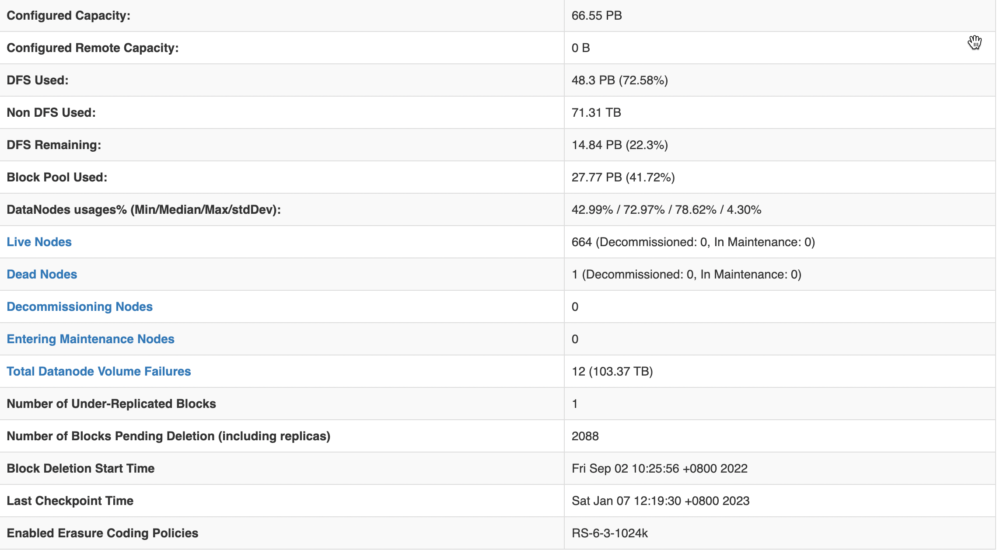
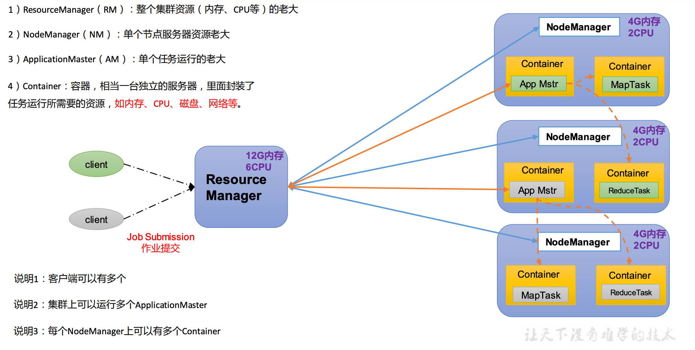
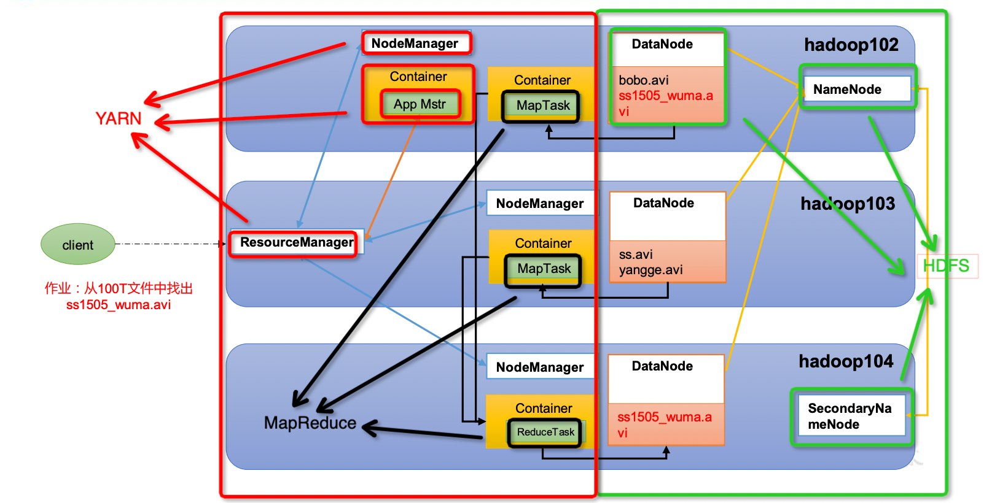
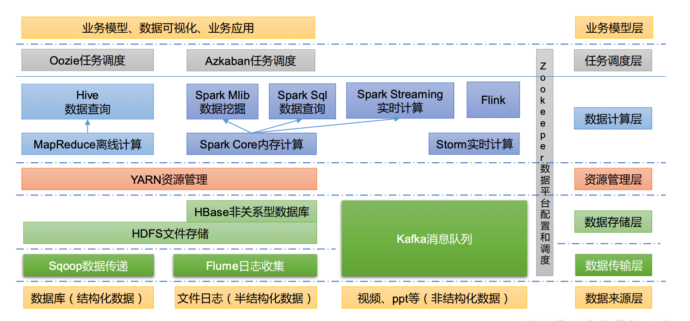
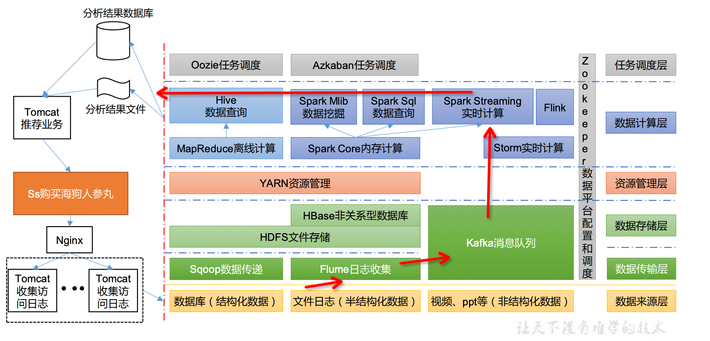
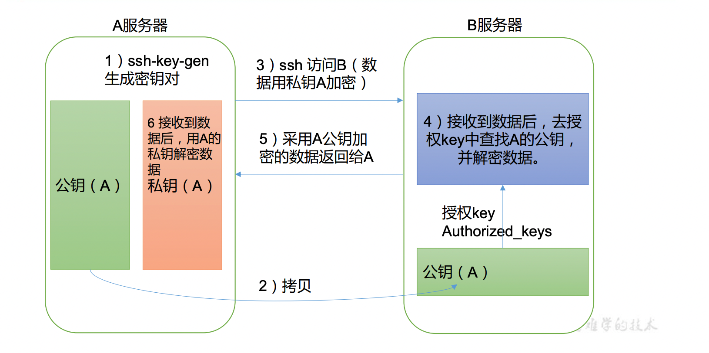
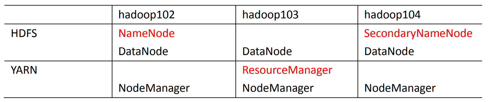

xz*   定义: Hadoop是一个由Apache基金会所开发的分布式系统基础架构.
*   解决问题: **海量数据的存储**和**海量数据的分析计算**问题
*   广义定义: Hadoop通常是指一个更广泛的概念——Hadoop生态圈.
*   优势:
    *   高可靠:多数据副本
    *   高扩展性:在集群间分配任务数据,可方便扩展节点.
    *   高效性:在MapReduce的思想下,Hadoop是并行工作的,以加快任务处理速度
    *   高容错:自动将失败的任务重新分配
*   组成: HDFS分布式存储文件系统, YARN资源调度,MapReduce计算框架,Common辅助工具
    *   HDFS
        *   NameNode(nn):记录每一个文件块存储的位置, 存储文件的元数据,如文件名,文件目录结构,
            文件属性(生成时间、副本数、 文件权限),以及每个文件的块列表和块所在的DataNode等.
            (公司数据: 359,086,651 files and directories, 345,780,887 blocks (345,780,887 replicated blocks,
            0 erasure coded block groups) = 704,867,538 total filesystem object(s). Heap Memory used 136.55 GB 
            of 199.66 GB Heap Memory. Max Heap Memory is 199.66 GB. Non Heap Memory used 143.72 MB of 146.72 MB
            Commited Non Heap Memory. Max Non Heap Memory is <unbounded>.)
            
        *   Secondary NameNode(2nn):每隔一段时间对NameNode元数据备份(用户恢复NameNode节点使用)
        *   DataNode(dn):具体存储数据的位置,在本地文件系统存储文件块数据,以及块数据的校验和(保证数据正确).
            (公司数据: 665个节点)
    *   YARN: 资源管理器,管理cpu和内存
        *   ResourceManager(RM):管理整个集群资源(内存、CPU等)(公司数据:内存17.96T,核7977)
        *   NodeManager(NM):管理单个节点服务器资源(公司数据:节点84)
        *   ApplicationMaster(AM):管理单个任务运行
        *   Container:容器,相当一台独立的服务器,里面封装了任务运行所需要的资源,如内存(至少1g)、CPU(至少1核)、磁盘、网络等.
    
    *   MapReduce: 将计算过程分为两个阶段:Map 和 Reduce 
        *   Map 阶段并行处理输入数据(将多个任务划分到多个节点上)
        *   Reduce 阶段对 Map 结果进行汇总(将多个节点上的计算结果汇总)
    *   三者的关系:
    
        
    *   大数据生态体系
    
        *   Sqoop:Sqoop 是一款开源的工具,主要用于在 Hadoop、Hive 与传统的数据库(MySQL)间进行数据的传递,
            可以将一个关系型数据库(例如 :MySQL,Oracle 等)中的数据导入到 Hadoop 的 HDFS 中, 也可以将 HDFS 的数据导进到关系型数据库中.
        *   Flume:Flume 是一个高可用的,高可靠的,分布式的海量日志采集、聚合和传输的系统,
        Flume 支持在日志系统中定制各类数据发送方,用于收集数据；
        *   Kafka:Kafka 是一种高吞吐量的分布式发布订阅消息系统；
        *   Spark:Spark 是当前最流行的开源大数据内存计算框架.可以基于 Hadoop 上存储的大数据进行计算.
        *   Flink:Flink 是当前最流行的开源大数据内存计算框架.用于实时计算的场景较多.
        *   Oozie:Oozie 是一个管理 Hadoop 作业(job)的工作流程调度管理系统.
        *   Hbase:HBase 是一个分布式的、面向列的开源数据库.HBase不同于一般的关系数据库, 它是一个适合于非结构化数据存储的数据库.
        *   Hive:Hive 是基于 Hadoop 的一个数据仓库工具,可以将结构化的数据文件映射为一张数据库表,并提供简单的 SQL 查询功能,
            可以将 SQL 语句转换为 MapReduce 任务进行运行.其优点是学习成本低,可以通过类 SQL 语句快速实现简单的 MapReduce 统计,
            不必开发专门的 MapReduce 应用,十分适合数据仓库的统计分析.
        *   ZooKeeper:它是一个针对大型分布式系统的可靠协调系统,提供的功能包括:配置维护、名字服务、分布式同步、组服务等.
    *   推荐项目框架
    
        
*   集群环境相关 (本地可以搭建为分布式模式)
    *   公钥私钥原理(A访问B, B不可访问A, B接受A的公钥表明B愿意接受A的访问,公钥加密可用私钥解密,私钥密可用公钥加解密)
    
    *   对于hdfs中的NameNode和Secondary NameNode以及Yarn中的ResourceManager都是非常重要的服务,
        不可以放在同一个机器节点上,分配示例:
    
        *   核心配置文件 core-site.xml
        ```
        <!-- 指定 NameNode 的地址 -->
        <property>
             <name>fs.defaultFS</name>
             <value>hdfs://hadoop102:8020</value>
        </property>
        ``` 
        *   HDFS配置文件 hdfs-site.xml
        ```
        <!-- nn web 端访问地址-->
        <property>
            <name>dfs.namenode.http-address</name>
            <value>hadoop102:9870</value>
        </property>
        <!-- 2nn web 端访问地址-->
        <property>
            <name>dfs.namenode.secondary.http-address</name>
            <value>hadoop104:9868</value>
        </property>
        ``` 
        *   YARN 配置文件yarn-site.xml
        ```
        <!-- 指定 ResourceManager 的地址-->
         <property>
            <name>yarn.resourcemanager.hostname</name>
            <value>hadoop103</value>
         </property>
        ``` 
        *   MapReduce 配置文件mapred-site.xml
        ```
        <!-- 指定 MapReduce 程序运行在 Yarn 上 -->
        <property>
            <name>mapreduce.framework.name</name>
            <value>yarn</value>
        </property>
        <!-- 历史服务器 web 端地址 用于查看程序的历史运行情况-->
        <property>
            <name>mapreduce.jobhistory.webapp.address</name>
            <value>hadoop102:19888</value>
        </property>
        ```

