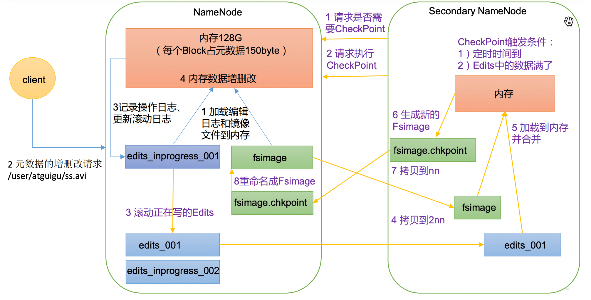

*   概述
    *   定义: 首先HDFS是一个`文件系统`,其次它是`分布式`的
    *   适用场景: 适合一次写入，多次读出的场景。一个文件经过创建、写入和关闭之后就不需要改变。
    *   优点:
        *   高容错性(数据自动保存多个副本。通过增加副本的形式，提高容错性。某一个副本丢失以后，它可以自动恢复。)
        *   适合处理大数据(pb级别存储规模, 百万规模数量文件)
        *   机器廉价
    *   缺点:
        *   不适合低延迟数据访问
        *   无法高效的对小文件进行存储
            *   小文件会占用NameNode大量的内存来存储文件目录和块信息。这样是不可取的，因为NameNode的内存总是有限的(公司NameNode堆内存200G)； 
            *   小文件寻址时间超过读取时间.
        *   不支持并发写入,文件随机修改
*   HDFS组成架构
    *   NameNode（nn）：就是Master，它是一个主管、管理者( active 和 standby (热备, 3.0可配置多个)  高可用机制)
        *   管理HDFS的命名空间；
        *   配置副本策略；(配置某一个文件的副本数量)
        *   管理数据块（Block）映射信息；
        *   处理客户端读写请求。
        *   block位置信息 fsImage 并不存储, namenode启动后由datanode自动上报
        *   DataNode：就是Slave。NameNode下达命令，DataNode执行实际的操作。
        *  存储实际的数据块；
        *  执行数据块的读/写操作。
    *   Client：就是客户端。
        *   文件切分,文件上传HDFS的时候，Client将文件切分成一个一个的Block，然后进行上传；
        *   与NameNode交互，获取文件的位置信息；
        *   与DataNode交互，读取或者写入数据；
        *   Client提供一些命令来管理HDFS，比如NameNode格式化；
        *   Client可以通过一些命令来访问HDFS，比如对HDFS增删查改操作；
    *   Secondary NameNode：(持久化元数据信息方式) 并非NameNode的热备。当NameNode挂掉的时候，它并不能替换NameNode并提供服务。
        *   辅助NameNode，分担其工作量，比如定期合并FsImage和Edits，并推送给NameNode；
        *   在紧急情况下，可辅助恢复NameNode。
*   HDFS文件块大小
    *   说明: HDFS中的文件在物理上是分块存储（Block），块的大小可以通过配置参数(dfs.blocksize）来规定，
        默认大小在Hadoop2.x/3.x版本中是128M，1.x版本中是64M。如果一个文件只有1kb,也需要分配一个128M的block,
        那么多余的空间可以用来存储其他的文件, 一个block是用于寻址的一个最小单元, 也是读取数据的最小单元
        
    *   由上图看出以寻址时间为10ms看block应设置为100M, 所以默认配置为128M, 也即block配置主要与磁盘的传输速率有关,
        对于使用固态硬盘,传输速率在300~400MB/s block配置应该为256M 
        *   结论: HDFS块的大小设置主要取决于磁盘传输速率。
    *   为什么块的大小不能设置太小，也不能设置太大?
        *   HDFS的块设置太小，会增加寻址时间，程序一直在找块的开始位置
        *   如果块设置的太大，从磁盘传输数据的时间会明显大于定位这个块开始位置所需的时间。导致程序在处理这块数据时，
            会非常慢。(寻址时间为传输时间1% 最佳))
            
*   HDFS的读写流程
    
    *   1.客户端通过 Distributed FileSystem 模块向 NameNode 请求上传文件，NameNode 检查目标文件是否已存在，父目录是否存在。
    *   2.NameNode 返回是否可以上传。
    *   3.客户端请求第一个 Block 上传到哪几个 DataNode 服务器上。
    *   4.NameNode 返回 3 个 DataNode 节点，分别为 dn1、dn2、dn3。(考虑因素:节点是否可用, 距离最近,负载均衡)
    *   5.建立通道: 客户端通过 FSDataOutputStream 模块请求 dn1 上传数据，dn1 收到请求会继续调用dn2，然后 dn2 调用 dn3，
        将这个通信管道建立完成。
    *   6.dn1、dn2、dn3 逐级应答客户端。
    *   7.客户端开始往 dn1 上传第一个 Block（先从磁盘读取数据放到一个本地内存缓存）， 以 Packet 为单位，
        dn1 收到一个 Packet 就会传给 dn2，dn2 传给 dn3；dn1 每传一个 packet 会放入一个应答队列等待应答。
        当全部传输完成会返回一个ack,确认后才删除本地的缓存队列中的packet, 如果传输失败,则再次将该packet进行传输.
    *   8.当一个 Block 传输完成之后，客户端再次请求 NameNode 上传第二个 Block 的服务。
*   机架(rack)感知
    -   第一个副本在client所处的节点上, client不在集群里,则随机选择一个节点存放副本,   
        第二个副本在另一个机架的一个随机节点, 第三个副本在第二个副本所在机架的随机节点上
        
        
*   HDFS 读数据流程
    *   选择读节点DataNode有两个因素,一个是距离最近,一个是当前节点的负载情况,block读取过程是**串行读取**,一个一个的读取block
    
    *   （1）客户端通过 DistributedFileSystem 向 NameNode 请求下载文件，NameNode 通过查询元数据，找到文件块所在的 DataNode 地址。
    *   （2）挑选一台 DataNode（就近原则，然后随机）服务器，请求读取数据。
    *   （3）DataNode 开始传输数据给客户端（从磁盘里面读取数据输入流，以 Packet 为单位来做校验）。
    *   （4）客户端以 Packet 为单位接收，先在本地缓存，然后写入目标文件。
        
*   NameNode 和 SecondaryNameNode

    *   第一阶段: 
        *   （1）第一次启动 NameNode 格式化后，创建 FsImage 和 Edits 文件。如果不是第一次启动，直接加载编辑日志和镜像文件到内存。
        *   （2）客户端对元数据进行增删改的请求。
        *   （3）NameNode 记录操作日志，更新滚动日志(更新 edit_improgress_001 文件)。
        *   （4）NameNode 在内存中对元数据进行增删改。
    *   第二阶段：Secondary NameNode 工作
        (通常配置一个小时执行一次 checkpoint, 另一个触发条件可以配置当操作数达到100w次的时候执行 checkpoint)
        *   （1）Secondary NameNode 询问 NameNode 是否需要执行 CheckPoint。
        *   （2）Secondary NameNode 请求执行 CheckPoint。
        *   （3）NameNode 滚动正在写的 Edits 日志(生成 edit_001,),同时创建 edit_improgress_002 用于记录。
        *   （4）将编辑日志(edit_001)和镜像文件(fsImage)拷贝到 Secondary NameNode。
        *   （5）Secondary NameNode 加载编辑日志和镜像文件到内存，并合并。
        *   （6）生成新的镜像文件 fsimage.chkpoint。
        *   （7）拷贝 fsimage.chkpoint 到 NameNode。
        *   （8）NameNode 将 fsimage.chkpoint 重新命名成 fsimage。

*   DataNode 工作机制

    *   （1）一个数据块在 DataNode 上以文件形式存储在磁盘上，包括两个文件，一个是数据本身，
        一个是元数据包括,元数据记录了数据块的长度，块数据的校验和，以及时间戳。
    *   （2）DataNode 启动后向 NameNode 注册，通过后，周期性（6 小时）的向 NameNode上报所有的块信息。
    *   （3）心跳是每 3 秒一次，心跳返回结果带有 NameNode 给该 DataNode 的命令如复制块数据到另一台机器，
        或删除某个数据块。如果超过 10 分钟没有收到某个 DataNode 的心跳， 则认为该节点不可用。
    *   （4）集群运行中可以安全加入和退出一些机器。
    
*   数据完整性(通过crc计算和校验位是否一致)

    
*   总结:

    
*   安全模式 :上报和元数据不一致时回触发安全模式

*   hadoop2.x hdfs联邦设计:
    -   设计了多个互相独立的名称节点 ,试hdfs的命名服务可以水平扩展,这些 nameNode分别进行各自命名空间和块管理, 所有namenode节点共享所有数据节点存储资源 每个数据节点需要想所有的namenode节点注册

