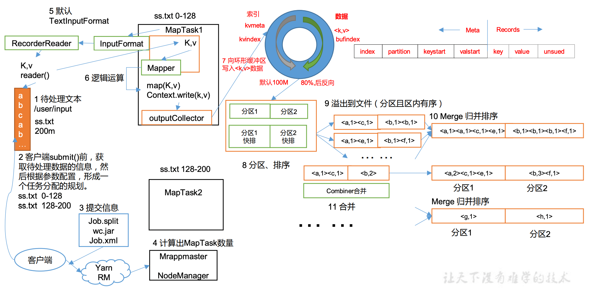
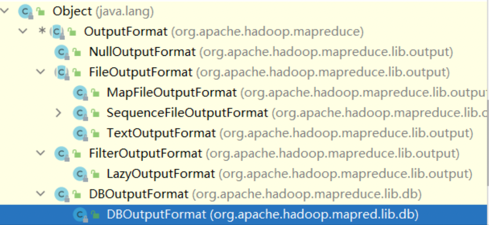

# 概述
*   定义:分布式运算程序的编程框架,核心功能是将用户编写的**业务逻辑代码**和**自带默认组件(MR提供的组件)**
    整合成一个完整的分布式运算程序，并发运行在一个 Hadoop 集群上.
    *   优点:
        *   良好的扩展性(增加机器来扩展它的计算能力),
        *   高容错性(其中一台机器挂了，它可以把上面的计算任务转移到另外一个节点上运行，不至于这个任务运行失败),
        *   适合 PB 级以上海量数据的离线处理
    *   缺点:
        *   不擅长实时计算,不擅长流式计算(输入数据集是静态的，不能动态变化),
        *   不擅长 DAG(有向无环图)计算(多个应用程序存在依赖关系，后一个应用程序的输入为前一个的输出.在这种情况下， 
            MapReduce 并不是不能做，而是使用后，每个 MapReduce 作业的输出结果都会写入到磁盘， 会造成大量的磁盘 IO，导致性能非常的低下.)
*   MapReduce 核心思想
`
    *   图中**分区**十分重要,数据所在的分区决定了后面进入对应的reduceTask
*   MapReduce 进程(一个完整的 MapReduce 程序在分布式运行时有三类实例进程)  
    MapReduce是进程级别的, 对应spark则是线程级别(spark通过线程池管理, 减少了开辟线程的开销)
    *   MrAppMaster:负责整个程序的过程调度及状态协调.
    *   MapTask:负责 Map 阶段的整个数据处理流程.
    *   ReduceTask:负责 Reduce 阶段的整个数据处理流程.
#   Hadoop 序列化
*   序列化:是把内存中的对象，转换成字节序列(或其他**数据传输协议**)以便于存储到磁盘(**持久化**)和**网络传输**.
*   反序列化:将收到字节序列(或其他数据传输协议)或者是磁盘的持久化数据，转换成内存中的对象.
*   序列化作用: 一般来说，“活的”对象只生存在内存里，关机断电就没有了.而且“活的”对象只能由本地的进程使用，
    不能被发送到网络上的另外一台计算机.然而序列化可以存储“活的” 对象，可以将“活的”对象发送到远程计算机.
*   Java 的序列化是一个重量级序列化框架(Serializable)，一个对象被序列化后，会附带很多额外的信息
    (各种校验信息，Header，继承体系等)，不便于在网络中高效传输.所以， Hadoop自己开发了一套序列化机制(Writable).
*   Hadoop序列化特点:(1)紧凑:高效使用存储空间.(2)快速:读写数据的额外开销小.(3)互操作:支持多语言的交互
#MapReduce 框架原理(InputFormat,Shuffle,OutputFormat)

##InputFormat 数据输入
*   切片与 MapTask 并行度决定机制
*   问题: MapTask 的并行度决定 Map 阶段的任务处理并发度，进而影响到整个 Job 的处理速度.
    思考:1G 的数据，启动 8 个 MapTask，可以提高集群的并发处理能力.那么 1K 的数据，也启动 8 个 MapTask，会提高集群性能吗?
    MapTask 并行任务是否越多越好呢？哪些因素影响了 MapTask 并行度？
*   MapTask 并行度决定机制
    *   数据块:Block 是 HDFS 物理上把数据分成一块一块.**数据块是 HDFS 存储数据单位**.
    *   数据切片:数据切片只是在**逻辑上对输入进行分片**，并不会在磁盘上将其切分成片进行存储.
        **数据切片是 MapReduce 程序计算输入数据的单位**，**一个切片会对应启动一个 MapTask**.
    *   切片机制:
        *   一个Job的Map阶段并行度由客户端在提交Job时的切片数决定
        *   每一个Split切片分配一个MapTask并行实例处理
        *   默认情况下，切片大小=BlockSize(减少节点间的通信)
        *   每一个文件单独切片(与任务总体文件无关, 只与单个文件所在的block有关)
###FileInputFormat 实现
*   思考:在运行 MapReduce 程序时，输入的文件格式包括:基于行的日志文件、二进制格式文件、数据库表等.那么，针对不同的数据类型，
    MapReduce 是如何读取这些数据的呢？ FileInputFormat 常见的接口实现类包括:**TextInputFormat**、KeyValueTextInputFormat、
    NLineInputFormat、**CombineTextInputFormat** 和自定义 InputFormat 等.
    *   TextInputFormat(默认的 FileInputFormat 实现类.按行读取每条记录.
        键是存储该行在整个文件中的起始字节偏移量，为LongWritable 类型.值是这行的内容，
        不包括任何行终止符(换行符和回车符)，Text 类型.)
    *   CombineTextInputFormat
        *   提出原因:框架默认的 TextInputFormat 切片机制是对任务按文件规划切片，不管文件多小，都会是一个单独的切片，
            都会交给一个 MapTask，这样如果有大量小文件，就会产生大量的MapTask，处理效率极其低下.
        *   应用场景:CombineTextInputFormat 用于小文件过多的场景，它可以将多个小文件从逻辑上规划到 一个切片中，
            这样多个小文件就可以交给一个 MapTask 处理.
        *   虚拟存储切片最大值设置:CombineTextInputFormat.setMaxInputSplitSize(job, 4194304);// 4m
        *   切片机制(生成切片过程包括:虚拟存储过程和切片过程二部分.对于切片过程, 
            如果合并文件后依然小于切片最大值会继续与下一个虚拟存储文件合并)

##MapReduce 工作流程

*   提交信息: 数据分片(Job.split),执行源码jar包(WC.jar),job配置(Job.mxl)
*   环形内存缓冲区:数据写满80%时,反向执行
*   Shuffle 过程从第 7 步开始到第 16 步

##Shuffle 机制
*   Map 方法之后，Reduce 方法之前的数据处理过程称之为 Shuffle.(下图与上图部分重复)

*   **Partition分区** : 分区数量应该和RedcuceTask数量保持一致(个人理解)
    *   问题引出:要求将统计结果按照条件输出到不同文件中(分区).比如:将统计结果按照手机 归属地不同省份输出到不同文件中(分区)
    *   默认 Partitioner 分区
        ```java
           public int getPartition(K key, V value, int numReduceTasks) {
                return (key.hashCode() & Integer.MAX_VALUE) % numReduceTasks;
           }
        ```
    *   自定义:继承Partitioner，重写getPartition()方法
    *   分区总结:
        *   如果 ReduceTask 的数量> getPartition 的结果数，则会多产生几个空的输出文件 part-r-000xx ；
        *   如果1< ReduceTask 的数量< getPartition 的结果数，则有一部分分区数据无处安放，会 Exception；
        *   如果 ReduceTask 的数量=1，则不管 MapTask 端输出多少个分区文件，最终结果都交给这一个 ReduceTask，
            最终也就只会产生一个结果文件 part-r-00000;(此时不执行分区过程)
        *   分区号必须从零开始，逐一累加.
*   WritableComparable 排序
    *   MapTask和ReduceTask均会对数据**按照key**进行排序.该操作属于Hadoop的默认行为.(key必须支持排序,否则会报错)
        任何应用程序中的数据均会被排序，而不管逻辑上是否需要.(reduce阶段相同的key是连续的,可以提高reduce的效率)
    *   默认排序是按照字典顺序排序，且实现该排序的方法是快速排序.
    *   MapTask阶段排序:将处理的结果暂时放到环形缓冲区中，当环形缓冲区使用率达到一定阈值(80%)后，
        再对缓冲区中的数据进行一次快速排序，并将这些有序数 据溢写到磁盘上，而当数据处理完毕后, 它会对磁盘上所有文件进行归并排序.
    *   ReduceTask阶段排序:它从每个MapTask上远程拷贝相应的数据文件，如果**文件大小超过一定阈值**,则溢写磁盘上，
        否则存储在内存中.如果**磁盘上文件数目达到一定阈值**，则进行一次归并排序以生成一个更大文件； 如果内存中文件大小或者数目超过一定阈值，
        则进行一次合并后将数据溢写到磁盘上.当所有数据拷贝完毕后，ReduceTask 统一对内存和磁盘上的所有数据进行一次归并排序.
*   排序种类:
    *   (1)部分排序(使用最多)MapReduce根据输入记录的键对数据集排序.保证输出的每个文件内部有序.(**使用居多**)
    *   (2)全排序 最终输出结果只有一个文件，且文件内部有序.实现方式是只设置一个ReduceTask.
        但该方法在处理大型文件时效率极低，因为一台机器处理所有文件，完全丧失了MapReduce所提供的并行架构(**不推荐使用**).
    *   (3)辅助排序:(GroupingComparator分组) 在Reduce端对key进行分组.应用于:在接收的key为bean对象时，
        想让一个或几个字段相同(全部 字段比较不相同)的key进入到同一个reduce方法时，可以采用分组排序.(**不常用**)
    *   (4)二次排序 在自定义排序过程中，如果compareTo中的判断条件为两个即为二次排序.
*   combiner合并
    *   (1)Combiner是MR程序中Mapper和Reducer之外的一种组件.
    *   (2)Combiner组件的**父类就是Reducer**.
    *   (3)Combiner和Reducer的区别在于运行的位置,Combiner是在每一个MapTask所在的节点运行;
    *   (4)**Combiner的意义就是对每一个MapTask的输出进行局部汇总，以减小网络传输量.**
    *   (5)Combiner能够**应用的前提是不能影响最终的业务逻辑**(如果需要计算平均值之类的操作则不可使用combiner)，
        而且，Combiner的输出kv应该跟Reducer的输入kv类型要对应起来.
##OutputFormat 
*   数据输出:OutputFormat是MapReduce输出的基类，所有实现MapReduce输出都实现了OutputFormat接口. 默认输出格式TextOutputFormat
    
*   自定义OutputFormat:
    *   应用场景:输出数据到MySQL/HBase/Elasticsearch等存储框架中.
    *   自定义OutputFormat步骤
        *   ➢ 自定义一个类继承FileOutputFormat.
        *   ➢ 改写RecordWriter，具体改写输出数据的方法write().
##ReduceTask 并行度决定机制
*   MapTask 并行度由切片个数决定，切片个数由输入文件和切片规则决定.
*   设置 ReduceTask 并行度(个数)ReduceTask 的并行度同样影响整个 Job 的执行并发度和执行效率，但与 MapTask 的并
     发数由切片数决定不同，ReduceTask 数量的决定是可以直接手动设置:  
     ```
        // 默认值是 1，手动设置为 4
        job.setNumReduceTasks(4);
     ```
    
*  注意事项: 
   *   (1)ReduceTask=0，表示没有Reduce阶段，输出文件个数和Map个数一致.
   *   (2)ReduceTask默认值就是1，所以输出文件个数为一个.
   *   (3)如果数据分布不均匀，就有可能在Reduce阶段产生数据倾斜
   *   (4)ReduceTask数量并不是任意设置，还要考虑业务逻辑需求，有些情况下，需要计算全局汇总结果，就只能有1个ReduceTask.
   *   (5)具体多少个ReduceTask，需要根据集群性能而定.
   *   (6)如果分区数不是1，但是ReduceTask为1，是否执行分区过程.答案是:不执行分区过程.因为在MapTask的源码中，
            执行分区的前提是先判断ReduceNum个数是否大于1.不大于1 肯定不执行.(最后的结果都会交给一个reduce过程,分区没有意义)
##Join 应用
*   Reduce Join
    *   Map 端的主要工作:为来自不同表或文件的 key/value 对，打标签以区别不同来源的记录(order和pd).
        然后用连接字段作为key(pid)，其余部分和新加的标志作为value，最后进行输出.
    *   Reduce 端的主要工作:在 Reduce 端以连接字段作为key的分组已经完成，我们只需要在每一个分组当中将那些来源于不同文件的记录
        (在 Map 阶段已经打标志)分开，最后进行合并就 ok 了.
    *   封装bean对象,需要定义一个两张表字段的并集对象,在mapTask输出一个稀疏的表
    *   缺点: **合并的操作是在 Reduce 阶段完成，Reduce 端的处理压力太大，Map节点的运算负载则很低，资源利用率不高，
            且在 Reduce 阶段极易产生数据倾斜.**

    
*   Map Join
    *   使用场景:Map Join 适用于一张表十分小、一张表很大的场景
    *   Map 端缓存多张表，提前处理业务逻辑，这样增加 Map 端业务，减少 Reduce 端数据的压力，尽可能的减少数据倾斜.
    *   实现方式: 采用 DistributedCache
        *   在 Mapper 的 setup 阶段，将文件读取到缓存集合中.
        *   在 Driver 驱动类中加载缓存.
        ```java
        //缓存普通文件到 Task 运行节点.
        job.addCacheFile(new URI("file:///e:/cache/pd.txt"));
        //如果是集群运行,需要设置 HDFS 路径
        job.addCacheFile(new URI("hdfs://hadoop102:8020/cache/pd.txt"));
        ```

                
##数据清洗(ETL)
*   “ETL，是英文 Extract-Transform-Load 的缩写，用来描述将数据从来源端经过抽取(Extract)、转换(Transform)、加载(Load)
    至目的端的过程.ETL 一词较常用在数据仓库，但其对象并不限于数据仓库在运行核心业务 MapReduce 程序之前，往往要先对数据进行清洗，
    清理掉不符合用户要求的数据. 清理的过程往往只需要运行 Mapper 程序，不需要运行 Reduce 程序.
##MapReduce 开发总结
*   1)输入数据接口:InputFormat
    *   (1)默认使用的实现类是:TextInputFormat
    *   (2)TextInputFormat 的功能逻辑是:一次读一行文本，然后将该行的起始偏移量作为 key，行内容作为 value 返回.
    *   (3)CombineTextInputFormat 可以把多个小文件合并成一个切片处理，提高处理效率.
*   2)逻辑处理接口:Mapper用户根据业务需求实现其中三个方法:map() setup() cleanup ()
*   3)Partitioner 分区
    *   (1)有默认实现 HashPartitioner，逻辑是根据 key 的哈希值和 numReduces 来返回一个 分区号；key.hashCode()&Integer.MAXVALUE % numReduces
    *   (2)如果业务上有特别的需求，可以自定义分区.
*   4)Comparable 排序
    *   (1)当我们用自定义的对象作为 key 来输出时，就必须要实现 WritableComparable 接口，重写其中的 compareTo()方法.
    *   (2)部分排序:对最终输出的每一个文件进行内部排序.
    *   (3)全排序:对所有数据进行排序，通常只有一个 Reduce.
    *   (4)二次排序:排序的条件有两个.
*   5)Combiner 合并Combiner 合并可以提高程序执行效率，减少 IO 传输.但是使用时必须不能影响原有的 业务处理结果.
*   6)逻辑处理接口(该部分不熟悉,细节可能需要重看):Reducer 用户根据业务需求实现其中三个方法:reduce() setup() cleanup ()
*   7)输出数据接口:OutputFormat
    *   (1)默认实现类是 TextOutputFormat，功能逻辑是:将每一个 KV 对，向目标文本文件 输出一行.
    *   (2)用户还可以自定义 OutputFormat.

#数据压缩
##概述
*   优缺点: 减少磁盘 IO、减少磁盘存储空间. 增加 CPU 开销.
*   压缩原则:(1)运算密集型的 Job，少用压缩 (2)IO 密集型的 Job，多用压缩
*   压缩算法比较:


*   性能比较

*   snappy(公司默认使用snappy,最近需要改为Gzip):Snappy is a compression/decompression library. 
    It does not aim for maximum compression, or compatibility with any other compression library; instead, 
    it aims for very high speeds and reasonable compression. For instance, compared to the fastest mode of zlib, 
    Snappy is an order of magnitude faster for most inputs, but the resulting compressed files are anywhere from 20% 
    to 100% bigger.On a single core of a Core i7 processor in 64-bit mode, Snappy compresses at about 250
    MB/sec or more and decompresses at about 500 MB/sec or more.
    
*   压缩方式选择:压缩方式选择时重点考虑:压缩/解压缩速度、压缩率(压缩后存储大小)、压缩后是否可以支持切片.
##压缩位置选择
*   压缩可以在 MapReduce 作用的任意阶段启用.


