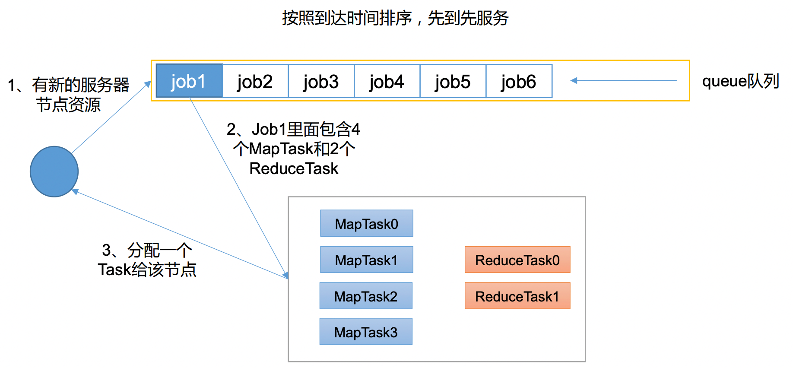
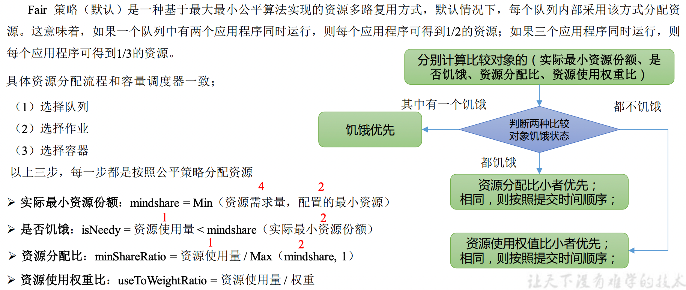

#Yarn 资源调度器
*   定义:Yarn 是一个资源调度平台，负责为运算程序提供服务器运算资源，相当于一个分布式的操作系统平台，
    而 MapReduce 等运算程序则相当于运行于操作系统之上的应用程序。
    
##Yarn 基础架构
*   YARN 主要由 ResourceManager(Scheduler + Application Manager)、NodeManager、ApplicationMaster 和 Container 等组件构成。

    
##yarn HA架构
ResourceManager负责接收客户端的任务请求，接收和监控NodeManager的资源的汇报，负责资源的分配与调度，启动和监控 ApplicationMaster（AM），是集群中单点故障的发生点，RM挂了整个服务也就挂了。借鉴HDFS HA的思想，Yarn的RM也分Active和Standby两种状态。在Active RM机器挂掉后，Standby RM作为备用而提供服务。RM在启动时会通过向ZK的/hadoop-ha目录写一个lock文件，写成功则为Active，否则Standby，Standby RM会一直监控lock文件的是否存在，如果不存在就会尝试去创建，争取为Active RM。Active RM在运行的时候，会将作业信息存储在ZK的/zkrmstore下，并向这个目录写入app信息。当Active RM挂了后，且另外一个Standby RM成为Active RM后，它会从/rmstore中读取相应的作业信息，并重新构建作业信息。然后启动内部服务，开始接收NM的心跳，构建集群资源的信息，并接收客户端的提交作业的请求等。在Yarn HA中，ZKFC自动故障转移作用和HDFS HA中的ZKFC作用类似，监控RM的健康状态，向ZK集群定期发送心跳 ，让自己被选举，当自己被ZK选举时，zkfc进程通过rpc调用让RM转换为active状态。区别在于Yarn HA的ZKFC只作为RM进程的一个线程 ，而非独立的守护进程来启动。

##Yarn 工作机制

*   MRAppmaster 是yarn ApplicationMaster 的一个实现, 每种计算框架都有自己独特的 ApplicationMaster，
    负责与 ResourceManager 协商资源，并和 NodeManager 协同来执行和监控 Container。
    MapReduce 只是可以运行在 YARN 上一种计算框架。
*   （2）client 向 ResourceManager 申请运行一个 Application。
*   （3）ResourceManager 将该应用程序的**资源路径**返回给 YarnRunner。
*   （4）该程序将运行所需资源(job.split 切片控制 maptask 个数, job.xml(配置参数), jar包(程序代码))
    放到**资源路径**上。
*   （5）程序资源提交完毕后，申请运行 mrAppMaster。
*   （6）ResourceManager 将用户的请求初始化成一个 Task,并放入任务调度队列中。
*   （7）其中一个 NodeManager 领取到 Task 任务。
*   （8）该 NodeManager 创建容器 Container，并产生 ApplicationMaster。
*   （9）Container 从 HDFS**资源路径** 上拷贝资源到本地。
*   （10）ApplicationMaster 向 ResourceManager 申请运行 MapTask 资源。
*   （11）ResourceManager 将运行 MapTask 任务分配给另外两个 NodeManager，另两个 NodeManager 分别领取任务并创建容器。
    (MapTask 可能放在同一个 NodeManager 上)
*   （12）ApplicationMaster 向两个接收到任务的 NodeManager 发送程序启动脚本，这两个 NodeManager 分别启动 MapTask(YarnChild 进程)，
    MapTask 对数据分区排序。
*   （13）MrAppMaster 等待所有 MapTask 运行完毕后，向 ResourceManager 申请容器，运行 ReduceTask。
*   （14）ReduceTask 向 MapTask 获取相应分区的数据。
*   （15）程序运行完毕后，MRAppmaster 会向 ResourceManager 申请注销自己,回收资源。
##Yarn 调度器和调度算法
*   Hadoop 作业调度器主要有三种：FIFO、容量（Capacity Scheduler）和公平（Fair Scheduler）。
    Apache Hadoop3.1.3 默认的资源调度器是 Capacity Scheduler。
    
*   先进先出调度器（FIFO）(不支持多队列,生产不使用)

    
*   容量调度器（Capacity Scheduler）(Yahoo)

    *   多队列：每个队列可配置一定的资源量，每个队列采用FIFO调度策略。
    *   容量保证：管理员可为每个队列设置资源最低保证(eg:当总资源不足的时候默认分配10%,20%,15%)和资源使用上限(图中20%,50%,30%)
    *   灵活性：如果一个队列中的资源有剩余，可以暂时共享给那些需要资源的队列，而一旦该队列有新的应用程序提交，
        则其他队列借调的资源会归还给该队列。
    *   多租户： 支持多用户共享集群和多应用程序同时运行。为了防止同一个用户的作业独占队列中的资源，
        该调度器会对同一用户提交的作业所占资源量进行限定。
*   容量调度器资源分配算法

    *   队列资源分配 从root开始，使用深度优先算法，优先选择资源占用率最低的队列分配资源。(总体利益最大)
    *   作业资源分配 默认按照提交作业的优先级和提交时间顺序分配资源。
    *   容器资源分配 按照容器的优先级分配资源；如果优先级相同，按照数据本地性原则：
        *   （1）任务和数据在同一节点
        *   （2）任务和数据在同一机架
        *   （3）任务和数据不在同一节点也不在同一机架
    
*   公平调度器（Fair Scheduler）(FaceBook)

    *   与容量调度器相同点
        *   多队列：支持多队列多作业
        *   容量保证：管理员可为每个队列设置资源最低保证和资源使用上线
        *   灵活性：如果一个队列中的资源有剩余，可以暂时共享给那些需要资源的队列，而一旦该队列有新的应用程序提交，
            则其他队列借调的资源会归还给该队列。
        *   多租户：支持多用户共享集群和多应用程序同时运行；为了防止同一个用户的作业独占队列中的资源，该调度器
            会对同一用户提交的作业所占资源量进行限定。
    *   与容量调度器不同点
        *   核心调度策略不同:
            *   容量调度器：优先选择资源利用率低的队列
            *   公平调度器：优先选择对资源的**缺额**比例大的
        *   每个队列可以单独设置资源分配方式:
            *   容量调度器：FIFO(内存)、 DRF(CPU+内存)
            *   公平调度器：FIFO、FAIR、DRF

*   公平调度器——缺额

        *   公平调度器设计目标是：在时间尺度上，所有作业获得公平的资源。某一时刻一个作业应获资源和实际获取资源的差距叫“缺额” 
        *   调度器会优先为缺额大的作业分配资源

*   公平调度器队列资源分配方式
    *   FIFO策略(略)
    *   Fair策略

        
*   公平调度器资源分配算法
    *   队列资源分配
        *   需求:集群总资源100，有三个队列，对资源的需求分别是：  
            queueA -> 20， queueB ->50， queueC -> 30
        *   第一次算：100 / 3 = 33.33  
                queueA：分33.33 → 多13.33  
                queueB：分33.33 → 少16.67  
                queueC：分33.33 → 多3.33
        *   第二次算： （13.33 + 3.33）/ 1 = 16.66  
                queueA：分20  
                queueB：分33.33 + 16.66 = 50  
                queueC：分30
    *   作业资源分配
        *   不加权（关注点是Job的个数）：
            *   需求：有一条队列总资源12个, 有4个job，对资源的需求分别是:  
                job1->1, job2->2 , job3->6, job4->5
            *   第一次算: 12 / 4 = 3  
                job1: 分3 --> 多2个  
                job2: 分3 --> 多1个  
                job3: 分3 --> 差3个  
                job4: 分3 --> 差2个
            *   第二次算: 3 / 2 = 1.5  
                job1: 分1  
                job2: 分2  
                job3: 分3 --> 差3个 --> 分1.5 --> 最终: 4.5  
                job4: 分3 --> 差2个 --> 分1.5 --> 最终: 4.5
            *   第n次算: 一直算到没有空闲资源
        *   加权（关注点是Job的权重）：
            *   需求：有一条队列总资源16，有4个job 对资源的需求分别是:  
                job1->4 job2->2 job3->10 job4->4
                每个job的权重为:  
                job1->5 job2->8 job3->1 job4->2
            *   第一次算: 16 / (5+8+1+2) = 1  
                job1: 分5 --> 多1  
                job2: 分8 --> 多6  
                job3: 分1 --> 少9  
                job4: 分2 --> 少2  
            *   第二次算: 7 / (1+2) = 7/3  
                job1: 分4  
                job2: 分2  
                job3: 分1 --> 分7/3（2.33） -->少6.67  
                job4: 分2 --> 分14/3(4.66) -->多2.66
            *   第三次算:2.66/1=2.66  
                job1: 分4  
                job2: 分2  
                job3: 分1 --> 分2.66/1 --> 分2.66  
                job4: 分4  
            *   第n次算: 一直算到没有空闲资源
                

