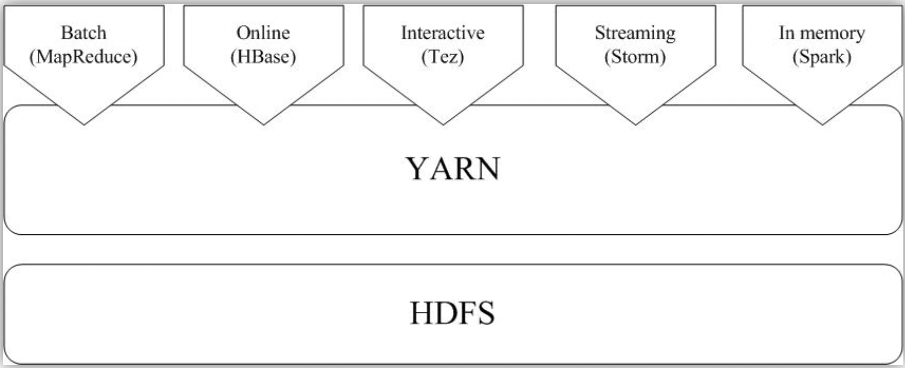

*   本节首先介绍Spark支持的三种典型集群部署方式，即standalone、Spark on Mesos和Spark on YARN；
*   然后，介绍在企业中是如何具体部署和应用Spark框架的，在企业实际应用环境中，针对不同的应用场景，可以采用不同的部署应用方式，
    或者采用Spark完全替代原有的Hadoop架构，或者采用Spark和Hadoop一起部署的方式。

###Spark三种部署方式
Spark应用程序在集群上部署运行时，可以由不同的组件为其提供资源管理调度服务（资源包括CPU、内存等）。比如，可以使用自带的独立集群管理器（standalone）
，或者使用YARN，也可以使用Mesos。因此，Spark包括三种不同类型的集群部署方式，包括standalone、Spark on Mesos和Spark on YARN。
*   standalone模式:与MapReduce1.0框架类似，Spark框架本身也自带了完整的资源调度管理服务，可以独立部署到一个集群中，
    而不需要依赖其他系统来为其提供资源管理调度服务。在架构的设计上，Spark与MapReduce1.0完全一致，都是由一个Master和若干个Slave构成，
    并且以槽（slot）作为资源分配单位。不同的是，Spark中的槽不再像MapReduce1.0那样分为Map 槽和Reduce槽，
    而是只设计了统一的一种槽提供给各种任务来使用。
*   Spark on Mesos模式:Mesos是一种资源调度管理框架，可以为运行在它上面的Spark提供服务。Spark on Mesos模式中，
    Spark程序所需要的各种资源， 都由Mesos负责调度。由于Mesos和Spark存在一定的血缘关系，因此，Spark这个框架在进行设计开发的时候，
    就充分考虑到了对Mesos的充分支持， 因此，相对而言，Spark运行在Mesos上，要比运行在YARN上更加灵活、自然。Spark官方推荐采用这种模式，
    所以，许多公司在实际应用中也采用该模式。
*   Spark on YARN模式:Spark可运行于YARN之上，与Hadoop进行统一部署，即“Spark on YARN”，其架构如图9-13所示，资源管理和调度依赖YARN，
    分布式存储则依赖HDFS。

###从“Hadoop+Storm”架构转向Spark架构
为了能同时进行批处理与流处理，企业应用中通常会采用“Hadoop+Storm”的架构（也称为Lambda架构）。
图中给出了采用“Hadoop+Storm”部署方式的一个案例， 在这种部署架构中，Hadoop和Storm框架部署在资源管理框架YARN（或Mesos）之上，
接受统一的资源管理和调度，并共享底层的数据存储（HDFS、HBase、Cassandra等）。 Hadoop负责对批量历史数据的实时查询和离线分析，
而Storm则负责对流数据的实时处理。

但是，上面这种架构部署较为繁琐。由于Spark同时支持批处理与流处理，因此，对于一些类型的企业应用而言，从“Hadoop+Storm”架构转向Spark架构
就成为一种很自然的选择。采用Spark架构具有如下优点：
*   实现一键式安装和配置、线程级别的任务监控和告警；
*   降低硬件集群、软件维护、任务监控和应用开发的难度；
*   便于做成统一的硬件、计算平台资源池。 
*   需要说明的是，Spark Streaming的原理是将流数据分解成一系列短小的批处理作业，每个短小的批处理作业使用面向批处理的Spark Core进行处理，
    通过这种方式变相实现流计算，而不是真正实时的流计算，因而通常无法实现毫秒级的响应。
    因此，对于需要毫秒级实时响应的企业应用而言，仍然需要采用流计算框架（如Storm）。
  

Hadoop和Spark的统一部署
*   一方面，由于Hadoop生态系统中的一些组件所实现的功能，目前还是无法由Spark取代的，比如，Storm可以实现毫秒级响应的流计算，
    但是，Spark则无法做到毫秒级响应。
*   另一方面，企业中已经有许多现有的应用，都是基于现有的Hadoop组件开发的，完全转移到Spark上需要一定的成本。因此，在许多企业实际应用中，
    Hadoop和Spark的统一部署是一种比较现实合理的选择。
    
由于Hadoop MapReduce、HBase、Storm和Spark等，都可以运行在资源管理框架YARN之上，因此，可以在YARN之上进行统一部署（如图9-16所示）。
这些不同的计算框架统一运行在YARN中，可以带来如下好处：
*   计算资源按需伸缩；
*   不用负载应用混搭，集群利用率高；
*   共享底层存储，避免数据跨集群迁移。
