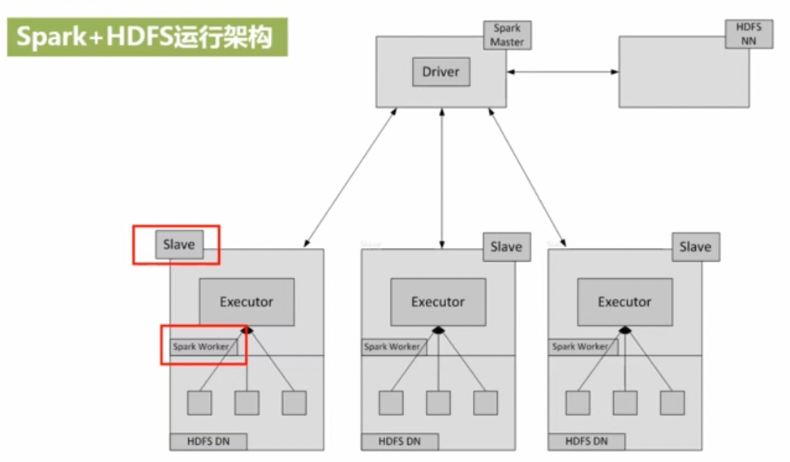
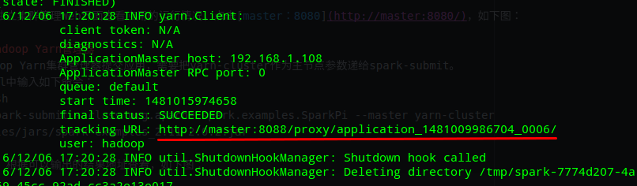
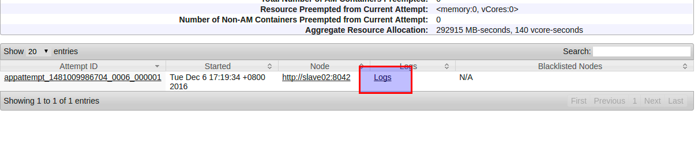
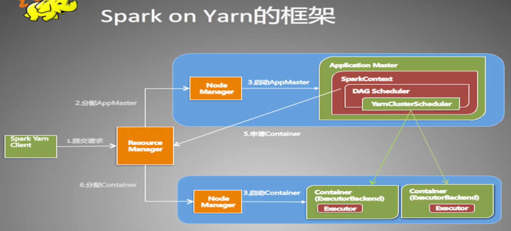

###spark 运行模式


spark-shell命令及其常用的参数如下：
**./bin/spark-shell --master <master-url>**

Spark的运行模式取决于传递给SparkContext的**Master URL**的值。Master URL可以是以下任一种形式：
*   local 使用一个Worker线程本地化运行SPARK(完全不并行)
*   local[*] 使用逻辑CPU个数数量的线程来本地化运行Spark
*   local[K] 使用K个Worker线程本地化运行Spark（理想情况下，K应该根据运行机器的CPU核数设定）
*   spark://HOST:PORT 连接到指定的Spark standalone master(采用自带的集群资源管理器)。默认端口是7077.
*   yarn-client  以客户端模式连接YARN集群。集群的位置可以在HADOOP_CONF_DIR 环境变量中找到。
*   yarn-cluster 以集群模式连接YARN集群。集群的位置可以在HADOOP_CONF_DIR 环境变量中找到。
*   mesos://HOST:PORT 连接到指定的Mesos集群。默认接口是5050。

**yarn-client 模式driver和客户端再同一个节点上,yarn-cluster模式下,客户端直接把任务提交到cluster,由cluster指定节点生成driver**
 

##启动Spark集群

* 首先需启动Hadoop集群
* 启动spark集群

完成后可以有以上多种任务提交方式

###独立集群管理器
* （1）在集群中运行应用程序JAR包向独立集群管理器提交应用，需要把spark：//master:7077作为主节点参数递给spark-submit。
  下面我们可以运行Spark安装好以后自带的样例程序SparkPi，它的功能是计算得到pi的值（3.1415926）。 在Shell中输入如下命令：

```shell
bin/spark-submit --class org.apache.spark.examples.SparkPi --master 
spark://master:7077 examples/jars/spark-examples_2.11-2.0.2.jar 100 2>&1 | grep "Pi is roughly"
```

* （2）在集群中运行spark-shell(也可以用spark-shell连接到独立集群管理器上。)首先做一点准备工作，把一个README.md文件拷贝到HDFS上，
  用于后面的测试。
```shell
cd /usr/local/hadoop/
# 下面这条命令中，我们把spark安装目录下的README.md文件上传到分布式文件系统HDFS的根目录下
bin/hadoop fs -put hadoop fs -put /usr/local/spark/README.md /
```

在Shell中输入如下命令启动进入spark-shell：
```shell
cd /usr/local/spark/
bin/spark-shell --master spark://master:7077
```
可以在spark-shell中输入如下代码进行测试：
```scala
scala> val textFile = sc.textFile("hdfs://master:9000/README.md")
textFile: org.apache.spark.rdd.RDD[String] = hdfs://master:9000/README.md MapPartitionsRDD[1] at textFile at <console>:24
scala> textFile.count()
res0: Long = 99                                                                 
scala> textFile.first()
res1: String = # Apache Spark
```

###Hadoop YARN管理器
* （1）在集群中运行应用程序JAR包 向Hadoop YARN集群管理器提交应用，需要把yarn-cluster作为主节点参数递给spark-submit。
```shell
bin/spark-submit --class org.apache.spark.examples.SparkPi --master yarn-cluster examples/jars/spark-examples_2.11-2.0.2.jar
```

运行后，根据在Shell中得到输出的结果地址查看，如下图：

复制结果地址到浏览器，点击查看Logs，再点击stdout，即可查看结果，如下图：


* （2）在集群中运行spark-shell也可以用spark-shell连接到独立集群管理器上。(这个时候属于yarn-client模式提交任务)
```shell
bin/spark-shell --master yarn
```

在spark-shell中输入如下代码进行测试：
```scala
scala> val textFile = sc.textFile("hdfs://master:9000/README.md")
textFile: org.apache.spark.rdd.RDD[String] = hdfs://master:9000/README.md MapPartitionsRDD[3] at textFile at <console>:24

scala> textFile.count()
res2: Long = 99

scala> textFile.first()
res3: String = # Apache Spark
```
用户在Hadoop Yarn集群管理Web界面查看所有应用的运行情况，可以在浏览器中输入地址进行查看(http://master:8088/cluster)

* spark on yarn 框架图:
