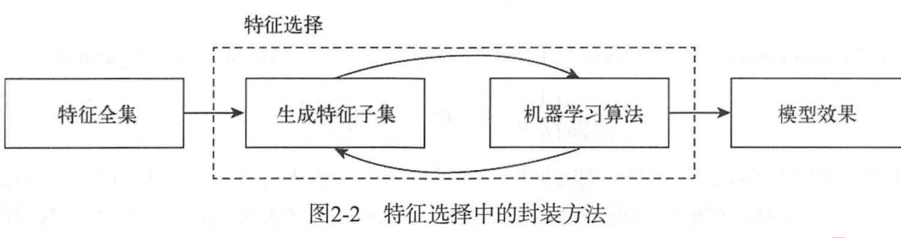
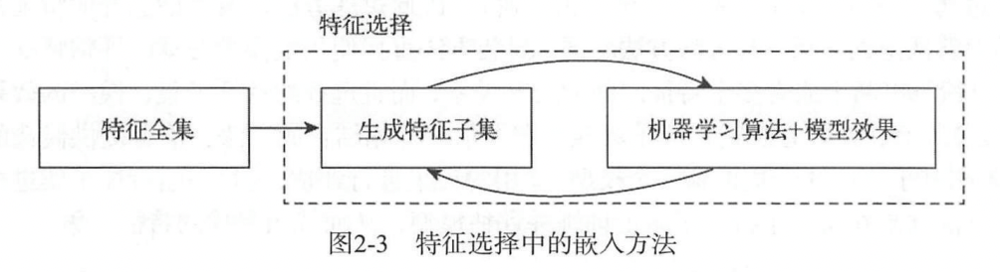
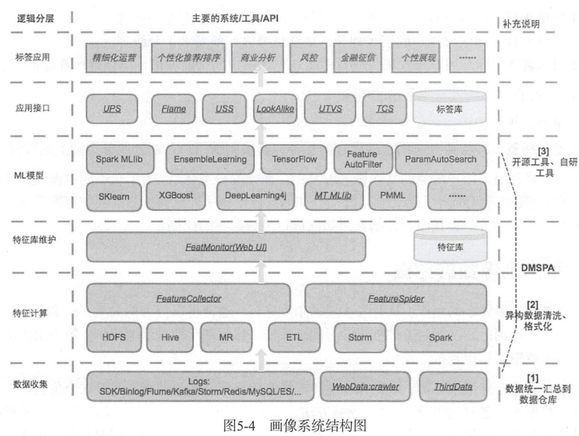

###问题建模
问题建模: 需要明确 **业务指标** 和 **模型预测指标**

评估指标: 线下使用但是 机器学习评估指标,线上使用的是业务指标, 在一个新问题的开始阶段需要探索和业务指标一致的线下指标
使其变化趋势一致 ,否则线下指标没有意义  

指标分类(根据任务类型):分类指标,回归指标,聚类指标,排序指标

样本选择: 从海量数据中识别和选择相关性高的数据作为模型的输入, 在保证最好的结果的基础上,样本越少对应的样本选择策略最优
原因:大量样本消耗计算资源,无关样本对模型无帮助,样本存在噪声

数据去噪:噪声导致样本质量变低,但是可以提升模型的健壮性,所以在去噪时需要权衡模型效果和模型的健壮性

采样:可以克服高维特征和大量数据导致的问题,有助于降低成本,缩短时间,提升效果,一个好的子样本集应具有无偏性(子样本期望和全体样本期望一致)
和小的样本方差

原型选择和训练集选择(暂时未懂)

交叉验证: 分为留出法,k折交叉验证,自助法(应用于样本量少的情况)

###特征工程

大量数据的简单模型胜过少量数据的复杂模型,更多的数据胜过聪明的算法,更好的数据胜过更多的数据

特征工程的前提是收集足够多的数据, 其次是从大量的数据中提取关键信息并表示为模型需要的形式

特征提取:将原始数据空间变换到新的特征空间,或者说换一种数据表达方式,特征提取的目标是对业务精确全面的描述
另外,生产的特征最总用于模型预测,因此需要理解模型和算法,需要清楚模型需要什么样的特征才有精确的预测结果

实向量: 模型和算法要求输入是维度相同的实向量,因此,特征工程首先需要将原始数据转化为实向量

探索性数据分析(特征探索?):在缺少先验知识的条件下探索数据内部结构和规律的一种分析方法或理念  
目的:洞察数据集,发现数据内部结构, 提取重要特征,异常值检查,检验基本假设,建立初步模型

数值特征:考虑因素是大小和分布,是否需要归一化(这个取决于模型对于输入值的敏感程度)

对特征进行交叉组合:特征交叉提升了模型的表达能力,然线性模型具有非线性的性质

常见数值特征处理方式:
-   截断:对于连续特征,可以再保留重要信息的条件下进行阶段,去掉冗余的精度(可能是噪声),对于长尾数据,可以先进行对数转换再进行截断  
-   二值化:对于计数特征,需要考虑使用 原始的计数 还是 仅二值化处理 或者 分桶操作  
-   分桶:如果模型对于特征值大小敏感,而且特征值存在一个较大的数值跨度, 那么对于输入的数值型特征可能需要做分桶处理,
        常见的分桶有固定宽度分桶,数量级分桶, 分位数分桶等  
-   缩放:标准化缩放(线性回归,逻辑回归比较有效,对于输入特征大小敏感),l1范式(向量中各元素绝对值之和),l2范式(向量中各元素平方和开根号)缩放,
        对数缩放(可将长尾变短尾)
    
-   缺失值处理:可以补一个均值或者中位数或者忽略(将缺失值作为一种新型进行编码喂给模型)
-   特征交叉:
-   非线性编码:通过多项式核, 高斯核等
-   行统计量:空值个数, 0个数,正负值个数, 均值,中位数,最大最小是,峰度,偏度

类别特征:性别,是否已婚,籍贯等,可以用数字表示,但是没有实际数学意义,一般进行one-hot编码,分层编码(邮编,身份证等 位数包含信息),
类别特征之间的交叉组合,类别特征和数值特征交叉组合等

时间特征, 空间特征, 文本特征

特征选择: 从特征集合中选一个子集
目的:简化模型,使模型易于被研究人员和用户理解;改善性能:节省计算开销;降低过拟合风险
如果一个特征有用,但是它与另一个特征强相关,那么它很有可能冗余

特征选择的过滤方法: 单变量过滤方法和多变量(考虑特征之间的相互关系)过滤方法  
常用的单变量过滤:计算特征变量与目标变量之间的相关性和互信息, 过滤掉最不相关的特征(计算效率高,不易过拟合,但是存在冗余)  
多变量过滤:基于相关性和一致型的过滤

过滤方式主要考虑:覆盖率,计算相关性,最小冗余(这两部分部门还没有做)

封装方法: 训练多个特征子集在模型上的表现用来寻找一个最优的特征子集
完全搜索: 广度优先的方式遍历所有的特征,构建特征子集

嵌入方法:将特征选择嵌入到模型构建过程中

###常用模型
###模型融合
#数据挖掘

###用户画像

用户画像可以看做将数据标签化
不同领域,不同行业的商业目标不同,用户画像的层级划分差异也会比较大

**构建用户标签体系**(用户画像数据挖掘): 
-  第一类:通过策略统计分析直接得到:直接处理数据经过计算得到
-  第二类:通过机器学习训练模型,然后基于模型预测得到

(第二类)
主要流程: 数据收集,数据清洗,特征生成,标签建模,预测计算,效果评估,线上应用,效果反馈
数据收集: 埋点,binlog日志,爬虫数据,第三方等
特征计算: 数据处理(异常值过滤,数据异构转同构),数据加工(统计,平滑,归一)
特征库维护: 新特征收录,老特征下线,可视化展示各种指标,旁路监控
机器学习模型:使用算法完成特征选择,模型训练,效果评估,例行预测; 特征选择通常使用高效的filter方法,
(如果一个特征的方差很小,那么它对模型肯定没有什么贡献,有它没它都一样) 如方差,卡方,信息增益等指标度量特征的重要程度
应用接口: 查画像操作(UPS,根据用户id查询对应的属性标签)UTVS(根据属性组合,圈定一批用户)
画像应用:将画像标签应用到各个业务线

用户标示

自然人概念(NPI natural person identification):userId, deviceId, payAccount, QQ,Email,phoneNum
这些id可能都会关联到一起构建一个NPI, 都可以绑定到同一个NPI.
可以将数据表示为分布式图,然后求解最大连通子图,每一个最大连通子图就是一个NPI

特征数据

