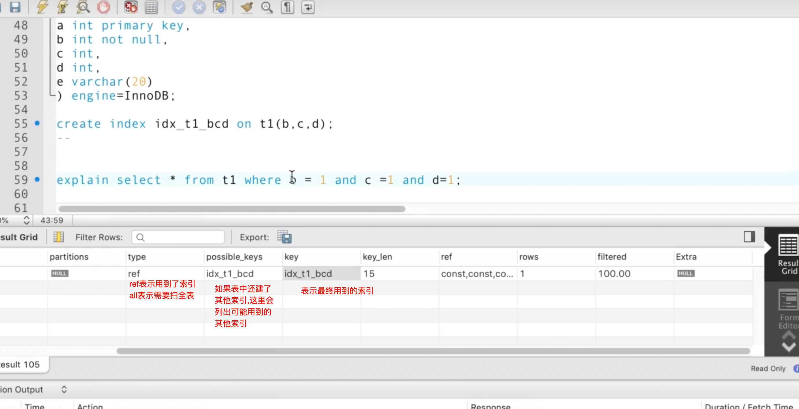
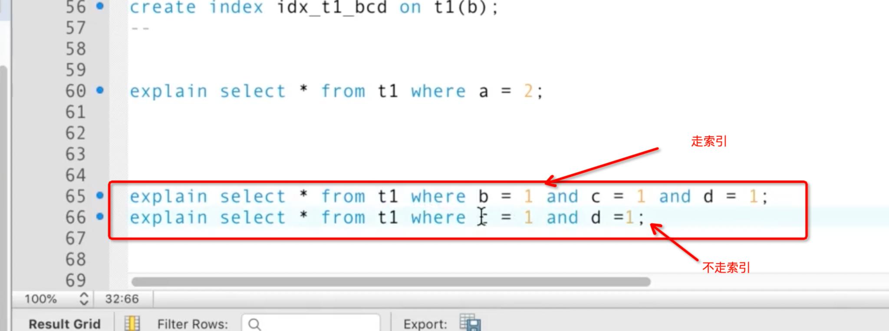
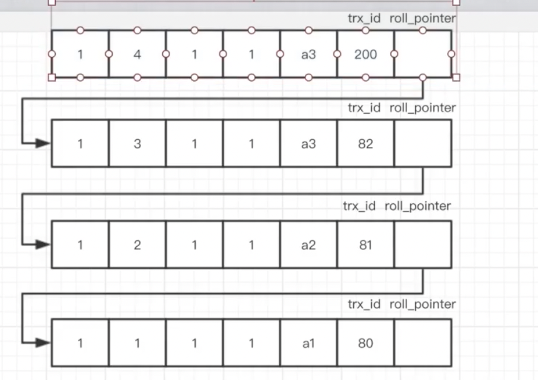

https://juejin.cn/column/6960552483013787684

看做一个应用, 存数据, 取的快, sql解析器,优化器, 缓存等 下层是一个文件系统, 中间是存储引擎(InnoDB:支持行锁,支持事务)

行格式和数据页(16kb)格式

局部性原理: 如果程序代码中用到了某个数据,那么它很有可能在接下来的时间里用到该数据相邻的数据  操作系统会通过页的方式取数据(通常4kb)

InnoDB**数据页**大小为16kb

重要部分: User Record , Free Space , Page Directory

row format : Compact , Dynamic

行记录格式:

对于非BLOB数据,最多65535,但是一页只有16kb
所以存在跨页存储

innoDb(聚集索引) , myIsam(堆表,不支持行锁)

页格式 

行格式

varchar(M) M 变长存储 表示最多可以存M个字符(字节, 版本)

65535  行溢出  :
dynamic 和 Compact的区别: 解决行溢出的问题方式不同
-   部分数据 + 下一页地址
-   第一页仅存后续页的地址,那么第一页可以存更多行的地址

对于辅助索引,有一个**回表**的过程 叶子节点存的是主键索引的值, 如果定位还需要依据主键索引再查主键索引对应的B+树 

ps:type=range 也会走索引

什么时候全表扫描会比走索引好?
如果通过索引发现范围达到了所有数据的80%,回表查询速度还不如直接全表扫描

使用索引: 最左前缀原则

对于xxx%可以用索引, 但是%xxx不能用,实际的场景中,可以reverse存储, 可以再代码里先把需要查询的reverse 然后通过xxx%走索引, 查完再reverse回来 

null 排在最左

事务: 
(sql标准定义的隔离级别, 但是mysql在sql标准的基础上解决了幻读)
-   读未提交:如果开启两个client, client 1  修改了 但是还没有提交事务, 然后第二个 client 2 可以直接读到 1 修改的数据 也即 脏读
-   读已提交 , 同理, 加上了一个约束, 只有 client 1 提交了, client 2 才可以读到 client 1 修改的数据
    -   但是引出了一个问题, client 2 在 client 1 的一个事务  结束前后,读到的结果可能是不一样的   也即  (不可重复读)
    -   client 2 在 client 1 的一个事务  结束前后, client 1 插入一条数据  会导致 client 2前后读取的条数不同 (幻读)
    
-   可重复读: client 2 在 client 1 的一个事务  结束前后互不受影响,直到 client 2 的事务结束,重新开启事务才可以读到 client 1 提交的修改
    -   mysql 在该隔离级别 解决了幻读的问题
    
-   串行化: 除了读操作,其他操作都是阻塞执行

###读已提交过程(b事务[100]可能会读到a事务[200]提交后的状态)
查数据的时候存在一个 readView, 里面保存了还未提交的事务id(活跃的事务,遇到活跃的事务则跳过,因为不是自己的活跃事务) 
下图中的[200,82,81]  
如果a事务提交, 那么b事务对应的readView中会删去200这条记录,那么b事务在查找过过程中遇到不在readView中的200   
就会返回事务id为200的记录 

#### 记录的真实数据
-   记录的真实行数据除了定义的列信息之外,还有三个隐藏列  
    列名|是否可为空|占用空间|描述
    -   row_id  唯一标识id
    -   transaction_id 事务id
    -   roll_pointer 回滚指针
    
-   修改的时候会记录一个版本链, 依据 transaction_id 比对拿到和自身事务id一致的数据

###可重复读(b事务和a事务在各自的事务里互不影响)
实现方式: b事务[100]不会读到a事务[200]提交后的状态  
还是通过readView    
如果a事务提交, 那么b事务不会删除对应的readView中200这条记录,那么a事务则不会影响b事务

版本链 和 readView 加起来被称为MVCC(multiVersion concurrency control)(多版本并发控制)
相比加锁的方式,MVCC可以提高读的并发性 

ps:对于读已提交和可重复读, 在实现逻辑上主要是readView的处理方式不同:
-   读已提交在每次select时候就会创建readView
-   可重读读仅在第一次select的时候创建readView

### 锁(以上主要是解决和读有关原理 对于写操作主要是和**锁**有关 )
-   读锁(shared lock  S锁):如果对某条数据加了读锁,那么该条数据其他事务无法对其进行更改(可以加读锁,不可加写锁)
-   写锁(exclusive lock  X锁):如果对某条数据加了写锁, 那么该条数据其他事务无法访问它(读锁和写锁都不可以加)
-   select不加锁(读锁和写锁是对资源而言的,对于普通的select语句不涉及锁操作)
    
-   读操作场景
    -   select ... lock int share mode 读锁
        -   使用场景: 读出数据之后其他事务无法修改,自己也不一定能修改, 因为其他事务可以再加读锁
    -   select ... for update  写锁
        -   使用场景: 读出数据后,其他事务既不能写,也不能加读锁,那么就导致只有自己可以修改数据 
-   写操作场景
    -   delect 删除一条数据时,会先对记录加X锁,再执行删除操作
    -   insert 插入一条数据时, 会加**隐式锁**来保证这条记录在本事务提交前不会被其他事务访问到
    -   update:
        -   当更新前后数据没有导致存储空间变化,那么会加X锁,然后直接更新数据
        -   如果更新数据导致存储空间发生变化, 那么会加X锁,然后insert一条数据 

