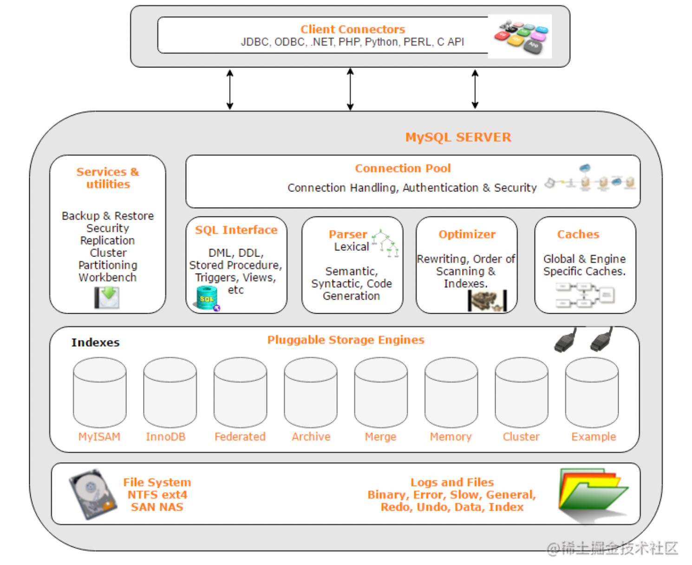
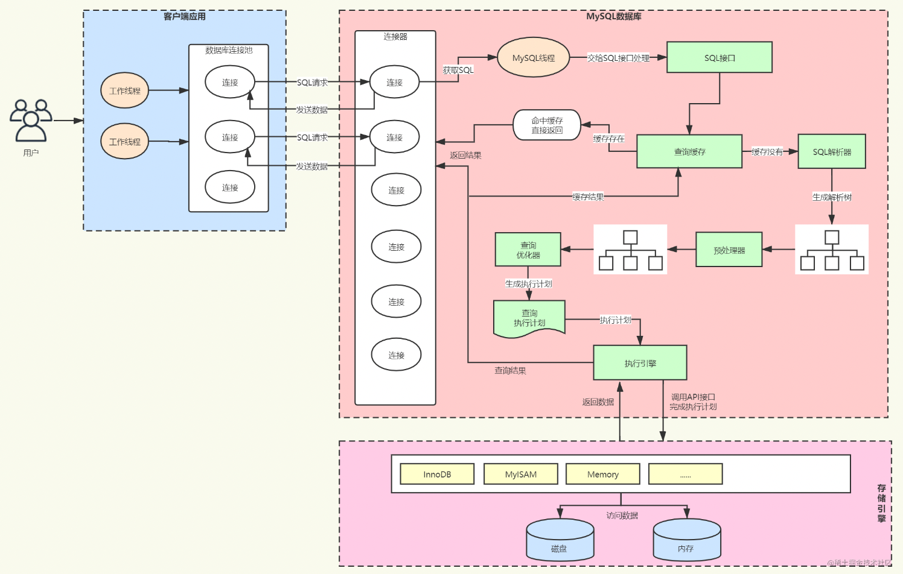

###mysql体系架构图

-   第一层 连接层：主要负责连接处理、身份验证、安全性等，一般 C/S 架构都会有这一层。
-   第二层 核心服务层：主要有查询缓存、分析器、优化器、执行器等，以及所有的内置函数（如日期、时间、数学和加密函数等），所有跨存储引擎的功能都在这一层实现，比如存储过程、触发器、视图等。
-   第三层 存储引擎层：这一层是底层数据存取操作实现部分，由多种存储引擎共同组成。服务器通过API与存储引擎通信，API规避了不同存储引擎的差异，不同存储引擎也不会互相通信。
-   第四层 数据存储层：文件系统存储数据，存放数据文件、日志文件等，完成与存储引擎的交互。
####SQL查询执行路径

