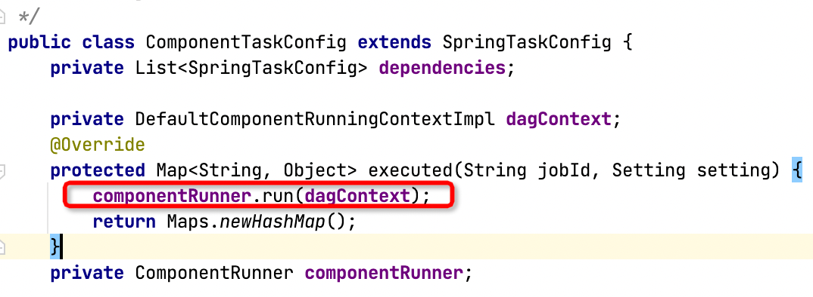
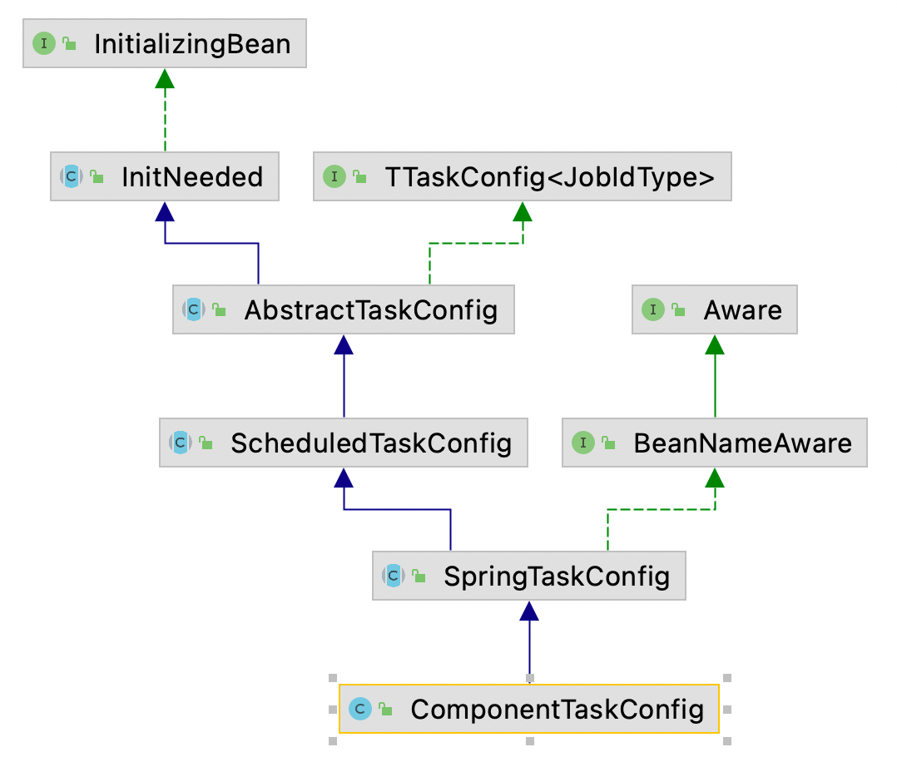
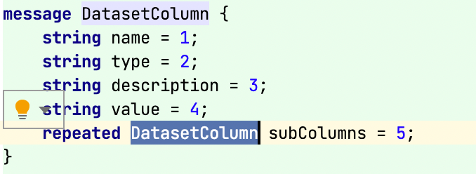

####找到平时项目或代码中用到的设计模式, 将代码和用到的设计模式对应起来,方便理解记忆

###构建型模式(简单,不举例)
-   工厂方法模式：为每一类对象建立工厂，将对象交由工厂创建，客户端只和工厂打交道。
    -   factoryBean
-   抽象工厂模式：为每一类工厂提取出抽象接口，使得新增工厂、替换工厂变得非常容易。
    -   将工厂抽象出一个接口,来接受具体的工厂实现类,主类不需要考虑具体实现类
-   建造者模式：用于创建构造过程稳定的对象，不同的 Builder 可以定义不同的配置。
    -   各种builder, 主要解决构建复杂对象的情况
-   单例模式：全局使用同一个对象，分为饿汉式和懒汉式。懒汉式有双检锁和内部类两种实现方式。
    -   多次调用的同一个对象,个人理解应该做为一个无状态的对象,这样可以保证线程安全
-   原型模式：为一个类定义 clone 方法，使得创建相同的对象更方便。
    -   注意深拷贝和浅拷贝问题

###结构型模式
-   适配器模式:将一个类的接口转化为另一个接口,使原本因为接口不适配的两个类能够在一起工作
    eg:SpringMvc中通过 为不同的 handler 实现相同的 handlerAdapter 接口,对于上层的调用
    者只需要获取对应的 handlerAdapter 处理request即可.

-   **桥接模式**:将抽象部分与它的实现部分分离，使它们都可以独立地变化。它是一种对象结构型模式，又称为柄体模式或接口模式。  
    eg:项目中, ComponentRunner 作为实现了 run方法的接口 作为 ComponentTaskConfig 的成员变量用于提供组件运行的职能,
    而 ComponentTaskConfig则继承了和调度相关的接口
    
    

-   组合模式: 整体与部分的结构，当整体与部分有相似的结构，在操作时可以被一致对待时，就可以使用组合模式  
    eg:项目中protobuf中定义的 DatasetColumn 有这样的套娃的味道
    
    

装饰模式  外观模式  享元模式  代理模式