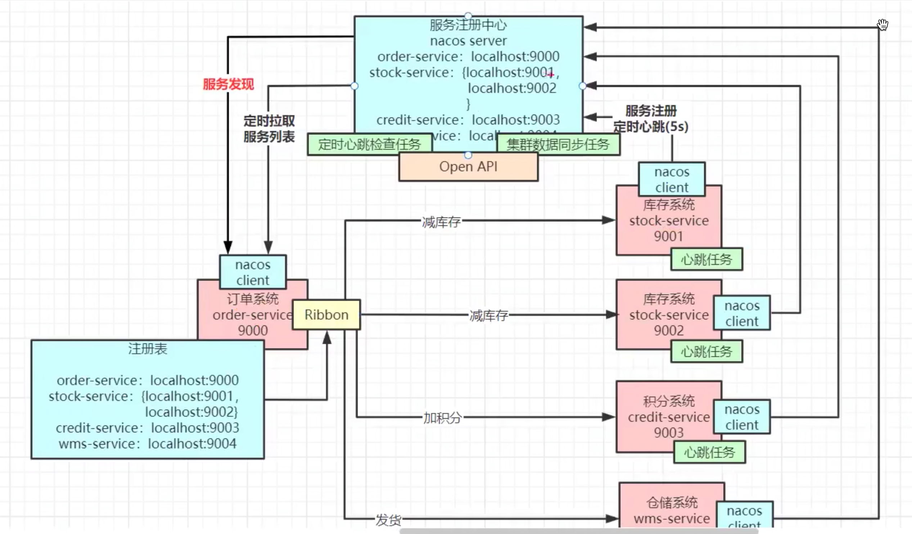
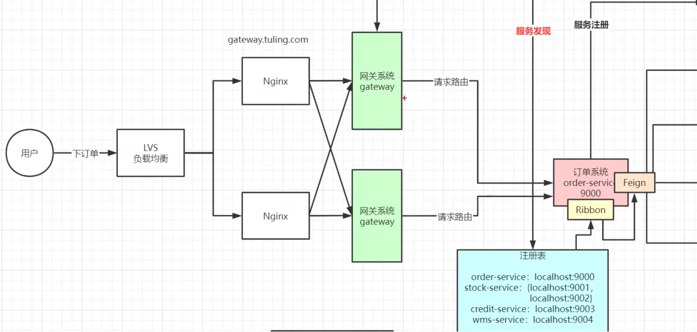
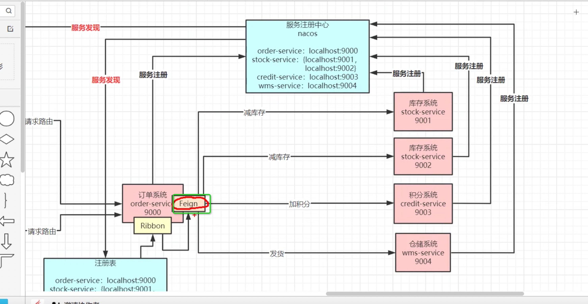
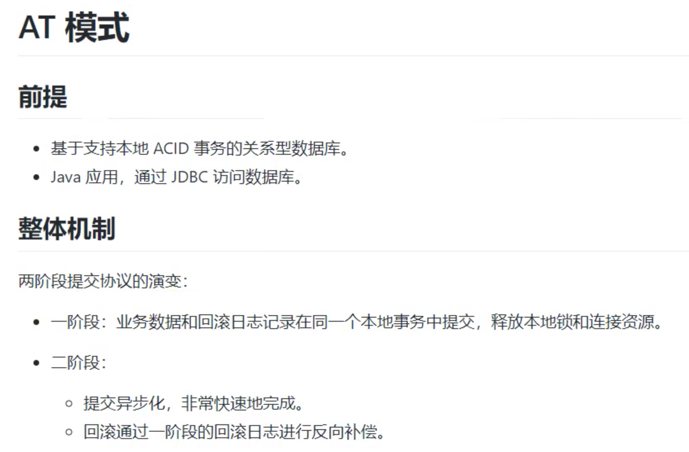
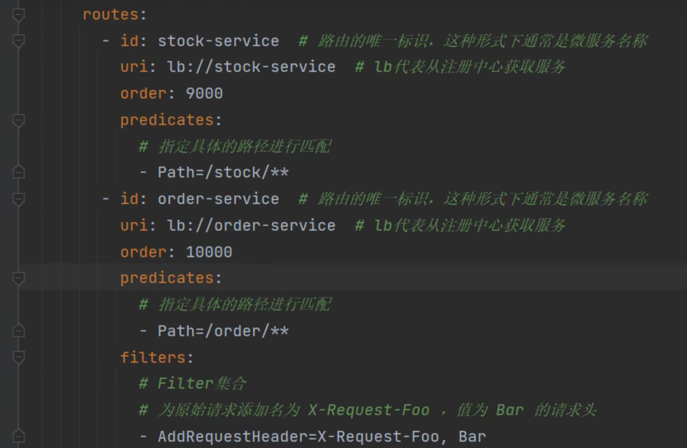
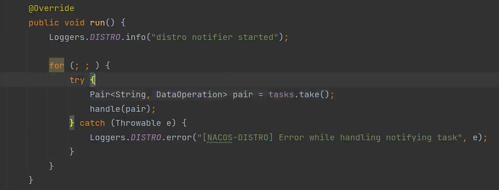
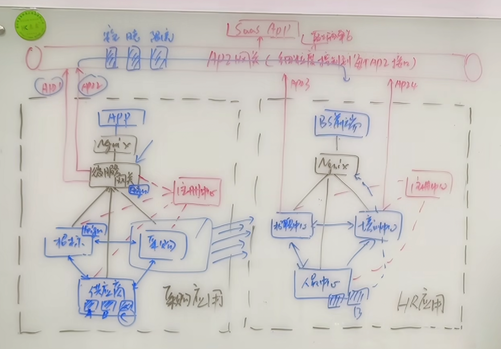

nocos 核心架构图:

RIBBON通过拦截器解析域名服务

sentinel 限流， 熔断，  降级 

分布式事务问题？ seata解决 

订单和减库存操作都会提交到协调服务
回滚日志： undo日志进行回滚补偿

网关： 通过url地址做转发 配置中path是重点访问方式： 网关地址+path+url， 网关也需要配置到注册中心 
一些公共的功能都可以提取到网关来做：比如权限，授权

nacos是异步注册逻辑

tasks是个阻塞队列， 可以避免cpu消耗， 没有任务的时候会阻塞

注册中心(如果只存在后端的微服务之间的调用，去中心化，可以只到这一层)，
微服务网关(设计到前端调用，需要一个统一的网关接口)和
API网关(跨应用层使用，中心化，可对每一个接口实现安全，日志， 限流，熔断等各种api接口治理管理能力)
如果仅通过nginx反向代理那么久不能起到一个服务自动发现注册的功能 

微服务网关可以用来暴露一个统一的微服务群的访问入口,nginx是配合前端的一个后台访问入口,而api网关是公司跨应用互相访问的一个入口

RPC实现原理： 本地通过创建接口的代理对象， 然后代理对象的具体invoke（）方法里通过网络协议传递provider端对应接口名，参数类型，参数值，获取返回结果 
在invoke方法里也就是传输协议部分可以配置负载策略， 降级策略