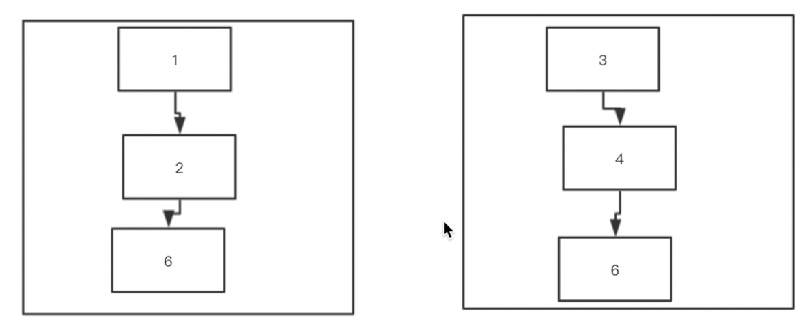

####zk是什么?
-   zk是数据库
-   拥有文件系统特点的数据库
    -   create /shiro 1
    -   create /shiro/haruhi 1 
-   解决数据一致性问题的分布式数据库

原理: (满足以下四点就是所谓的ZAB协议)
-   领导
-   过半机制
-   预提交, 收到ack, 提交 (2pc:两阶段提交)
    -   首先leader接受到事务请求, 写入事务日志,通知其他节点写入事务日志,返回ack, 最后执行
    -   如果follower接受到请求则会转发给leader处理
-   启动的时候会处理数据同步的问题

选举: 
-   投票
-   选票
-   投票箱
-   过半机制

-   投给自己(myid , zkid)
-   沟通,改票,pk

zkid越大, 数据越新

事务请求: create, set , delete
非事务请求: isExist , get

节点分类: 
-   非参与者(obverser节点)
-   参与者:
    -   leader
    -   follower
    
领导者选举发生的事件节点: 
-   集群启动
-   leader挂掉
-   follower挂掉后 leader发现已经没有一半的follower 跟随自己了 不能对外提供服务, 重新选举

内存结构:
-   DateTree(存储了当前所有的数据)
-   事务日志(先写入事务日志 再更新dataTree)

脑裂问题:(必须大于一般,所以可以避免脑裂问题)

增加的节点是follower会强化读性能,但是对于投票还有事务请求会来回与leader通信对性能也会有影响, 
如果增加observer(只负责读请求,不参与选举和投票)的话可以解决以上问题

存储节点类型: 
-   持久化节点: 会持久化到磁盘中,除非主动删除
-   临时节点:只会存储在内存中, 如果session过期,自动删除
-   持久 序列化节点
-   临时序列化节点(用于实现分布式锁)

