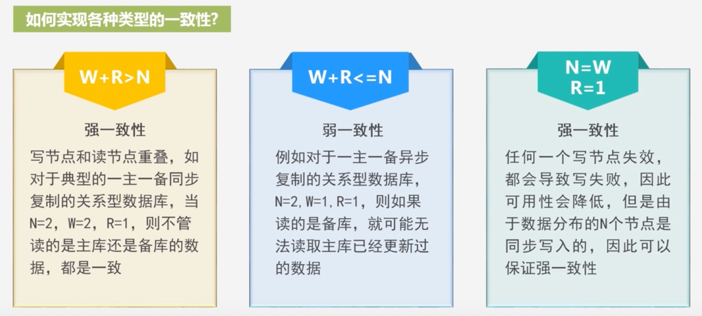

*   元数据(meta data):描述数据的数据
*   数据仓库:用于支持管理决策的数据集合，首先，数据仓库用于支持决策，面向分析型数据处理，对多个异构的数据源有效集成，
    集成后按照主题进行了重组，并包含历史数据，而且存放在数据仓库中的数据一般不再修改。
    
*   待解决: 协同划分和非协同划分的join方式

*   flatmap 应该理解为map flat(先map操作再打平)

*   一致性：一个事务必须使数据库从一个一致性状态变换到另一个一致性状态 
    所谓一致性其实可以理解为正确性

顶点间消息交换模型:

*   远程读取: 节点将数据放入本地磁盘,通知其他节点过来读取数据(延迟高,实时性差)
*   共享内存: 访问同一块内存(扩展性差,只能纵向扩展不能横向扩展)
*   基于消息传递模型:
    *   提升表达能力
    *   有助于提升系统整体性能,异步,批量的方式
    
W+R>N   强一致性, 写节点和读节点有重复 实际使用中W+R=N+1即可保证强一致性

分布式系统容错的方式:
    *   检查点
    *   操作日志

todo: 面试专题, 并发专题, 刷题总结,项目,调度器

响应式, 异步非阻塞  函数式服务,

适配器

todo:
-   设计模式回顾一下, 然后在此基础上整理项目
    
-   项目: droplet , 实时训练, 标准组件服务, 特征工程流程
-   刷过的题重新过一下,(codetop,下周每天晚上刷10题,保持手感, 白天回顾以前的知识,还有项目)
-   简历
