#### ThreedPoolExecutor 参数
-   corePoolSize 固有个数的线程数
-   maximumPoolSize 最大线程数量
-   keepAliveTime 空闲线程存活时间
-   unit 存活时间单位
-   workQueue 工作队列 
    -   新任务被提交后，会先进入到此工作队列中，任务调度时再从队列中取出任务。jdk中提供了四种工作队列：
    -   ①ArrayBlockingQueue 基于数组的有界阻塞队列，按FIFO排序。新任务进来后，会放到该队列的队尾，有界的数组可以防止资源耗尽问题。
        当线程池中线程数量达到corePoolSize后，再有新任务进来，则会将任务放入该队列的队尾，等待被调度。
        如果队列已经是满的，则创建一个新线程，如果线程数量已经达到maxPoolSize，则会执行拒绝策略。

    -   ②LinkedBlockingQuene 
        基于链表的**无界**阻塞队列（其实最大容量为Interger.MAX），按照FIFO排序。由于该队列的近似无界性，
        当线程池中线程数量达到corePoolSize后，再有新任务进来，会一直存入该队列，而不会去创建新线程直到maxPoolSize 
        ，因此使用该工作队列时，参数maxPoolSize其实是不起作用的。
    -   ③SynchronousQuene 
        一个不缓存任务的阻塞队列，生产者放入一个任务必须等到消费者取出这个任务。也就是说新任务进来时，不会缓存，
        而是直接被调度执行该任务，如果没有可用线程，则创建新线程，如果线程数量达到maxPoolSize，则执行拒绝策略。
    -   ④PriorityBlockingQueue 
        具有优先级的无界阻塞队列，优先级通过参数Comparator实现。
-   threadFactory 线程工厂 
    创建一个新线程时使用的工厂，可以用来设定线程名、是否为daemon线程等等
-   handler 拒绝策略

#### **线程池**几种状态(并不是线程的几种状态)
-   running: 正常运行,可以接受并处理任务
-   shutdown:线程池关闭,不能接受新任务,但是会处理队列里中的剩余任务
-   stop:不能接受新任务,也不处理队列里的任务
-   tidying:在 stop 后会进入 tidying 状态
-   terminated:最后进入 terminated 状态

#### mysql索引底层原理
#####B+Tree(InnoDb)
-   非叶子节点只存储索引 ,那么每一个节点可以存放更多的索引
-   叶子节点包含所有的索引字段和数据
-   叶子节点通过指针链接,提高区间的访问性能

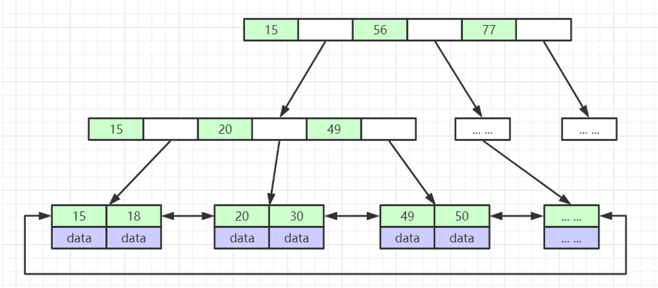
#####MyISAM
-   索引文件和数据文件是分离的

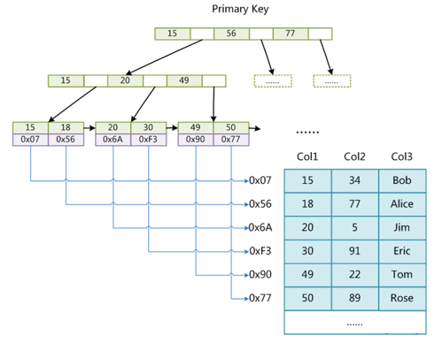

#####Hash
-   对索引进行一次hash可定位数据位置
-   不满足范围查询,存在hash冲突问题

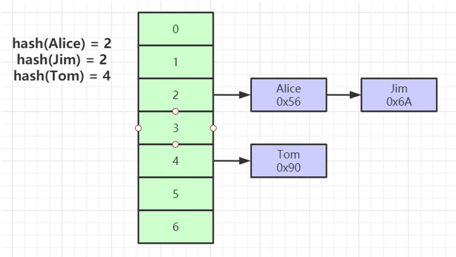

#### String, StringBuilder,StringBuffer的区别
-   String 不可变,如果尝试改变会生成一个新的字符串对象, StringBuilder 和StringBuffer 是可变的
-   StringBuilder 不是线程安全的,StringBuffer 是线程安全的

#### ArrayList 和 LinkedList 有什么区别
-   ArrayList 基于数组实现,数组支持随机查找, LinkedList 基于链表实现
-   它们都实现了 List 接口,但是 LinkedList 还实现了 Deque 接口

#### CopyOnWriteArrayList 底层实现原理 (适合读多写少的场景)
-   基于数组实现, 添加元素时会复制一个新的数组,让读和写操作分离开来
-   写操作会加锁,防止出现并发写入是丢失数据问题,写操作结束会将原数组指向新数组
-   优缺点: 读写分离,提升了可用性,但是只能做到最终一致性

#### HashMap的扩容机制
-   生成数组
-   遍历老数组中的链表和红黑树
-   计算每个节点的hash值映射到数组
-   依据数据中每个位置的节点个数转化为红黑树或者保持链表状态
-   将新的hashmap赋值给原来的hashmap引用

#### ConcurrentHashMap 的扩容机制
-   java7使用的分段锁(细粒度锁)来保证线程安全

-   1.7
    -   java7的concurrentHashMap基于Segment分段实现
    -   每个Segment是一个小型的HashMap
    -   先对Segment进行扩容,逻辑和hashmap类似
-   1.8
    -   当某个线程put时发现concurrentHashMap正在进行扩容时, 那么该线程也一起进行扩容
    -   如果没有进行扩容,则put后判断是否超过阈值,选择是否进行扩容
    -   支持多个线程同时进行扩容
    -   转移元素时,将原数组分组,每个组分给不同的线程转移,每个线程负责一组或者多组转移工作
    
#### ThreadLocal 底层原理
-   线程局部变量, 线程可以在任意时刻,任意方法中获取缓存数据 
-   底层通过 ThreadLocalMap 来实现, ThreadLocalMap 是 ThreadLocal 的一个静态内部类 , 每一个Thread对象都有一个 ThreadLocalMap 属性,
    map 的 key 是 ThreadLocal 对象,value 是线程局部变量缓存的值
    
-   注意点: 在线程池中使用 threadLocal 可能会造成内存泄露, 正确的 使用方法是手动调用 threadLocal 的 remove 方法
-   经典应用场景: 一个线程一个连接,该连接对象可以在多个方法之间传递,线程间不共享同一个连接

#### volatile 关键字
-   并发领域三大特性: 原子性,可见性, 有序性,  volatile 保证了可见性和有序性,没有保证原子性, volatile + cas是常见的操作
-   加了 volatile 关键字的属性, cpu 会直接从主内存读取数据  (相比不加 volatile cpu 效率会降低)
    对于没有加 volatile 修饰的属性则是写到 cpu 的缓存(寄存器),而缓存里的属性并不能马上刷回内存 , 所以不能保证可见性
-   可见性 底层通过内存屏障来实现的, 所以会禁止指令重排,保证了有序性

#### ReentrantLock 中的公平锁和非公平锁的底层实现区别
-   公平锁,非公平锁底层都会使用AQS进行排队
-   公平锁在线程使用 lock() 时会检查AQS中是否有线程在排队,如果有,则也进行排队
-   非公平锁则不会检查,而是直接竞争锁
-   共同点 都会进行排队, 当锁释放时,都是唤醒排在最前面的线程,所以差别只是体现在加锁阶段,唤醒阶段是一样的

#### ReentrantLock 中 tryLock() 和 lock() 区别
-   lock() 没有返回值, 阻塞加锁, 如果加不到锁,就会一直等待
-   tryLock() 有boolean返回值, 可以继续执行后续代码
-   自旋锁比较消耗cpu性能

```java
        //阻塞
        reentrantLock.lock();
         //非阻塞
        boolean b = reentrantLock.tryLock();

        //自旋锁 
        while(!reentrantLock.tryLock()){

        }
```

#### CountDownLatch 和 Semaphore
-   CountDownLatch 表示计数器, 给 CountDownLatch 设置一个数字, 一个线程调用await() 将会阻塞, 直到 countDown()使数字为0  
    当数字为0 的时候,将唤醒所有 在AQS中 await() 的线程
    
-   Semaphore 信号量 可以设置许可数, 线程通过 acquire() 来获取许可, 当没有许可数时,通过AQS排队, 线程可以通过 release()释放许可,
    同样,释放许可后也会唤醒 AQS 中所有的线程,直到没有空闲许可
    
#### Synchronized 的偏向锁, 轻量级锁, 重量级锁
-   偏向锁: 在锁对象的对象头中记录一下当前获取到该锁的线程ID, 如果该线程下次来获取就可以直接获取到
-   轻量级锁: 由偏向锁升级而来, 一个线程获取到锁后,此时是偏向锁, 如果此时第二个线程来竞争锁,就会升级为轻量级锁
-   自旋锁: 线程在获取锁的过程中不会阻塞线程, 所以不会出现唤醒线程,**阻塞和唤醒操作都需要操作系统进行, 比较耗时**,
    自旋锁是通过CAS获取预期的一个标记,相对而言比较轻量(但是节省cpu性能)
-   重量级锁: 如果自旋次数过多则会升级为重量级锁, 重量级锁会导致线程阻塞


#### synchronized 和 ReentrantLock
-   synchronized 是关键字, ReentrantLock 是一个类
-   synchronized 会自动加锁释放, ReentrantLock 需要手动
-   synchronized 是JVM层面, ReentrantLock 是API层面
-   synchronized 是非公平锁, ReentrantLock 可以自己选择
-   synchronized 锁的是对象, 锁信息保存在对象头中,  ReentrantLock 通过 int 类型的 state 来表示锁的状态
-   synchronized 存在锁升级过程

#### JVM中哪些是线程共享区
-   堆和方法区(常量池,方法信息,类信息)是所有线程共享的
-   虚拟机栈(线程栈),本地方法栈,程序计数器是线程独有的

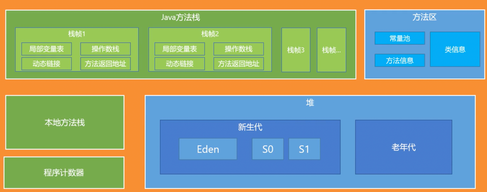

#### JVM中那些可以作为 gc root
-   栈中的本地变量, 方法区中的静态变量, 本地方法栈中的变量, 正在运行的线程

#### 项目中如何排查JVM问题
-   公司有项目的jvm监控信息,如果频繁发生 fullGC 但是没有出现oom, 说明 fullGC 已经回收了很多对象, 所以这些对象最好再 youngGC的时候回收掉,避免进入老年代,
    考虑这些对象是不是太大直接放入了老年代, 可以尝试加大年轻代的带下, 如果改完后fullGC减少,则证明有效
    
-   对于已经发生OOM的系统,可以生成dump文件,分析找到异常的示例对象,异常的线程(占用CPU高) 定位具体代码

#### 类加载器和双亲委派模型
-   jvm中存在三个默认的类加载器: BootstrapClassLoader, ExtClassLoader, AppClassLoader, 类加载器分别加载不同路径下的jar和class文件
-   AppClassLoader 的父加载器是 ExtClassLoader ,ExtClassLoader的父加载器是 BootstrapClassLoader
-   双亲委派是指,jvm在加载类的时候会先委派给 ExtClassLoader 加载, 而 ExtClassLoader 又会委派给 BootstrapClassLoader 加载 , 
    只有当父加载器没有加载到才会让自己加载 一定程度上保证了安全性, 同时防止重复加载(优化性能)
    
#### tomcat中为什么要使用自定义的类加载器
-   一个tomcat中可能会部署多个应用, 多个应用可能存在相同的全类名,但是逻辑不同
-   tomcat启动后就是一个jvm进程, 也就是只有一个jvm , 所以如果使用默认的 AppClassLoader会存在问题
-   所以会为每个类生成一个 WebAppClassLoader类型的类加载器, 每个类加载器加载自己的类实现应用间的隔离

#### tomcat如何进行优化
-   两方面:内存和线程
-   启动tomcat 实际就是启动一个jvm, 可以按jvm调优的方式进行调整
-   缓存区: appReadBufferSize ,bufferPoolSize 
-   调整 minSpareThreads MaxThreads 设置空闲时线程数和最大线程数
-   调整IO模型 , NIO相比BIO更高效

#### 浏览器发出一个请求到收到响应经历了哪些步骤
-   浏览器解析用户输入的URL, 生成一个HTTP格式的请求
-   通过本机HOST查找域名对应的ip地址,如果找不到则去本机配置的DNS服务器查找ip
-   浏览器通过操作系统将请求发送出去
-   经过路由器,交换机,最后到达服务器
-   服务器通过请求所指定的端口 找到绑定该端口的应用程序, 比如tomcat
-   tomcat接收到请求后按照http协议进行解析 得到要访问的 servlet
-   如果是springmvc的DispatcherServlet,则会找到对应的 controller 中的方法, 执行方法得到结果
-   tomcat将响应的结果封装成http响应的格式,在通过网络发送给浏览器所在的服务器
-   浏览器所在的服务器将结果传递给浏览器, 浏览器负责解析渲染

#### spring中Bean创建的生命周期
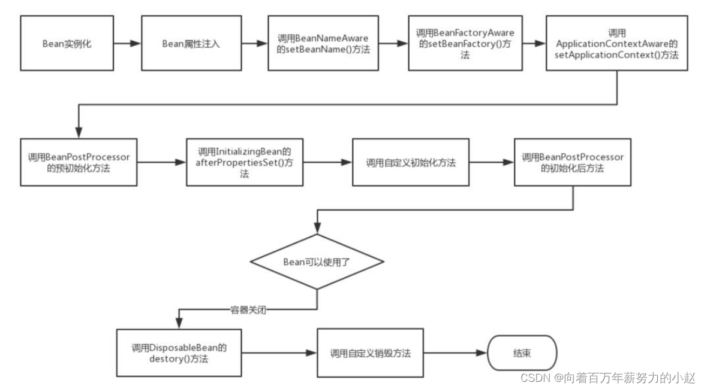
-   推断构造方法(spring根据某一个类来生成一个bean对象,如果这个类中有多个构造方法,那么Spring是如何选择来实例化得到一个对象的 )
-   实例化
-   属性填充 (依赖注入)
-   处理aware回调(BeanNameAware,BeanFactoryAware,ApplicationContextAware,)
-   初始化前(BeanPostProcessor)
-   初始化: initializingBean 的afterPropertiesSet() 方法  
    initMethod()方法(需要指定initMethod())
-   初始化后(BeanPostProcessor)
-   销毁(需要指定destroyMethod())
ps:@PostConstruct ,afterPropertiesSet() ,initMethod()
```java
public class MyBeanProcessor implements BeanPostProcessor {
    
    @Override
    public Object postProcessBeforeInitialization(Object bean, String beanName) throws BeansException {
        System.out.println("☆☆☆" + beanName + " = " + bean);
        return bean; 
    }
    
    @Override
    public Object postProcessAfterInitialization(Object bean, String beanName) throws BeansException {
        System.out.println("★★★" + beanName + " = " + bean);
        return bean;
    }
}
```

#### Spring中的bean是线程安全的吗
-   如果bean是无状态 则线程安全

#### ApplicationContext 和 BeanFactory
-   ApplicationContext 继承自 BeanFactory , 同时还继承了EnvironmentCapable, MessageSource, ApplicationEventPublisher等接口
    使得ApplicationContext 还有获取系统环境变量, 国际化,时间发布,资源定位等功能

#### springMVC整合Tomcat过程
-   tomact启动
-   解析web.xml
-   ContextLoaderListener 是一个 ServletContext 的监听器,在 ServletContext 初始化 会执行 contextInitialized()
    创建 WebApplicationContext 即 spring 的 ApplicationContext 
-   解析 listener , ContextLoaderListener.contextInitialized() --->创建**父容器**---> 存到servletContext
-   实例化DispatcherServlet对象 ---> init()方法 ---> 创建Spring容器(ApplicationContext对象)--->绑定父容器 ---> 拿配置文件
    --> 扫描启动spring容器
-   ps: Servlet 规范中 ，所有的 Servlet 具有一个相同的上下文 ServletContext，ServletContext 将优先于 Servlet 初始化，
    Spring 利用了这个特性，在 ServletContext 初始化时创建父容器，并将其绑定到 ServletContext 的属性中，
    然后在每个 DispatcherServlet 初始过程中创建子容器并将 ServletContext 中的容器设置为父容器。
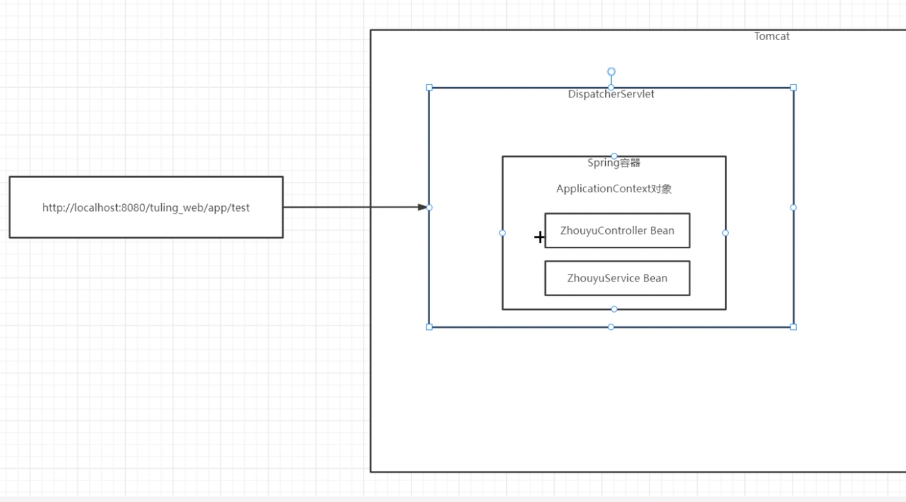
    
-   通过代码的方式实现web.xml:
```java
public class MyWebApplicationInitializer implements WebApplicationInitializer {
    /*
            1. 创建一个spring容器, 绑定配置类
            2. new一个 DispatcherServlet 对象,传入spring容器
            3. servletContext 绑定 DispatcherServlet 对象, 添加 映射
     */

    @Override
    public void onStartup(ServletContext servletContext) {

        // Load Spring web application configuration
        AnnotationConfigWebApplicationContext context = new AnnotationConfigWebApplicationContext();
        context.register(AppConfig.class);

        // Create and register the DispatcherServlet
        DispatcherServlet servlet = new DispatcherServlet(context);
        ServletRegistration.Dynamic registration = servletContext.addServlet("app", servlet);
        registration.setLoadOnStartup(1);
        registration.addMapping("/app/*");
    }
}
```

#### springMVC的底层工作流程(细节) 
https://www.yuque.com/renyong-jmovm/dadudu/gr0qfw2onc1i0oaz
-   tomcat 创建 DispatcherServlet 对象, 
-   调用 DispatcherServlet 的 init() 方法
-   init() 方法会创建一个spring容器, 并添加一个监听器 , 当spring启动完成后会执行 initStrategies()方法
-   其中比较核心的是 initStrategies 中的 initHandlerMappings() 方法和  initHandleAdapters()方法
-   initHandlerMappings():
    -   Handler 表示请求处理器 有以下四种: 
        -   添加了@RequestMapping注解的方法(工作中经常用的)
        -   实现了 HttpRequestHandler 接口的bean对象
        -   实现了Controller接口的bean对象
        -   HandlerFunction 对象
    -   HandlerMapping 负责去寻找上面的 Handler 并保存路径和 Handler 之间的映射关系,方便下次处理相同的url请求
    -   不同的HandlerMapping负责寻找不同的Handler: RequestMappingHandlerMapping, BeanNameUrlHandlerMapping, RouterFunctionMapping
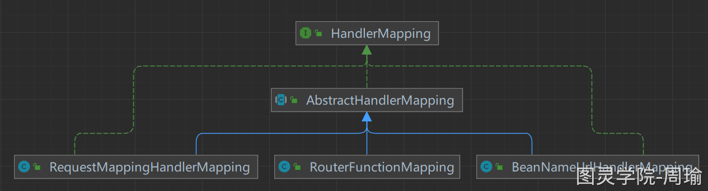
        
-   **AbstractHandlerMapping实现了HanlerMapping接口, 并实现了getHandler(HttpServletRequest request)方法,
    这样根据请求可以拿到处理请求的handler ,然后 可以更具handler拿到对应的适配器HandlerAdapter 处理request**
-   initHandleAdapters():
    -   因为有不同的handler 他们的执行方式不同,他们的执行方式可能是这样的:
    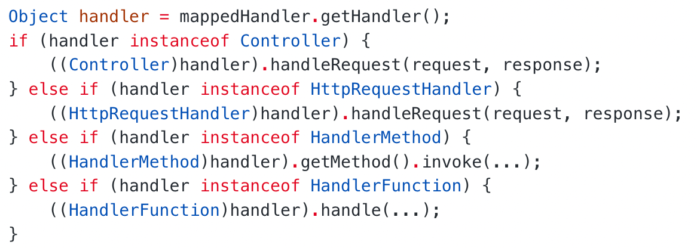
    -   mvc采用适配器模式,将不同种类的handler适配成一个HandlerAdapter接口 再执行各自HandlerAdapter实现的handle()方法
    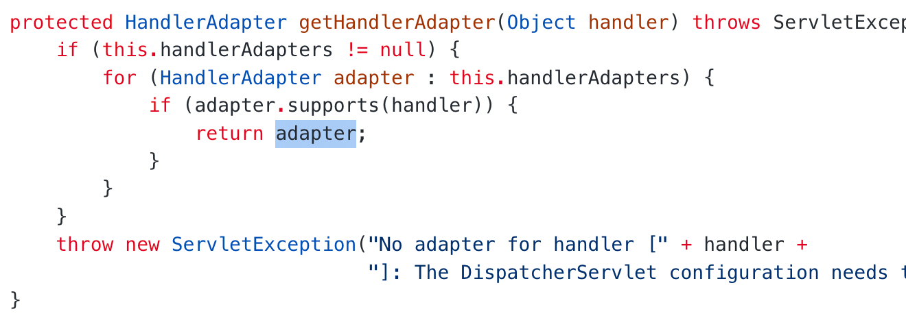
    -   对于四个Adapter 的 supports 方法:
    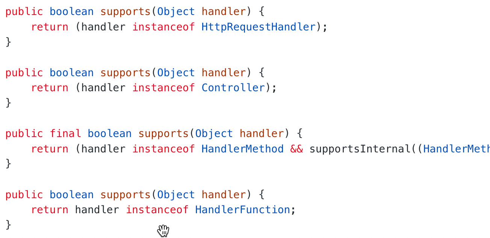
-   controller 执行完返回 ModelAndView 给 DispatcherServlet


#### 对于springboot starter的理解
-   官方的starter仅提供一个依赖,官方有一个单独的spring-boot-autoconfigure模块
-   非官方除了需要提供依赖还需要间接引用配置类

#### spring中的事务是如何实现的
-   基于 数据库事务 和 AOP 机制
-   对于使用 @Transactional 的注解bean , 为其创建一个代理对象
-   调用方法时,会判断方法上是否加了 @Transactional 注解
-   如果加了, 通过 `事务管理器` 创建一个数据库连接
-   修改 autocommit 为 false 禁止自动提交(重要)
-   方法中会执行 sql , 如果没有出现异常就直接提交事务
-   出现异常,如果异常需要回滚则回滚事务,否则依然提交事务
-   spring事务隔离界别(可设置)对应的就是数据库的隔离级别
-   spring事务传播机制  基于数据库链接实现, 一个数据库连接一个事务, 如果传播机制设置为需要新开一个事务,那么久先建立一个数据库连接
    在此链接上执行sql
    
#### spring中 @Transactional 失效分析
-   依据原理来分析: spring事务实现是基于 cglib 代理来实现的,也就是基于父子关系实现
-   如果 @Transactional 标注的方法是 private 的,那么是无法生效的
-   另外如果调用方法的对象不是代理的对象,那么当然也不会生效(相当于注解没有生效, 仅仅是作为一个方法调用)

#### spring refresh()方法、
Spring 启动容器时,首先开启激活容器,
创建初始化 beanFactory ,扫描保存所有注入的bean的定义信息
Spring 创建bean 首先创建实现了 BeanPostProcessors 接口的后置处理器,创建组件相关的bean,例如,国际化的MessageSource 组件, EventMulticaster事件派发器,Listeners 注册监听器等
然后创建其他剩下的单实例bean,在其它单实例bean被创建时,会被后置处理器监控到,执行创建前后,或初始化前后,定义在后置处理器中的方法: 例如
AutowiredAnnotationBeanPostProcessor : 通过该后置处理器完成注解自动注入的功能
AnnotationAwareAspectJAutoProxyCreator: 通过该后置处理器设置AOP时,对指定目标方法所在类生成动态代理类
AsyncAnnotationBeanPostProcessor : 设置异步的后置处理器
还有设置定时任务的…
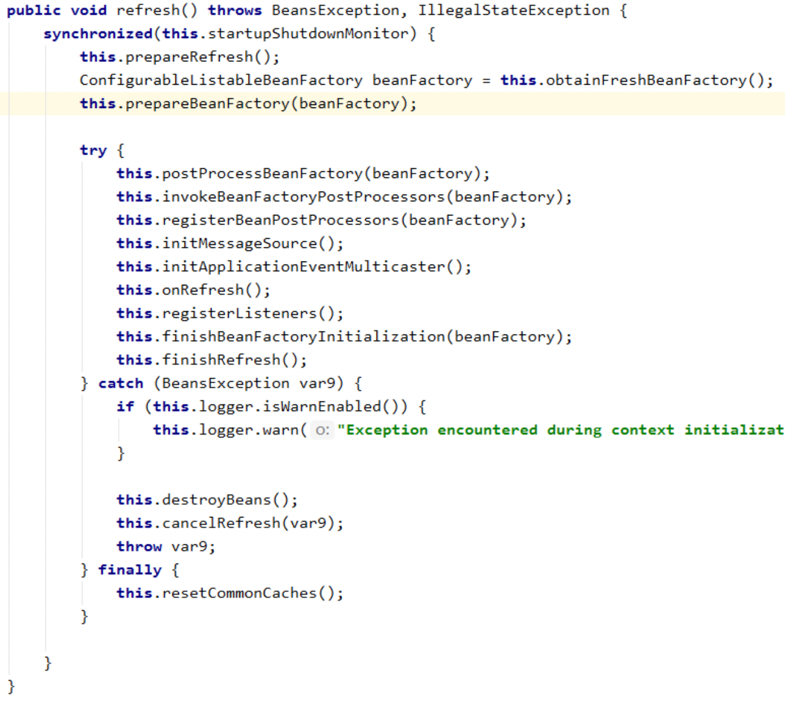
-   this.prepareRefresh() 激活开启容器
-   this.obtainFreshBeanFactory() 获取 bean 工厂
-   this.prepareBeanFactory(beanFactory) 对获取到的 beanFactory 做预处理设置
-   this.postProcessBeanFactory(beanFactory); beanFactory准备工作完成后进行的后置处理工作
-   this.invokeBeanFactoryPostProcessors(beanFactory) 执行 beanFactory 后置处理器的方法
-   this.registerBeanPostProcessors(beanFactory) 注册 bean 的后置处理器
-   this.initMessageSource() 初始化 MessageSource 组件
-   this.initApplicationEventMulticaster() 初始化事件派发器,多播器
-   this.onRefresh() 用来初始化子容器中的bean,默认是空方法
-   this.registerListeners() 注册监听器
-   this.finishBeanFactoryInitialization(beanFactory) 初始化所有剩下的单实例 bean
-   this.finishRefresh() 完成ben的创建初始化工作,完成 IOC 容器的创建
#### spring容器启动流程
-   扫描 得到所有的 BeanDefinition 对象, 存入一个map中
-   筛选出所有的非懒加载的单例 BeanDefinition 并创建Bean , 对于多例 Bean 不需要在启动过程中进行创建, 在每次需要获取bean的时候利用BeanDefinition创建
-   利用BeanDefinition 创建bean就是bean的生命周期, 包括推断构造方法,实例化, 属性填充, aware回调 
    , 初始化前(BeanPostProcessor aop ),初始化(initMethod()),初始化后(BeanPostProcessor aop ),销毁(destroyMethod())
-   单例bean创建完后, spring会发布一个容器启动事件
-   细节: 源码中会提供一些模版方法(空方法),让子类实现, 源码中会涉及到一些 BeanFactoryPostProcessor 和 BeanPostProcessor ,
    扫描是通过 BeanFactoryPostProcessor 来实现的, 而依赖注入就是通过 BeanPostProcessor 实现的, 启动过程还会处理@import注解等
    
ps:
-   Spring IoC容器允许BeanFactoryPostProcessor在容器实例化任何bean之前读取bean的定义(配置元数据)，并可以修改它。
    同时可以定义BeanFactoryPostProcessor，通过设置’order’属性来确定各个BeanFactoryPostProcessor执行顺序。
-   BeanPostProcessor 也叫后置处理器，作用是在Bean对象在实例化和依赖注入完毕后，在显示调用初始化方法的前后添加我们自己的逻辑。
    注意是Bean实例化完毕后及依赖注入完成后触发的

#### spring 用到了那些设计模式
-   工厂模式: BeanFactory , FactoryBean
-   构建者模式: 各种builder : BeanDefinitionBuilder 
-   装饰器模式: BeanWrapper
-   代理模式: AOP
-   模版方法模式: 父类空实现
-   责任链模式: 多个 BeanPostProcessor
-   观察者模式: 事件监听机制 ApplicationEvent,ApplicationListener用户也可以自己继承接口，然后context发布事件的时候listener会调用onApplicationEvent()方法
-   策略模式: spring 需要更具 BeanDefinition 依据不同的策略来实例化bean
-   mvc中的适配器模式: handlerAdapter 处理不同的 handler
-   其他: 不了解的 最好不回答,23种涉及模式肯定都用到了: 访问者模式

#### springboot 中常用的注解和底层实现
-   @SpringBootApplication注解 表示一个springboot项目, 为以下三个注解组合:
    -   @Configure
    -   @ComponentScan
    -   @EnableAutoConfiguration :向Spring容器中导入一个Selector, 用来加载 class-path 下 Spring.factories 文件中定义的自动配置类,加载配置bean
    -   @import 可以引入 importSelector 的实现类, 将importSelector接口中 selectImports() 方法返回的 String[] 中的类定义为bean 注入容器
```java
@Target({ElementType.TYPE})
@Retention(RetentionPolicy.RUNTIME)
@Documented
@Inherited
@AutoConfigurationPackage
@Import({AutoConfigurationImportSelector.class})
public @interface EnableAutoConfiguration {
String ENABLED_OVERRIDE_PROPERTY = "spring.boot.enableautoconfiguration";

    Class<?>[] exclude() default {};

    String[] excludeName() default {};
}
```
    
-   @Bean , @Cotroller , @ResponseBody ...

#### springboot 如何启动Tomcat
-   利用 @ConditionalOnClass 判断当前的classpath中是否存在tomcat的依赖,如果有就启动一个 tomcat 的 Bean
-   spring容器创建完后,会获取启动tomcat的bean , 创建tomcat对象, 绑定端口 ,然后启动tomcat

#### springboot中的配置优先级
-   命令行参数
-   java系统参数(system.getproperties())
-   操作系统环境变量
-   文件配置
-   @Configuration注解类上的@PrepertySource

#### Mybatis 中 #{} 和 ${} 区别
-   工作中一般用 #{} 是预编译处理 最后会替换成 ? 调用 PreparedStatement 处理
-   ${} 最后会直接替换成变量的值, 调用 Statement 来赋值, 不安全, 可能存在 sql 注入问题


#### RestFul风格
-   使用同一个url处理资源， 以不同的请求方式对应不同的处理方式
    

#### RDB和AOF
-   RDB（Redis DataBase）：在指定的时间间隔内将内存中的数据集**快照**写入磁盘：
    -   过程： fork一个子进程，现将数据集写入临时文件，写入成功后，再**替换之前的文件**，采用二进制压缩储存
    -   优缺点： 启动效率高， 持久化起见发生故障会发生部分数据丢失
    
-   AOF：Append Only File: 以日志的形式记录每一次写操作
    -   优缺点： 文件比RDB大，恢复速度慢，效率低，但是数据安全，可以通过check-aof工具解决数据一致性问题，通过rewrite模式可以压缩
    
#### Redis过期建的删除策略：缓存key过期了如何删除
-   惰性过期： 当访问的时候发现已经过期才删除
-   定期删除：间隔一段时间扫描一定数量的expires字典中一定数量的key，清除过期的key

#### Redis事务
  
####Redis主从复制

#### Redis单线程
-   只有网络请求模块和数据操作模块是单线程的
-   持久化，集群数据同步是由额外的线程完成的

#### 为什么单线程还那么快？
-   基于内存操作
-   没有线程切换开销
-   基于IO多路复用
-   高效的数据存储结构：跳表，压缩列表，链表 （回答前两个或者前三个即可）
-   底层存储通过一张全局的hash表

#### epoll模型（redis中的 IO多路复用模型 ）
-   红黑树：注册每一个fd（文件描述符file descriptor）
-   链表： 记录每个已经就绪的fd（文件描述符）
    -   客户端和服务端之间通过socket进行链接， 而linux把每一个socket当做一个文件来对待，每一个文件都有一个唯一的文件标识符， 这个文件标识符就是fd
    -   每一个红黑树上注册的fd都有一个回调函数，如果就绪就会注册到链表上
    
-   三种事件：
    -   客户端有socket来了（建立链接，注册客户端fd ）
    -   读取客户端发出的redis命令
    -   指令结果返回给客户端
    
#### redis 跳表
-   对于zset(有序集合（元素加上一个分值）a:1, b:3,b:5)的存储可以用跳表存储，也可以用压缩列表 


####分布式锁
-   重点在于需要一个分布式锁的生成器, 需要用什么作为一个分布式锁的生成器 , 主要有两种方式,
    -   一种是zookeeper (CP):临时节点,顺序节点,watch机制实现
        
    -   一种是redis(AP)
    
####分布式事务方案
-   本地消息表方式: 简单来说就是对于一个多个阶段的任务, 第一个任务在执行落盘的时候附带后续任务执行的状态, 如果在后续状态阶段调用结果成功,则再次更新第一个任务的落盘状态为成功,如果失败,可以重试调用接口


####分布式事务场景和处理方式
分布式事务: 参与到事务里面的组件或者资源,它处于分布式的系统架构下面,用传统的事务处理方式没办法解决,这就导致了一个典型的分布式事务场景
-   最典型的场景就是两个事务参与者跨了资源: 部署两套oracle


    


