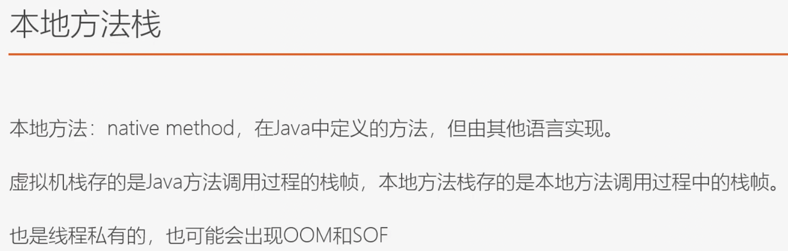

-   类加载子系统: 把磁盘上的.class加载到内存会放到`方法区`,字节码指令会放在方法区,然后有`执行引擎`来执行
-   运行时常量池是方法区的一部分
-   程序计数器, 一个线程执行的时候可能需要切换, 那么需要程序计数器来记录执行指令的地址,

-   准备阶段会赋值0 , 后续变量会有初始化(给类里static的属性赋值)
-   解析: 会把字符串表示的一些klass对象转化为方法区里的对象引用(把名字转化为真正的地址)

三个类加载器它们加载的目录不一样
-   BootStrapClassLoader 会加载/jre/lib 目录下的jar包
-   ExtClassLoader 会加载/jre/lib/ext 目录下的jar包
-   AppClassLoader 会加载  classpath下的classes的类

-   parent属性, 拿到类加载器加载一个没有加载过的类对象的时候会优先使用类加载器的parent类加载器去加载 ,
    简单而言是优先用上层的加载,类加载器在对应管理的路径加加载不到的时候会使用下层的类加载器去对应管理的路径 
    下加载,如果最后也加载不到的话就是使用AppClassloader去加载,
    所以可以避免类的重复加载,同时类加载器无法篡改一些官方提供的基础类信息,因为他们由官方提供的类加载器加载
    

-   对于tomcat里的每一个应用都会单独生成一个webAppClassloader

-   方法区和堆是多个线程共享的
-   对于java方法栈,本地方法栈,程序计数器都是线程独享的

    

 

 

 

适合新生代

