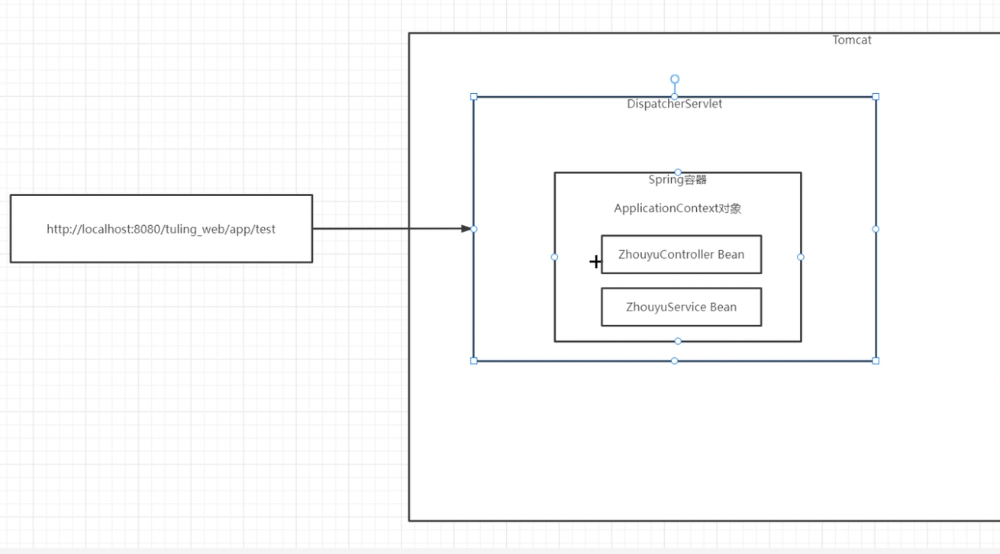
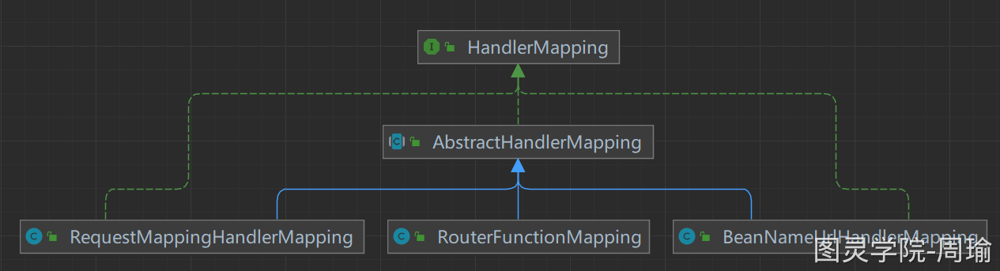
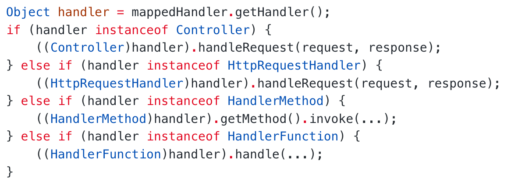
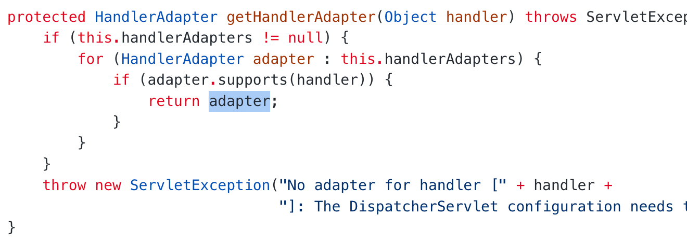
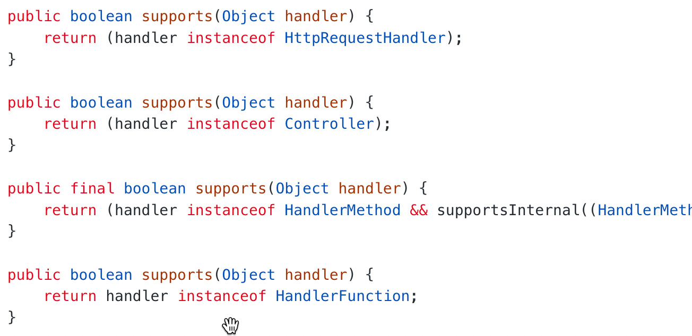

#### springMVC整合Tomcat过程
-   ps: Servlet 规范中 ，所有的 Servlet 具有一个相同的上下文 ServletContext，ServletContext 将优先于 Servlet 初始化，
    Spring 利用了这个特性，在 ServletContext 初始化时创建父容器，并将其绑定到 ServletContext 的属性中，
    然后在每个 DispatcherServlet 初始过程中创建子容器并将 ServletContext 中的容器设置为父容器。
    
    
-   tomact启动
-   解析 web.xml
-   解析 listener , ContextLoaderListener.contextInitialized() --->创建**父容器**---> 存到 servletContext
    -   ContextLoaderListener 是一个 ServletContext 的监听器,在 ServletContext 初始化 会执行 contextInitialized()
        创建 WebApplicationContext 即 spring 的 ApplicationContext
-   实例化 DispatcherServlet 对象 ---> init()方法 ---> 创建Spring容器(ApplicationContext对象) ---> 绑定父容器 --->
    拿配置文件 --> 扫描启动spring容器


-   通过代码的方式实现web.xml:
```java
public class MyWebApplicationInitializer implements WebApplicationInitializer {
    /*
            1. 创建一个spring容器, 绑定配置类
            2. new一个 DispatcherServlet 对象,传入spring容器
            3. servletContext 绑定 DispatcherServlet 对象, 添加 映射
     */

    @Override
    public void onStartup(ServletContext servletContext) {

        // Load Spring web application configuration
        AnnotationConfigWebApplicationContext context = new AnnotationConfigWebApplicationContext();
        context.register(AppConfig.class);

        // Create and register the DispatcherServlet
        DispatcherServlet servlet = new DispatcherServlet(context);
        ServletRegistration.Dynamic registration = servletContext.addServlet("app", servlet);
        registration.setLoadOnStartup(1);
        registration.addMapping("/app/*");
    }
}
```

#### springMVC的底层工作流程(细节)
https://www.yuque.com/renyong-jmovm/dadudu/gr0qfw2onc1i0oaz
-   tomcat 创建 DispatcherServlet 对象,
-   调用 DispatcherServlet 的 init() 方法
-   init() 方法会创建一个spring容器, 并添加一个监听器 , 当spring启动完成后会执行 initStrategies()方法
-   其中比较核心的是 initStrategies 中的 initHandlerMappings() 方法和  initHandleAdapters()方法
-   initHandlerMappings():
  -   Handler 表示请求处理器 有以下四种:
    -   添加了 @RequestMapping 注解的方法(工作中经常用的)
    -   实现了 HttpRequestHandler 接口的bean对象
    -   实现了 Controller 接口的bean对象
    -   HandlerFunction 对象
  -   HandlerMapping 负责去寻找上面的 Handler 并保存路径和 Handler 之间的映射关系,方便下次处理相同的url请求
  -   不同的HandlerMapping负责寻找不同的Handler: RequestMappingHandlerMapping, BeanNameUrlHandlerMapping, RouterFunctionMapping
      

-   **AbstractHandlerMapping 实现了 HanlerMapping 接口, 并实现了 getHandler (HttpServletRequest request)方法,
    这样根据请求可以拿到处理请求的handler ,然后 可以根据 handler 拿到对应的适配器 HandlerAdapter 处理request**
-   initHandleAdapters():
    -   因为有不同的handler 他们的执行方式不同,他们的执行方式可能是这样的:
        
    -   mvc采用适配器模式,将不同种类的handler适配成一个HandlerAdapter接口 再执行各自HandlerAdapter实现的handle()方法
        
    -   对于四个Adapter 的 supports 方法:
        
-   controller 执行完返回 ModelAndView 给 DispatcherServlet