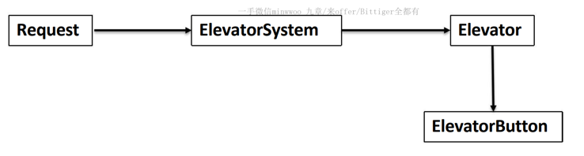
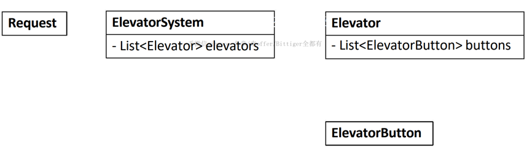
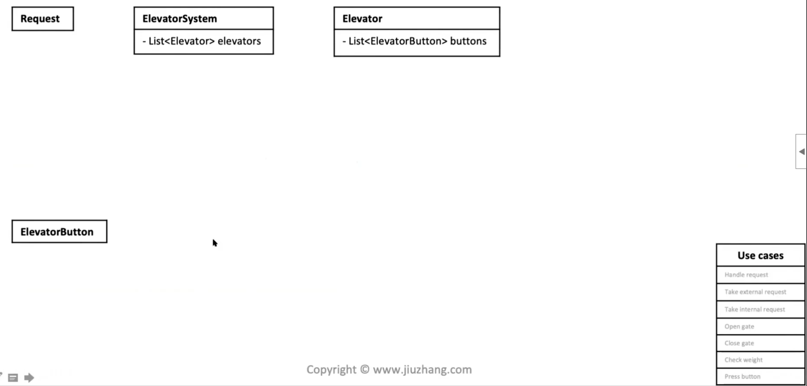
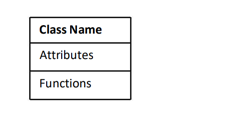
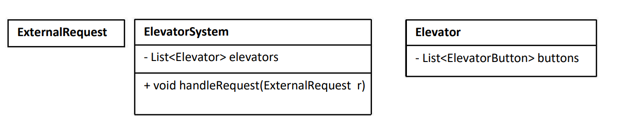
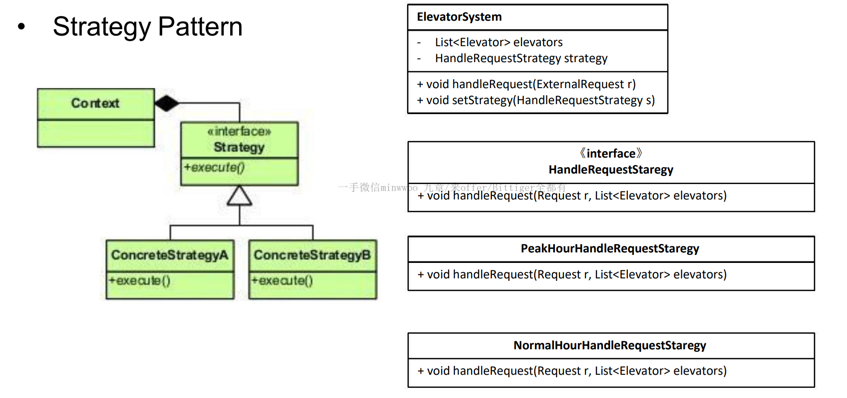
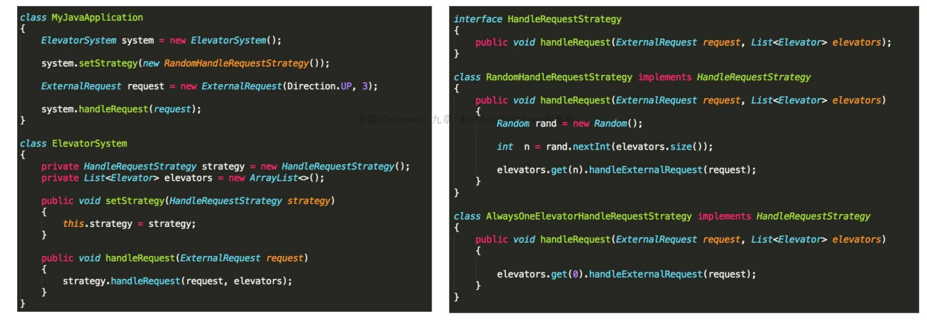

###OOD vs. System Design

|---|OOD|System Design|
|---|---|---|
|关键字|viability|Scalability|
例题|Design Elevator System|Design twitter|

###SOLID 原则
-   S:single responsibility principle
-   O:open close principle
-   L:liskov substitution principle
-   I:interface segregation principle
-   D:dependency inversion principle

####S:single responsibility principle 单一责任原则
-   一个类应该有且只有一个去改变它的理由,这意味着一个类应该只有一项工作
```java
public class AreaCalculator{
    private float result;
    
    public float getResult(){
        return this.result;
    }
    
    public float calculateArea(Triangle triangle){
        this.result = triangle.getHigh() * triangle.getwidth();
    }
    
    public void printResultInJson(){
        jsonPrinter.initialize();
        jsonPrinter.print(this.result);
        jsonPrinter.close();
    }
}
```

```java
public class AreaCalculator{
    private float result;
    
    public float getResult(){
        return this.result;
    }
    
    public float calculateArea(Triangle triangle){
        this.result = triangle.getHigh() * triangle.getwidth();
    }
}
public class Printer{
    public printInJson(AreaCalculator areaCalculator){
        jsonPrinter.initialize();
        jsonPrinter.print(areaCalculator.result);
        jsonPrinter.close();
    }
}
```
####S:O:open close principle 开放关闭原则
-   对象或者实体应该对扩展开放,对修改关闭(open to extension,close to modification)
```java
public interface Shape{
    float getArea();
}
public class Triangle implements Shape{
    public float getArea(){
        return base * high / 2;
    }
}
public class AreaCalculator{
    private float result;
    
    public float getResult(){
        return this.result;
    }
    
    public void  calculateArea(Shape shape){
        this.result = shape.getArea();
    }
}
```

####L:liskov substitution principle 里氏替换原则
-   任何一个子类或者派生类应该可以替换他们的基类或者父类
####I:interface segregation principle 接口隔离原则
-   不应该强迫一个类实现它用不上的接口
####D:dependency inversion principle 依赖反转原则
-   抽象不应该依赖于具体实现,具体实现应该依赖于抽象
-   high-level的实体不应该依赖于low-level的实体
-   什么是dependency?
    -   如果B类型是A的成员变量,那么A依赖于B,如果在一个类中引入了多个成员变量,  
        也即引入了更多的dependency(我们需要尽量少的引入)
   
-   如下例子中: AreaCalculator应该是一个可以计算任何图形的计算器,属于一个high-level的实体,  
    但是calculateArea()方法中传入了一个low-level的实体
```java
public class AreaCalculator{
    private float result;
    
    public float getResult(){
        return this.result;
    }
    
    public float calculateArea(Triangle t){
        this.result = t.h * t.b / 2;
        return result;
    }
}
```
-   正确做法,calculateArea()方法中传入一个interface
```java
public interface Shape{
    float getArea();
}

public class Triangle implements Shape{
    public float getArea(){
        return b * h / 2; 
    }
}

public class AreaCalculator{
    private float result;
    
    public float getResult(){
        return this.result;
    }
    
    public float calculateArea(Shape s){
        this.result = s.getArea();
        return result;
    }
}
```


###面试中应该怎么做?
-   实战演练:can u design an elevator system for this building?
-   5C解题法
    -   Clarify
        -   what:
            -   针对题目中的关键字来提问,帮助自己更好的确定答题范围
            -   大多数的关键字为名词, 通过名词的属性来考虑
    -   Core objects
        -   为了完成设计,需要哪些类?
            -   这是和面试官初步的纸面contract
            -   承上启下,来自于Clarify的结果,称为User case的依据
            -   为画类图打下基础
        -   如何定义Core Object?
            -   以一个Object作为基础,线性思考
                
            -   确定Object之间的映射关系(一一对应? 一多对应?)
                
            -   UML图 +,-,# 分别表示public,private,protected
    -   Cases
        -   什么是Use case?
            -   在你设计的系统中, 需要支持哪些功能?
        -   为什么要写use cases?
            -   这是你和面试官达成的第二份共识,把你将要实现的功能列在白板上
            -   帮助你在解题过程中,理清条理,一个一个case实现
            -   作为检查的标准
        -   怎么写use cases?
            -   利用定义的core Object 列举每一个object对应产生的use case
                -   ElevatorSystem
                    -   handle request
                -   Request(N/A)
                -   Elevaotr
                    -   take external request
                    -   take internal request
                    -   open gate
                    -   close gate
                    -   check weight
                -   ElevatorButton
                    -   press button
                        
            
        -   Request()
            -   每个use case 只需要先用一句简单的话描述即可
    -   Classes
        -   什么是类图 class graph ?
            
        -   为什么要画类图? 
            -   可交付, minimal viable product
            -   节省时间,不容易在coding上挣扎
            -   建立在use case 上, 和之前的步骤层层递进, 条理清晰,便于交流和更改
            -   如果时间允许/面试官要求,便于转化为code
        -   怎么画类图?
            -   遍历你所列出的user casses
            -   对于每一个user case 更加详细的描述这个user case 在做的事情  
                (例如: task external request -> elevator system tasks an external 
                request, and decide to push this request to an appropriate elevator)
            -   针对这个描述,在已有的core objects 里填充进所需要的信息
            -   use case: handle request  
                -   ElevatorSystem tasks an external request, and decide to push this request to an appropriate elevator
                
                -   what if i want to apply different ways to handle external requests during different time of a day ?
                -   solution2: **strategy design pattern** 
                    -   封装多种 算法/策略(只需要更改对应的 算法/策略)
                    -   使得 算法/策略 之间能够 互相替换
                
                
                    -   context: 主体
