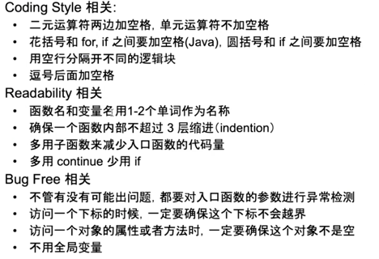

SubString n^2
SubSequence 2^n

1.异常检测(输入的参数,**边界检查**,凡事遇到数据遍历的注意判断是否越界) 
2.变量命名 有实际有意义的名字 
3.符号之间加空格 
4.一个代码中缩进越少越好,for 循环不要超过个 
5.以 boolean 作为返回值的函数用 isXxxx 命名 
6.多段逻辑之间加空行,方面阅读 
7.重复代码不允许 
8.尽可能避免全局变量 
9.工程中尽可能避免递归 
10.优化 coding quality 

    

练习题: 基于动态规划的最长回文子串
练习题: strStr rabin-karp算法 类似于 hashcode 算出一致再 double check 一下

时间复杂度
空间复杂度
编程复杂度:代码易读 可以和面试官讨论是否愿意牺牲一点时间复杂度 来 增加代码的可读性
思维复杂度:

P问题:polynomial

NP问题: Nondeterministic polynomial

O(n) 算法: 双指针,打擂台(最大值,最小值),单调栈,单调队列

双指针:相向,北向, 同向

相向:
-   reverse:反转字符串,判断回文
练习题1: 不考虑特殊字符,忽略大小写判断回文,
    valid palindrome(常用函数: isLetter(),isDigit(),toLowerCase(),toUpperCase())
练习题2:去掉一个字符是否可以成为回文串
-   two sum:两数之和,三数之和
-   partition:快排,颜色排序

