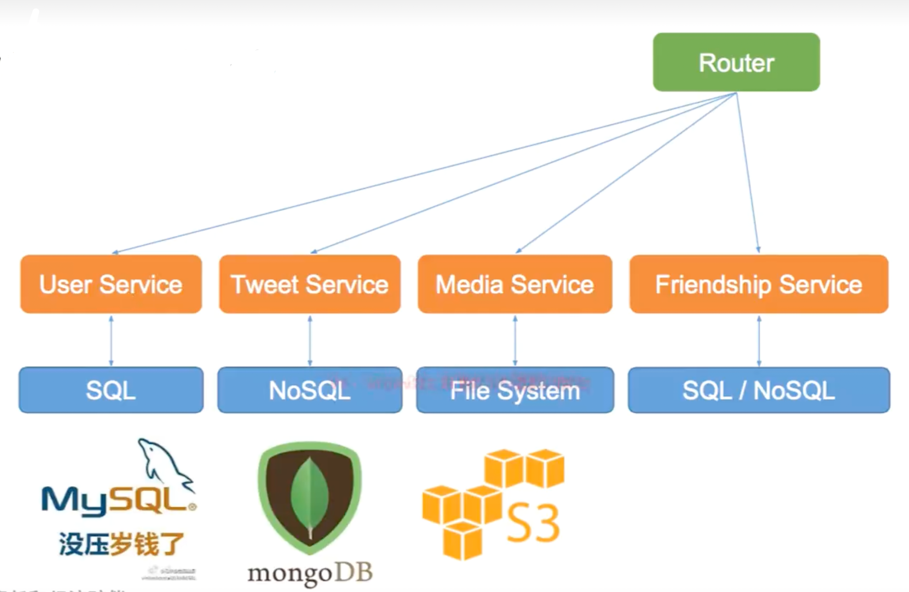
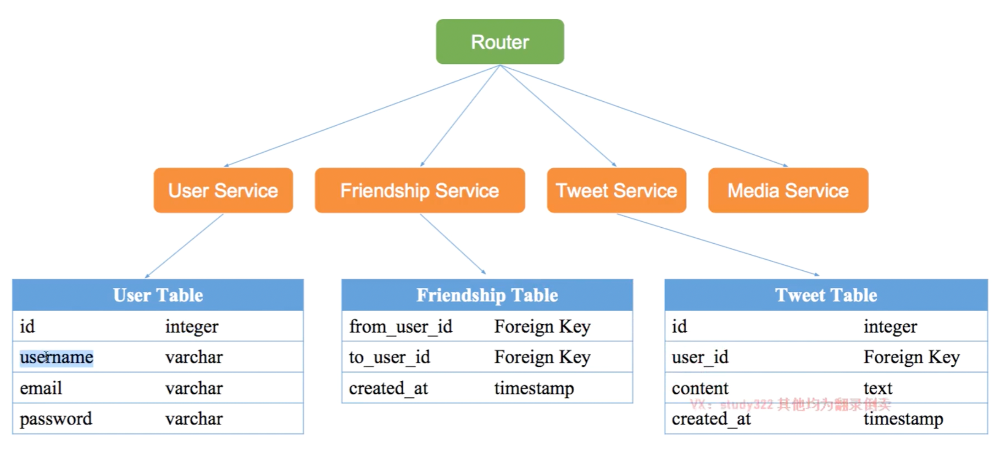
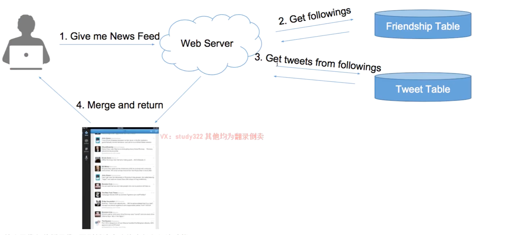
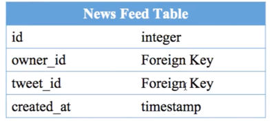
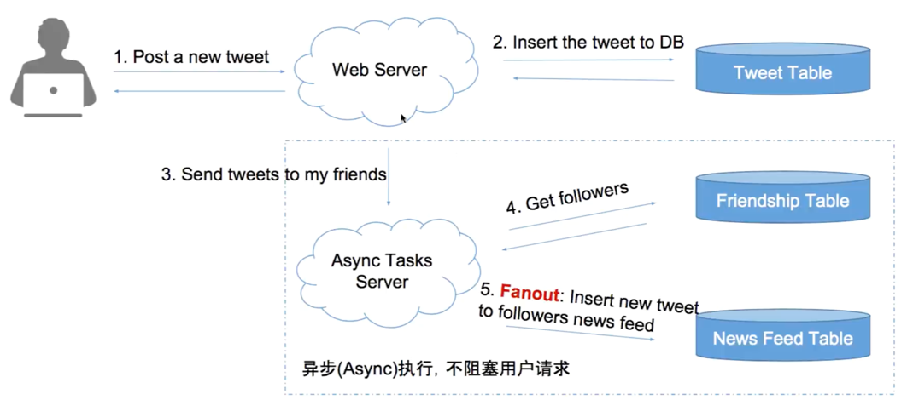

### 

-   系统设计中常说的trade off 是什么
-   什么叫做SOA(service Orientd Architecture)
-   什么是pull model 什么是push model
-   数据存储系统有哪些, 什么样的数据适合存在什么样的数据存储系统中
-   什么是异步任务和消息队列(message queue)
-   什么是数据的可持久化(persistent)
-   什么事去标准化(denormalize)
-   什么是惊群效应(thundering herd)
-   有哪些与news feed 类似的系统设计问题 

###系统设Vs面向对象设计

-  形式上:
    -   面向对象设计手把手coding
    -   系统设计高屋建瓴的'扯淡'
    
-   考察的知识点:
    -   面向对象设计:class,object,method,inheritance,interface,...
    -   系统设计:database,schema,sql,nosql,memcached,file system,distributed system,latency,
        scalability,master slave, load balance web server ,message queue,sharding,consistent hashing,qps
        
-   典型题:
    -   面向对象设计:电梯设计,游戏设计
    -   系统设计:短网址系统设计,新鲜事系统设计
https://www.lintcode.com/ladder/8/
https://jiuzhang.com/solutions

###实战:interviewer:please design twitter

回答问题的常见错误:关键词大师  
load balancer,Memcache,NodeJs,MongoDB,Mysql,Sharding,Consistent Hashing,Master Slave,HDFS,Hadoop
不要一开始就抛一些关键词,第一步应该是和面试官沟通细化需求

系统设计面试的评分标准
-   可行解 work solution 25%
-   特定问题 special case 20% 
-   分析能力 analysis 25%
-   权衡 tradeoff 15%(多个方案,使用哪一个)
-   知识储备 knowledge base 15%

系统设计问题4s分析法(解决前三个就是一个work solution, not prefect solution)
-   场景 scenario
    -   需要设计哪些功能
    -   ask/feature/qps/dau,interfaces
-   服务 service
    -   将大系统拆分问小系统
    -   split/application/module
-   存储 storage
    -   数据如何存储,如何访问
    -   schema/data/sql/nosql/file system
-   升级 scale
    -   解决缺陷,处理遇到的问题
    -   sharding/optimize/special case
    
### Storage 存储(数据如何存储与访问)
-   select 为每一个service选择存储结构
-   schema 细化表结构 

三种存储数据的系统
-   数据库系统
    -   关系型数据库 sql database(特点:发展成熟,支持复杂的查询)
        -   用户信息
    -   非关系型数据库 nosql database
        -   推文 tweets
        -   社交图谱 social graph(followers)
-   文件系统
    -   图片,视频, media files
-   缓存系统
    -   不需要支持数据持久化的数据 NonPersistent
    -   效率高,内存级别访问速度
    
文件系统和数据库系统的关系是什么?  
-   数据库系统是文件系统的一层包装,数据库系统依赖于文件系统
-   数据库系统提供更丰富的数据操作接口,操作粒度更细,文件系统只提供简单的文件操作接口
-   数据库系统重读取的数据,大部分情况下(除了被cache的),还是会到文件系统上读取,不考虑复杂的查询情况,可以认为读写效率相近

数据如何存储与访问  
-   select 为每一个service选择存储结构
-   schema 细化表结构 
-   程序 = 算法 + 数据结构
-   系统 = 服务 + 数据存储

    
interviewer:please design schema

不用列的很详细,列出主要的列

-   使用id作为主键的原因:username,email都可能会改变,主键有时候还需要作为其他表的外键(foreign key),如果频繁改变会很麻烦

interviewer :news feed 如何存取?
-   什么是新鲜事 news feed?
    -   登录facebook/twitter/朋友圈 看到的信息流
    -   所有朋友发的信息集合
-   有哪些典型的新鲜事系统?
    -   facebook
    -   twitter
    -   朋友圈
-   新鲜事系统的核心因素?
    -   关注于被关注
    -   每个人看到的news feed都是不同的
    
pull model
-   算法
    -   用户查看news feed的时候,获取每个好友的前100条tweets,合并出前100条news feed
        -   k路归并算法 merge k sortes arrays     
-   复杂度分析
    -   news feed 假如有N个关注对象,则N次 DB read (IO) (熟悉sql可以写成一句sql,但是效率依然比较低)+ k 路归并时间(内存)
    -   post a tweet => 1次 DB write 时间
原理图:

        
interviewer: pull model 有什么缺陷?
用户在获取news feed的时候现算,所以会比较慢,可能会卡住(用户可感知)

push model
-   算法
    -   为每一个用户建一个List存储他到news feed信息
    -   用户发一个tweet后,将该推文逐个推送到每个用户的news feed list中
        -   关键词: **fanout**
    -   用户需要查看news feed 的时候,只需要从该news feed list中读取最近的100条数据
-   复杂度分析
    -   news feed ---> 1次DB read 
    -   post a tweet  ---> N个粉丝,需要N次DB write
        -   好处是可以用异步任务在后台执行, 无需用户等待
    

create_at字段属于冗余存储,**denormalize**(去标准化) ,这样取数据的时候就可以直接排序,更快,包括可以冗余存储更过的冗余数据,比如tweet的content

缺陷:followers过多的时候news feed表会非常的大,不合理

pull模式和push模式哪个更好?
-   热门social app模型:(Instagram , twitter 有做排查算法)
    -   facebook  pull
    -   instagram  push+pull
    -   twitter  pull
    -   朋友圈  push?(没有过排序算法,只有广告插入)
广告的插入是push还是pull?
pull,广告不可能插入的时候就发送给所有的受众
-   误区
    -   不坚定想法,摇摆不定,不可以被面试官牵着鼻子走,不然说明知识储备不够,要硬钢:)
    -   不能表现出tradeoff能力
    -   无法解决特定的问题
    
###4s
-   用过前三个步骤的分析,已经得到了一个可行的方案
-   scenario 场景
    -   和面试官讨论
    -   搞清楚需要设计哪些功能
    -   并分析出所设计的系统大概所需要支持的 concurrent users/qps/memory/storage
-   service 服务
    -   合并需要设计的功能,相似的功能整合为一个service
-   storage 存储
    -   对每一个service选择合适的存储结构
    -   细化数据表单
    -   画图展示数据存储和读取的流程
-   得到一个work solution 而不是一个perfect solution
-   这个work solution 可以存在很多待解决的缺陷

###scale 扩展 - 如何优化系统
-   第一步 step1: optimize
    -  解决设计缺陷 solve problems
        -   pull vs push
    -   更多的功能设计 more features
        -   like,follow & unfollow,ads
    -   一些特殊情况 special cases
        -   僵尸粉
    
-   第二步 step2:maintanance
    -   鲁棒性
        -   如果有一台服务器/数据库挂了怎么办
    -   扩展性
        -   如果有流量暴增,如何扩展
    
scale扩展 解决pull的缺陷
-   最慢的部分发生在用户读请求(需要耗费用户等待时间)
    -   在DB访问之前加入cache
    -   cache每个用户的timeline(每个用户发的推特)
        -   N次DB请求 -->N次cache请求(N是关注的好友)
        -   tradeoff: cache所有? cache最近1000条?
    -   cache 每个用户的news feed
        -   如果没有cache 用户的news feed, 每次有需要做归并
        -   如果有cache,可以针对某一个时间戳后的推特做归并
    
-   对比mysql和memcached的qps
    -   qps应该在100到1000倍之间

scale扩展 解决push 的缺陷
-   浪费更多的存储空间
    -   disk is cheap
    
-   不活跃用户 inactive user问题
    -   粉丝排序 rank followers by weight(for example , last login time)
    
-   粉丝数目 followers >>关注数目 following
    -   trump 问题
        -   粉丝过多可能导致fanout过程需要几个小时
    -   无解? 切换回pull模式?
    -   trade off : pull+push vs pull

解决系统缺陷的思路不可以在pull和push上来回切换,现实项目中遇到的问题也是必须在现有的模型上做改动
-   正确的回答思路:
    -   尝试在现有的模型下做最小的改动来优化
        -   比如尝试多加几台机器用于做push任务的机器
    -   对长期的增长进行估计,并评估是否值得转换整个模型
    
-   push+pull的优化方案
    -   普通用户仍然使用push
    -   对于明星用户,不用push, 而是从timeline里取,然后合并到news feed中
    -   问题:如何定义明星用户? 粉丝数大于10w?
    -   问题:如果一个明星 follower数目减少到了阈值,造成timeline中原有的数据获取不到怎么解决?
        -   is_superstar 一旦为ture则不可进行更改即可
    
-   为什么公司普遍用pull,但是依然要学习push?
    -   系统设计不是选择一个最好的方案,而是一个合适的方案
    -   如果没有很大的流量,使用push是最经济的方案
    -   系统设计面试也不是期望答出最优的解决方案,而是从分析中判断对系统的理解和知识储备
    
-   什么时候用push?
    -   资源少,少些代码
    -   实时性要求不高
    -   用户发帖少
    -   双向好友关系,没有明星效应
    
-   什么时候用pull?
    -   资源充足
    -   实时性要求高
    -   发帖多
    -   单向好友关系,明星效应
    
ask before design, no more no less,work solution first,analysis is more important than solution

    