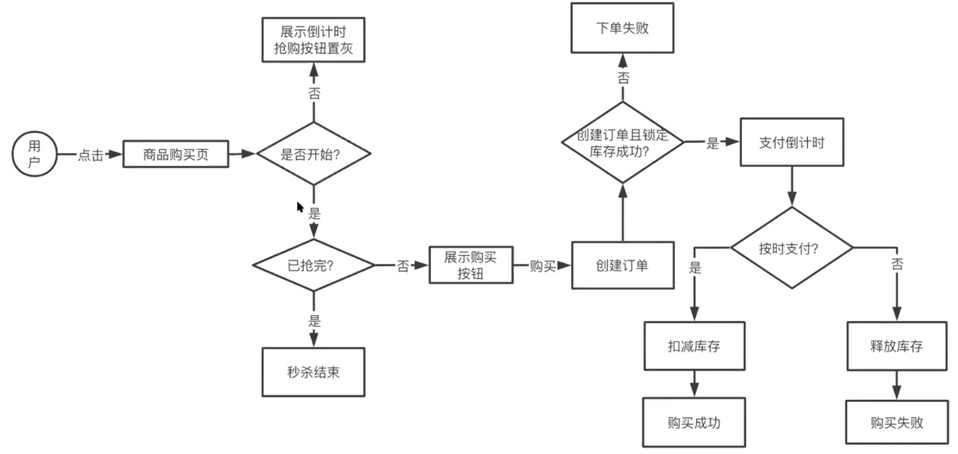
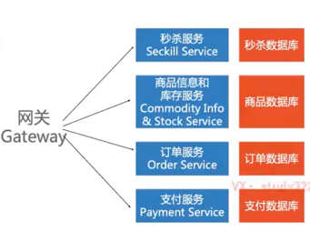
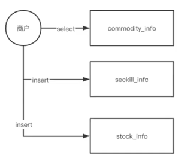
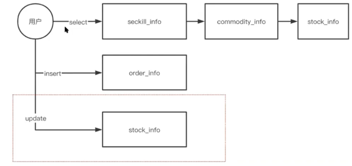
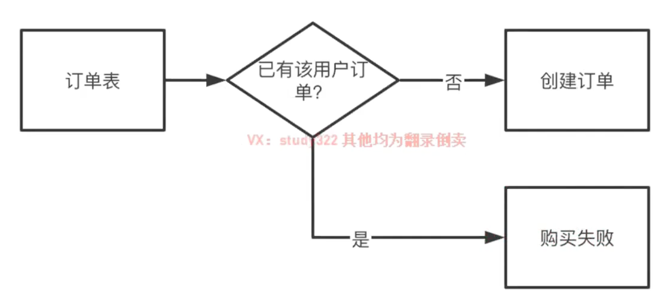
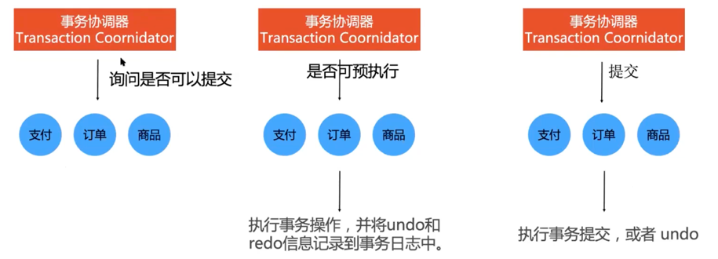
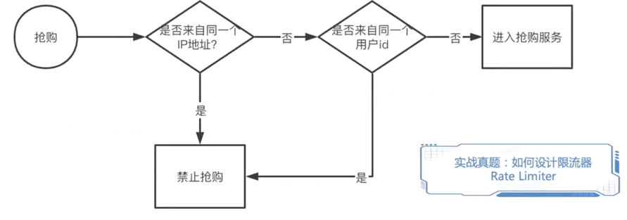

###scenario 场景
-   具体场景有哪些?
    -   提取关键词: 0点开始, 限量100台,每人限购一台
-   实际需求又什么?
-   详细流程怎么样?

QPS分析:
-   平日每秒1000
-   秒杀时每秒10w
-   qps增加100倍
购买下单流程

    
秒杀系统需要解决什么问题?
-   瞬时大流量高并发:服务区,数据路能承载的qps有限,数据库一般单机1000qps,需要根据业务预测并发量
-   有限库存,不能超卖:库存是有限的,需要精准的保证,不可超卖,也不可少卖.
-   黄牛的可以请求:使用脚本模拟用户购买模拟出十几万个请求抢购.
-   固定时间开启:时间到了才能购买, 提前一秒都不可,以服务器时间为准
-   严格限购: 一个用户只可购买一台

需求拆解
-   商家侧
    -   新建秒杀活动
    -   配置秒杀活动
    
-   用户侧
    -   商品秒杀页面(前端或客户端)
    -   购买,下单,付款
    
###service 服务
-   服务结构设计 --- 单体架构
    -   前端后端耦合(couping),服务压力大
    -   各功能模块耦合严重
    -   系统复杂,一个模块的升级需要导致整个服务都升级
    -   扩展性差,难以针对某一个模块单独扩展
    -   开发协作困难, 各个部门的人都在开发同一个代码仓库
    -   级联故障(cascading failure), 一个模块的故障导致整个服务不可用
    -   陷入单一技术和语言中
    -   数据库崩溃导致整个服务崩溃

-   服务结构设计 --- 微服务 (micro service)
    -   各功能模块结构,保证单一职责
    -   系统简单,升级某个服务不影响其他服务
    -   扩展性强,可对某个服务进行单独的扩容或缩容
    -   各个不能协作明晰
    -   故障隔离,某个服务出现故障不完全影响其他服务
    -   可对不同的服务选用更适合的技术架构或于洋
    -   数据库独立,互不干扰

        
###storage 存储
-   数据如何存储访问
-   为每一个service选择一个存储结构
-   schema细化表结构

数据库表设计
-   商品信息表 commodity 
-   活动秒杀表  second_kill_info
-   库存信息表 stock_info
-   订单信息表 order_info

commodity:

|id |name |desc |price|
|---|---|---|---|

second_kill_info:

|id|name|commodity_id|price|number|
|---|---|---|---|---|

stock_info:

|id|commodity_id|second_kill_id|stock|lock|
|---|---|---|---|---|
lock使用:  
    创建订单成功 stock -1 , lock +1
    付款成功 lock-1  
    付款失败 stock+1,lock-1  

order_info:

|id|commodity_id|second_kill_id|user_id|paid|
|---|---|---|---|---|

如何添加索引?
-   一般id类型都会添加索引

数据流

-   商家侧


-   用户侧



秒杀操作 --- 扣减库存(读取判断库存,然后扣减库存)
-   查询库存余量
```sql
select stock from `stock_info`
where commodity_id = xxx and second_kill_id = xxx;
```
-   扣减库存
```sql
update `stock_info` set stock = stock-1
where commodity_id = xxx and second_kill_id = xxx;
```
导致超卖问题如何解决?
-   方案一:读取和判断的过程中加上事务(比较耗时,一般不使用)
    -   事务开始
    ```sql
    start transaction ;
    ```
    -   查询库存余量, 并锁住数据(for update 是一个行锁,其他人不可修改)

    ```sql
    select stock from `stock_info`
    where commodity_id = xxx and second_kill_id = xxx for update;
    ```
    -   扣减库存
    ```sql
    update `stock_info` set stock = stock-1
    where commodity_id = xxx and second_kill_id = xxx;
    ```
    -   事务提交

-   方案二(使用update语句自带的行锁)
    -   查询库存余量
    ```sql
    select stock from `stock_info`
    where commodity_id = xxx and second_kill_id = xxx for update;
    ```
    -   扣减库存(增加了stock>0 判断条件)
    ```sql
    update `stock_info` set stock= stock-1
    where commodity_id=xxx and second_kill_id = xxx and stock>0;
    ```

**超卖问题解决了,存在其他问题吗?**
-   大量的请求都访问mysql,导致mysql崩溃  
    对于抢购活动来说,可能几十万人抢购,但是大部分请求都是无效的,不需要下沉到mysql
    
秒杀系统 --- 库存预热
-   秒杀的本质,是对库存的抢夺  
    每个秒杀的用户来都去数据库查询校验库存,然后扣减库存,导致数据库崩溃
    
-   mysql数据库单节点能支撑1000qps,但是redis单点可以支撑10w qps,  
    可以考虑将库存信息加载到redis中.直接通过redis判断来扣减库存
    
Redis简介
-   键值数据库
-   支持多种数据**非关型**数据结构
    -   字符串/数字(String)
    -   哈希表(Hash)
    -   链表(List)
    -   集合(Set)
    -   有序集合(Zset)
-   单线程数据库,可以通过io多路服用实现并发
-   支持主备容灾(disaster tolerance)存储
-   单次指令操作是原子性的,多指令可以通过lua脚本实现原子性
-   内存中操作,性能高
-   可用作数据缓存(cache),数据持久队列和消息队列(message queue)

断电了怎么办?  
    redis集群,冗余存储,重启数据恢复(RDB+AOF)

秒杀操作 --- 库存预热
-   什么时候进行库存预热 (warm-up)?  
    活动开始前:  
    商家  ----->   数据库读取秒杀活动信息   ---->  将商品库存预热至Redis  
```sql
set second_kill:28:commodity:189:stock 100
```

秒杀操作  ----  通过redis 扣减库存

-   大部分请求都被redis挡住了, 实际下沉到mysql的理论上应该就是能创建的订单了,  
    比如有100台iphone,那么到mysql的请求量理论上是100
-   GET key(获取key的值):  
    get second_kill:28:commodity:189:stock
-   DECR key(将key中存储的数字减一)  
    DECR second_kill:28:commodity:189:stock
    
这个流程有没有问题?
-   检查redis库存和扣减redis库存是两步操作,有并发的时候仍然会有超卖问题
-   解决方案
    -   方案一:使用lua脚本
    -   方案二:redis放行,在mysql的时候也需要再检查一次的
        -   如果请求量太大,放行数量过多,mysql也会存在压力(处理方式还是方案一)

            
如果在以上条件下访问到mysql的请求量依然很大,如何解决?  
解决方案:通过消息队列(Message queue) 进行削峰(peak clipping)操作

消息队列简介
-   一类基于 生产者/消费者 模型的组件
-   用于实现两个系统之间的解耦和异步(asynchronous)操作
-   生产者可以高速的向消息队列中投递消息
-   消费者可以按照自己的节奏去消费生产者投递的消息
-   消息队列一般带有重试能里,可以持续投递,知道消费者消费成功


库存扣减时机
-   下单时立即扣减库存  
    -   用户体验最好,用户一定可以付款成功
    -   问题:如果被恶意下单,不付款,其他人也买不了
-   先下单,不扣减库存,实际支付成功后扣减库存
    -   用户体验最差,大量下单情况下,会出现部分用户无法支付的情况
-   下单后锁定库存,支付成功后,减库存 (stock_info表中存在stock和lock两个字段) 

如何限购

问题:每一次下单都需要校验,对数据库压力大,可以使用redis进行校验

-   添加用户到集合:SADD second_kill:28:commodity:189:user uid1
-   判断用户是否属于集合:SISMEMBER second_kill:28:commodity:189:user uid1

付款和减库存的数据一致性  
-   付款--->支付服务(支付记录)--->订单服务(订单成功付款)---->商品服务(库存扣减)
-   分布式事务:保证多个存在于不同数据库的数据操作,要么同时成功,要么同时失败,主要用于强一致性的保证

    

###scale扩展
是否遗漏什么功能?  
前端 按钮置灰(每秒只可点击一次)  
未开始的时候禁用抢购按钮
如何计算倒计时?
-   前端轮寻服务器时间,获取距离活动的时间差

秒杀服务器挂掉了怎么办?
-   尽量不影响其他服务,尤其是非秒杀商品正常购买
服务雪崩(Avalanche):因**服务提供者**的不可用导致**服务消费者**的不可用,并将这种不可用逐渐放大的过程
    -   服务熔断(Fuse or Circuit-breaker):当扇出链路的某个微服务不可用或者响应时间太长时,熔断该节点微服务调用,
        快速返回错误响应信息,当检测到该节点微服务响应正常后恢复调用链路(netflix hystrix,sentinel)
        
防止恶意请求或者爬虫请求
-   验证码机制
-   限流机制 rate limit Mechanism

    
-   黑名单机制 blacklist Mechanism 


安全,监控,权限校验, 数据巡查,问题发现,报警


    
