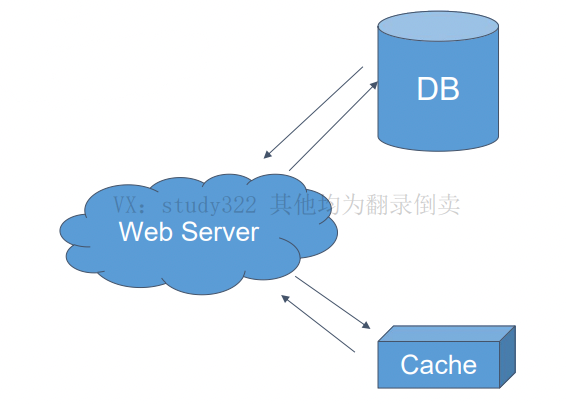

###Design User System - database & cache
-   使用4s分析法分析用户系统
-   缓存是什么 cache
-   缓存和数据库如何配合使用 database & cache
-   登录系统如何做 authentication service
-   好友关系存储和查询 friendship service
-   以 cassandra 为例了解 nosql 数据库
-   关系型数据库和非关系型数据库使用场景比较
-   扩展题:
    -   Nosql 单向好友关系
    -   如何按照 username email id phone 同时检索 user
    -   共同好友查询
    -   六度好友关系
    
####Design user system (注册,登录,用户信息查询,好有关系存储)
-   Scenario (支持 100M DAU)
    -   注册,登录,查询,用户信息更改
    -   QPS 估算:
        -   注册,登录,用户信息更改平均 0.1 : qps = 100M * 0.1 / (3600 * 24) 估算 qps = 100  peak = 100 * 3 = 300
        -   查询: qps = 1000 peak = 1000 * 3 = 3000
    
-   Service 
    -   Authentication Service 负责用户权限登录
    -   User Service 负责用户注册,查询
    -   Friendship Service 好友关系存储查询
    
-   Storage (qps 决定了数据存储系统的选择)
    -   mysql 等数据库 qps 量级为 1k
    -   MongoDB/cassandra 等硬盘型 nosql 数据库 qps 量级为 10k 
    -   redis/memcached 等内存型 nosql 数据库 qps 量级为 100k ~ 1M 
    -   注册,登录,用户信息更改 使用关系型数据库即可,查询需要使用 nosql 数据库
    
用户系统特点:**读多写少** , 一个读多写少的系统一定要使用 cache 进行优化
-   常用的 cache : redis (支持数据持久化)/ memcached (不支持数据持久化)
-   cache 一定是存在内存中吗? 不是, file system 也可以做为 cache ,cpu 也有 cache
-   cache 一定指 server cache 吗? 不是, frontend / client / browser 也可能有客户端的cache

UserService
-   优化BD查询:

```java
class UserService {
    private static final CACHE_USER_PREFIX ="user::";
    
    //记忆化搜索
    public User getUser(String userName) {
        String key = StringUtils.join(CACHE_USER_PREFIX,userName);
        boolean cached = cache.exist(key);
        if (cached) {
            return cached.get(key)
        }else {
            User user = userDao.get(key);
            cache.put(key,user);
            return user;
        }
    }
    
    public void setUser(User user){
        String key = StringUtils.join(CACHE_USER_PREFIX,userName);
        userDao.set(user);
        cache.delete(key);
    }
}
```
考虑四种情况:  
A: database.set(user); cache.set(key, user);  
B: database.set(user); cache.delete(key);  
C: cache.set(key, user); database.set(user);  
D: cache.delete(key); database.set(user);  

主要需要考虑的是应用执行到某一行,后续没有执行成功的情况  
业界选择的做法是B方案,原因是对于读多写少的情形,一般来说,缓存命中率比较高,所以比较少会走到 else 逻辑
ps:走 else 逻辑时,如果在cache put 在 setUser()后执行,则缓存里还是旧数据,解决方案有两种,一个是设置 ttl(一般采用这个) 还有一个是延迟双删

如果写操作很多怎么办?  
对于读多写少,使用cache优化主要是提供一个 cache 命中的方式来减少对数据库的压力从而提高效率  
对于写操作很多的情形,那么必然会有数据库的写入操作,那么 cache 的方式是没有作用的  

#### cache patten  
-   cache aside:服务器分别与 cache 和 DB 进行沟通, cache 和 DB 不直接进行沟通,
    -   代表: Memcached + Mysql 

    
-   cache through:服务器只与cache进行沟通,cache 与 DB进行沟通
    -   代表: redis (可以理解为redis 包含一个 cache 和一个 DB)


