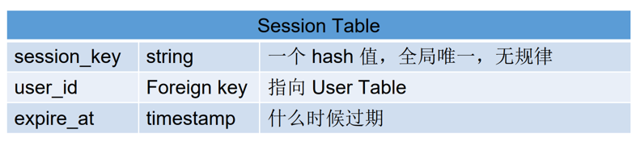
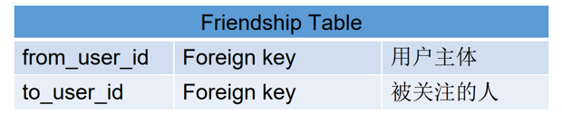
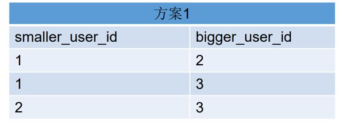
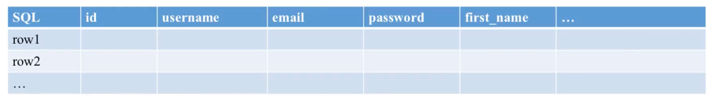
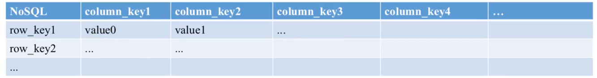
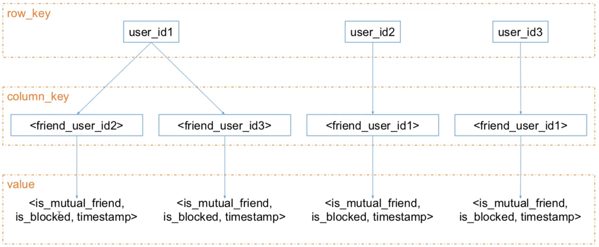
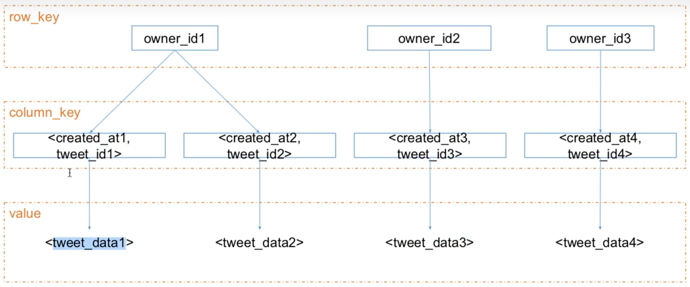

###Design User System - database & cache
-   使用4s分析法分析用户系统
-   缓存是什么 cache
-   缓存和数据库如何配合使用 database & cache
-   登录系统如何做 authentication service
-   好友关系存储和查询 friendship service
-   以 cassandra 为例了解 nosql 数据库
-   关系型数据库和非关系型数据库使用场景比较
-   扩展题:
    -   Nosql 单向好友关系
    -   如何按照 username email id phone 同时检索 user
    -   共同好友查询
    -   六度好友关系
    
####Design user system (注册,登录,用户信息查询,好有关系存储)
-   Scenario (支持 100M DAU)
    -   注册,登录,查询,用户信息更改
    -   QPS 估算:
        -   注册,登录,用户信息更改平均 0.1 : qps = 100M * 0.1 / (3600 * 24) 估算 qps = 100  peak = 100 * 3 = 300
        -   查询: qps = 1000 peak = 1000 * 3 = 3000
    
-   Service 
    -   Authentication Service 负责用户权限登录
    -   User Service 负责用户注册,查询
    -   Friendship Service 好友关系存储查询
    
-   Storage (qps 决定了数据存储系统的选择)
    -   mysql 等数据库 qps 量级为 1k
    -   MongoDB/cassandra 等硬盘型 nosql 数据库 qps 量级为 10k 
    -   redis/memcached 等内存型 nosql 数据库 qps 量级为 100k ~ 1M 
    -   注册,登录,用户信息更改 使用关系型数据库即可,查询需要使用 nosql 数据库
    
用户系统特点:**读多写少** , 一个读多写少的系统一定要使用 cache 进行优化
-   常用的 cache : redis (支持数据持久化)/ memcached (不支持数据持久化)
-   cache 一定是存在内存中吗? 不是, file system 也可以做为 cache ,cpu 也有 cache
-   cache 一定指 server cache 吗? 不是, frontend / client / browser 也可能有客户端的cache

UserService
-   优化BD查询:

```java
class UserService {
    private static final CACHE_USER_PREFIX ="user::";
    
    //记忆化搜索
    public User getUser(String userName) {
        String key = StringUtils.join(CACHE_USER_PREFIX,userName);
        boolean cached = cache.exist(key);
        if (cached) {
            return cached.get(key)
        }else {
            User user = userDao.get(key);
            cache.put(key,user);
            return user;
        }
    }
    
    public void setUser(User user){
        String key = StringUtils.join(CACHE_USER_PREFIX,userName);
        userDao.set(user);
        cache.delete(key);
    }
}
```
考虑四种情况:  
A: database.set(user); cache.set(key, user);  
B: database.set(user); cache.delete(key);  
C: cache.set(key, user); database.set(user);  
D: cache.delete(key); database.set(user);  

主要需要考虑的是应用执行到某一行,后续没有执行成功的情况  
业界选择的做法是B方案,原因是对于读多写少的情形,一般来说,缓存命中率比较高,所以比较少会走到 else 逻辑
ps:走 else 逻辑时,如果在cache put 在 setUser()后执行,则缓存里还是旧数据,解决方案有两种,一个是设置 ttl(一般采用这个) 还有一个是延迟双删

如果写操作很多怎么办?  
对于读多写少,使用cache优化主要是提供一个 cache 命中的方式来减少对数据库的压力从而提高效率  
对于写操作很多的情形,那么必然会有数据库的写入操作,那么 cache 的方式是没有作用的  

#### cache patten  
-   cache aside:服务器分别与 cache 和 DB 进行沟通, cache 和 DB 不直接进行沟通,
    -   代表: Memcached + Mysql 

    
-   cache through:服务器只与cache进行沟通,cache 与 DB进行沟通
    -   代表: redis (可以理解为redis 包含一个 cache 和一个 DB)
    
#### Authentication service(登录系统,session, cookie)
-   session会话:
    -   用户 login 后会为其创建一个 session 对象(可以理解为存储在服务器端的一个 map 对象)
    -   并把 session_key 返回给服务器,让服务器存储起来,浏览器也会将该值存储在浏览器的 cookie 中
    -   每次用户访问服务器都会带上 cookie 中的所有信息
    -   服务器会拿到 cookie 中的 session_key ,在 session table 中检查是否存在,是否过期
    -   Cookie：HTTP 协议中浏览器和服务器的沟通机制，服务器把一些用于标记用户身份的信息，传递给浏览器，浏览器每次访问任何网页链接的时候，
        都会在 HTTP 请求中带上所有的该网站相关的Cookie 信息。Cookie 可以理解为一个 Client 端的 hash table。
        
        
-   session三问:
    -   session过期后,服务器会主动删除吗? 不会， lazy loading ， lazy deleting
    -   一个账户只支持一台机器登录和多台机器同时登录的区别是什么?
        -   对于只支持一台机器登陆：在session table中增加device_token 用于标识唯一的device,当另一个device登录的时候可将  
            之前登录的session_key删除,同时发送在其他设备登录的信息...
        -   对于支持多台机器登录,不需要做任何更改,本来就支持创建多个session_key
    -   session适合存储在什么数据库存储系统中？ 
        -   如果是小规模用户,可以直接放在 cache 中,断电丢失,可以在登录的时候重新创建 ,对于大的网站还是需要存储在数据库系统中(保证用户体验)
  
#### 好友关系
-   单项好友关系(twitter , instagram , 微博)
    -   存在关系型数据库
        
    -   nosql 数据库    
-   双向好友关系(微信，Facebook，WhatsApp)
    -   方案一:存储为一条数据
        select * from friendship where smaller_user_id = x or bigger_user_id=x
        
    -   方案二: 存储为两条数据
        select * from friendship where from_user_id=x
        
    -   方案二更优: 原因,查询中没有 or 操作,查询更快,存储比较便宜 ,但是写入的时候需要保证两条数据同时写入成功  
        如果没有同时写入成功(情况极少),可以通过额外的处理相关log日志修复,问题不大
        
#### Cassandra 简介
-   三层结构: row_key, column_key (只可创建一次index), value
-   结构化信息如何存储?将其他需要存储的结构化数据序列化到value里进行存储
    -   什么是serialization? 将object序列化为string存储
    
-   row_key:Hash Key, Partition Key,sharding key, Cassandra 会根据这个 key 算一个hash 值然后决定整条数据存储在哪台机器上
    (row_key不支持范围查询,一般使用user_id作为row_key)
-   column_key(range query):insert(row_key, column_key, value)
    任何一条数据，都包含上面三个部分你可以指定 column_key 按照什么排序Cassandra 支持这样的“范围查询” ：
    query(row_key, column_start, column_end) 可以是复合值(复合索引)，如 timestamp + user_id
    
#### sql vs nosql
-   sql column实在schema中预先定义好的, 不可随意添加  
    数据以row为单位(读取都是完整的一条 row 数据)
    
-   nsoql 的column是动态的,无限大,可以任意添加  
    数据以 grid 为单位 row_key + column_key + value = 一条数据  
    只需提前定义好column_key本身的格式(是一个int 还是一个 int + String )
    
    -   存储friendship
    
    -   如果要查询最近一天关注的好友怎么做? 将 timestamp 信息放到 column_key 中
    -   存储news feed
    

#### 数据库选择原则:
-   大部分情况,sql 和 nosql 都是可以的
-   需要支持 transaction 的话不可选 nosql
-   你想在什么地方偷懒很大程度上决定了选什么数据库
    -   sql:结构化数据,自由创建索引
    -   nosql:分布式, auto-scale, replica
-   一般会同时使用多种数据库系统
-   user table: 大部分选择 sql: 信任度, multi-index
-   friendship table: 数据结构简单,key-value 查询需求, nosql效率高

####扩展练习1:
使用cassandra 存储单项好友关系,设计需要哪些表单和对应的表单结构, 支持如下操作:
-   查询某个人的关注列表
-   查询某个人的粉丝列表
-   查询A是否关注了B

需要两张表, 一张存粉丝,一张存关注
-   redis(没有表单的概念):  
    key = user_id  
    value = set of friend_user_id(粉丝表和关注表里分别是粉丝id集合和关注的id集合)  
    查询A是否关注B可以使用 redis 的 SISMEMBER 操作查询A关注里有没有B
    
-   cassandra:  
    row_key = user_id  
    column_key = friend_user_id(直接存id, 粉丝或者关注)  
    value 可以存其他东西, 如关注时间  
    查询A是否关注B: 在关注表中查询row_key = A, column_key = B 是否存在
    
#### 扩展练习2: Nosql存储User
如果使用不支持 multi-index 的 nosql 存储 user 如何同时支持 email ,username, phone , id 来检索用户? 
-   user 相关的所有数据都存在 user table 里
    -   redis: key = user_id , value = 用户信息
    -   cassandra:
        -   row_key = user_id
        -   column_key = 用户信息
        -    value= 其他
    
-   其他再同时创建多张表单,用作index
    -   redis:  key= email/phone/username,value = user_id
    -   cassandra: 
        -   row_key = email/phone/username
        -   column_key = user_id
        -   value:其他
    
#### 扩展练习3: 共同好友
共同好友(mutual friends) 是社交网站上常见的功能, 请设计功能: 列出A和B之间的共同好友
-   基本流程(两次数据库的 key - value 查询): 
    -   获取A的共同好友列表
    -   获取B的共同好友列表
    -   求交集
-   优化: 使用缓存 存储用户好友列表

#### linkedIn 六度关系
linkedIn 上有一个功能是显示你和某人之间的几度关系(通过多少个朋友可以认识),请设计这个功能 可以使用宽度优先搜索算法吗? 


