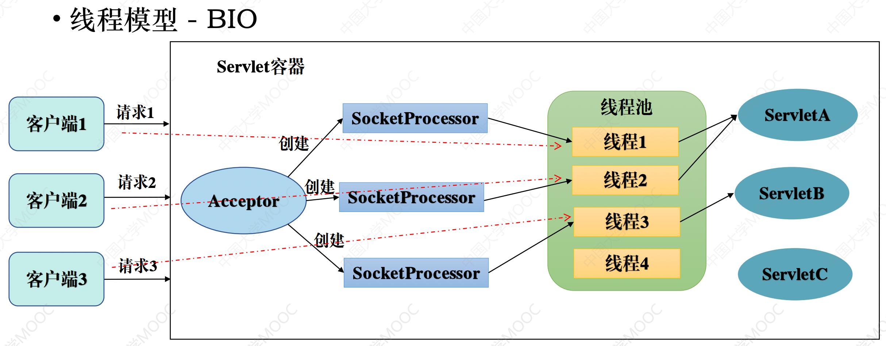
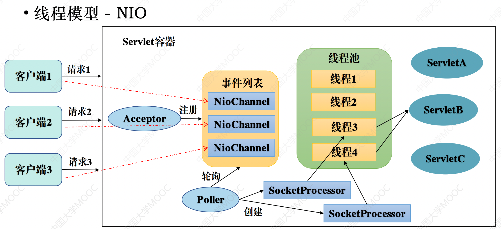
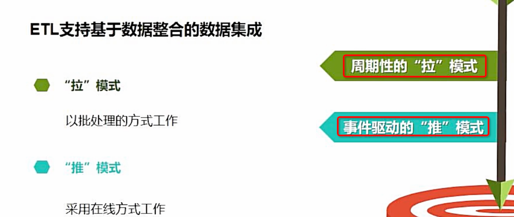

对于多线访问对象情况,那么该对象必须定义为无状态的, ,对于单个线程,因为java对每个线程      
都有对应的本地方法栈不会导致冲突

tomcat容器
io密集型和计算密集型: io密集型如果内存足够可以尽量的多开线程, 
如果是计算密集型则开太多的线程也无用, cpu处理不过来

NIO相比BIO主要是讲请求中的io过程通过一个事件队列剥离出去了,这样减少了线程的阻塞情况

对于一个应用的性能的提升主要是通过吧io这种慢处理过程从整个流程中剥离出去  ,放到一个队列中,异步进行处理
,这样通过多线程的方式进一步提升性能

POJO: 对对量没有要求, 例如对于servlet,他必须实现httpServlet接口,也即必须符合某一种规范  
那么它就不是一个pojo

Autowired 标注在构造方法上
Autowired 标注在 Setter 方法上

注入方式, 可以通过构造函数和set方式, 工作中常直接在成员变量上注入, 这种方式其实不推荐,  
从属性上进来违背了对象的封装性

spark streaming 采用小批量处理的方式使得它可以同时兼容批量和实时数据处理的逻辑和算法,  
方便了一些需要历史数据和实时数据联合分析的特定应用场景

