OOP使用者总结的良好的编程方法,使用设计模式可以增加系统的健壮性,易修改性,可扩展性

面向对象设计的三大目标: elegant , maintainable , extendable

使用频率最多的设计模式: 抽象工厂,工厂方法,外观,观察者,迭代器,单例,适配器,
组合,代理,策略,命令,原型,桥接,装饰,状态,模版,生成器,中介者,责任链,访问者
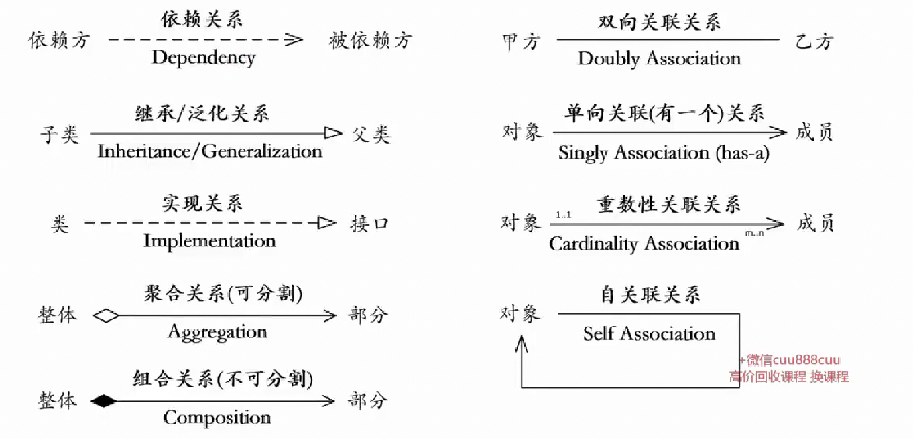

依赖和关联的区别: 依赖用于表示方法的入参和返回值 的一种依赖关系,而关联表示 成员变量的关系,关联相比依赖具有更强的关系,  
依赖需要调用方法触发,而关联是本身就存在的  

关联和聚合/组合的区别: 关联和聚合都可以表现为类成员的关系,但是关联更多的是一种平级的关系,但是聚合是一种整体和部分的关系

设计原则: 把变化的部分和不变的部分分离开来
-   多用组合,少用继承(**合成复用原则** composite reuse principle)
-   trade off: 耦合性越高,复用性越强,灵活度越低   耦合度越低,复用性越弱,灵活性越强

案例一: 鸭子模拟器(策略模式)
工作中案例联想: DAO(data access object): DAO层通常会利用策略模式,
如果链接多种类型的数据库(mysql,oracle)可以为每一种数据库的链接方式定义一种策略;
组件也存在多种实现方式=>标准化(spark,TensorFlow,python组件),官方(特征转化,xql,画像组件)
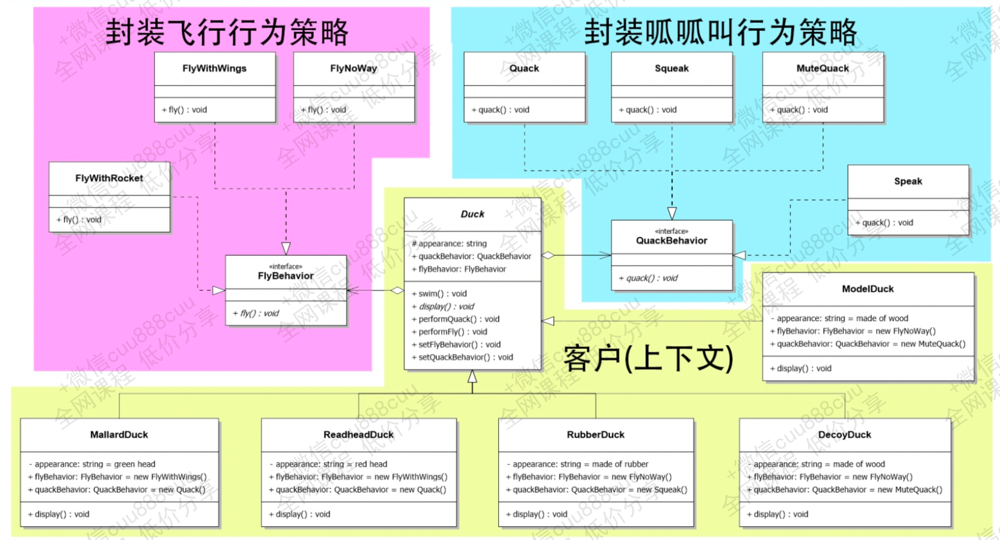
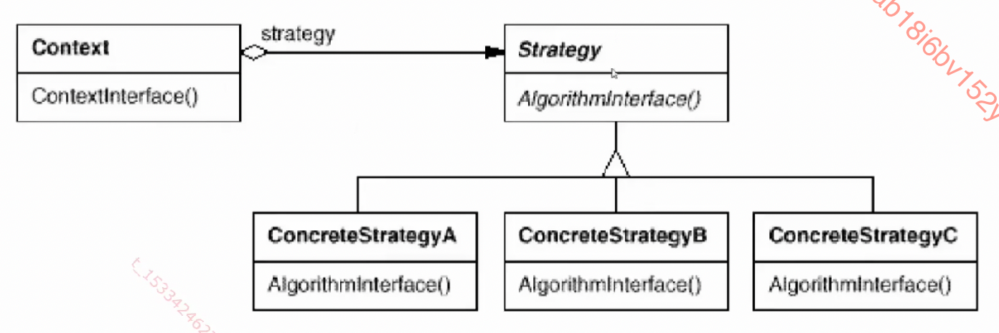
案例二: 披萨工厂(抽象工厂,工厂方法)
**依赖反转**(设计原则):要依赖抽象,不要依赖具体的类  
简单工厂: 简单工厂模式定义了一个工厂类,这个类专门用于创建其他类的实例,这些被创建的类都有一个公共的父类,根据传递参数的不同  
创建不同的子类实例,因为简单工厂里的 createProduct 方法是一个静态方法,所以简单工厂模式也叫静态工厂模式  
本质: 封装实例化过程  
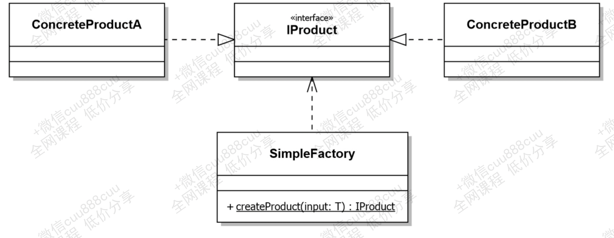

工厂方法:
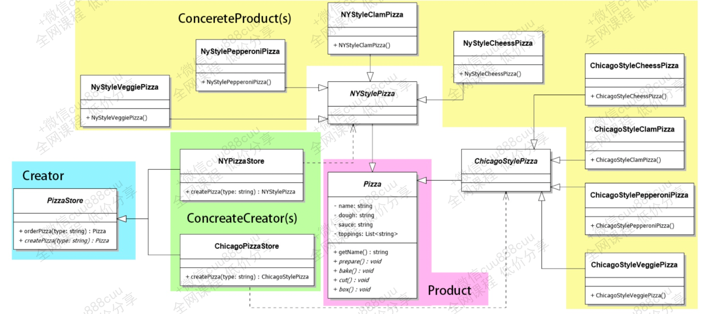
进一步扩展: 披萨原料工厂
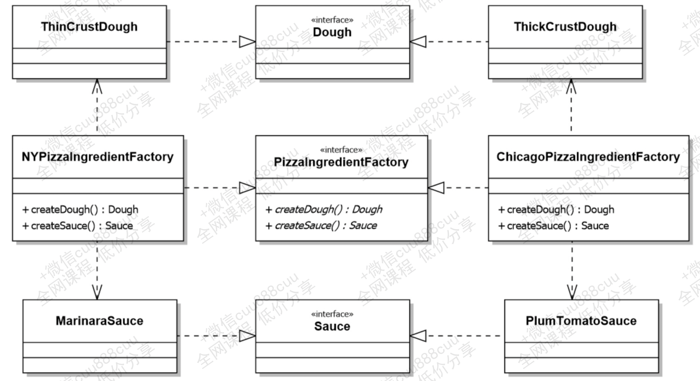
整合后的结果:
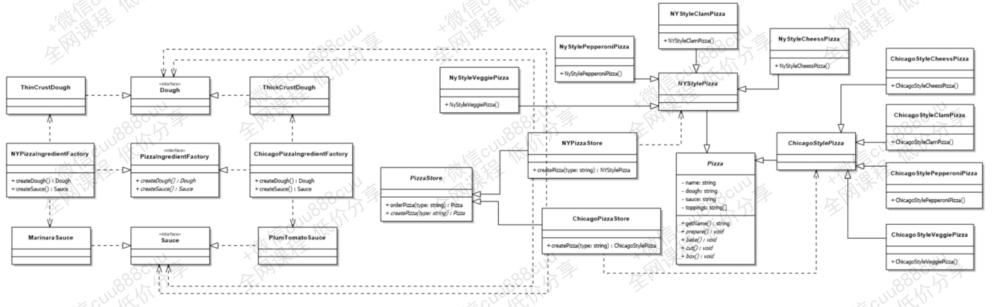
client 关联的的都是抽象的工厂(PizzaStore)和抽象的product(Pizza) , 由具体的工厂(NYPizzaStore,ChicagoPizzaStore)生产具体的product
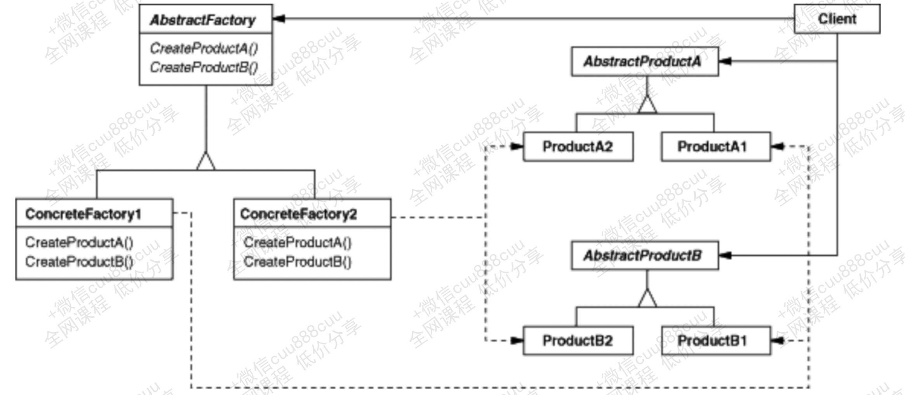

案例三: 家庭影院(外观模式 facade: 提供一个统一的接口,用来访问子系统中的一群接口)
最少知道原则:减少对象之间的交互,只留下几个"密友",然后只和密友交谈  
交互意味着耦合,而耦合意味着维护成本的上升

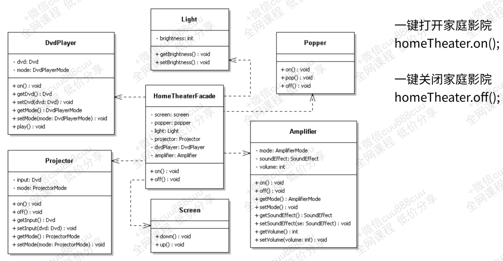
案例四: 气象站  
观察者模式: 定义了对象之间的一对多依赖关系,当一个对象改变状态时,他的所有依赖者都会收到通知并自动更新  
又名"发布&订阅模式"  发布者 + 订阅者 = 观察者模式  
发布者  ==> 主题 subject  
订阅者  ==> 观察者 observer  
可以订阅 subscribe 或者 退订 unsubscribe  
当主题内的指定数据改变时,就会通知当前已订阅该主题的所有观察者

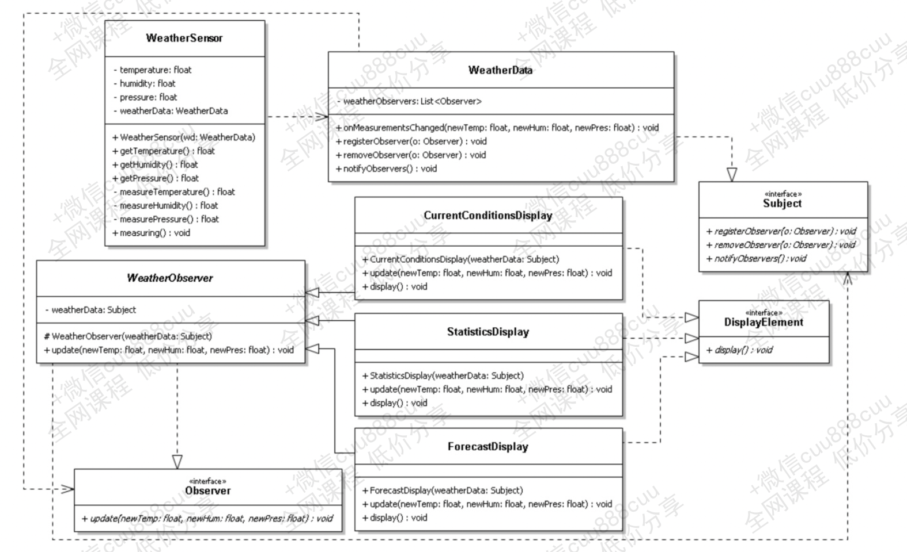
本质: 封装事件
案例五: 万能遥控器
命令模式: 将请求封装成对象,以便使用不同的请求,日志,队列等来参数化其他对象,命令模式也支持撤销操作(回到之前的一个状态)

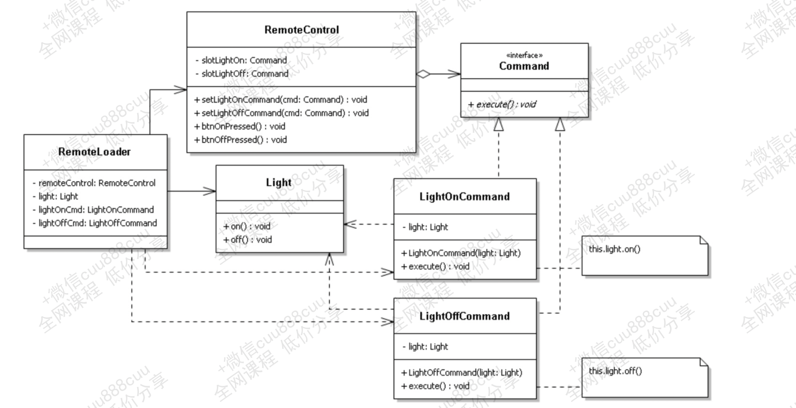

